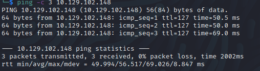

# Active
Name: Active
Date:  
Difficulty:  
Description:  
Better Description:  
Goals:  OSCP prep
Learnt:

## Recon

The time to live(ttl) indicates its OS. It is a decrementation from each hop back to original ping sender. Linux is < 64, Windows is < 128.


```bash
Password for [WORKGROUP\]:
Anonymous login successful

        Sharename       Type      Comment
        ---------       ----      -------
        ADMIN$          Disk      Remote Admin
        C$              Disk      Default share
        IPC$            IPC       Remote IPC
        NETLOGON        Disk      Logon server share 
        Replication     Disk      
        SYSVOL          Disk      Logon server share 
        Users           Disk      
Reconnecting with SMB1 for workgroup listing.
do_connect: Connection to 10.129.102.148 failed (Error NT_STATUS_RESOURCE_NAME_NOT_FOUND)
Unable to connect with SMB1 -- no workgroup available
```

```bash
smbget -R smb://10.129.154.238/Replication`
grep -r -e "password"`
```

SVC_TSG
```
Policies/{31B2F340-016D-11D2-945F-00C04FB984F9}/MACHINE/Preferences/Groups/Groups.xml:<Groups clsid="{3125E937-EB16-4b4c-9934-544FC6D24D26}"><User clsid="{DF5F1855-51E5-4d24-8B1A-D9BDE98BA1D1}" name="active.htb\SVC_TGS" image="2" changed="2018-07-18 20:46:06" uid="{EF57DA28-5F69-4530-A59E-AAB58578219D}"><Properties action="U" newName="" fullName="" description="" cpassword="edBSHOwhZLTjt/QS9FeIcJ83mjWA98gw9guKOhJOdcqh+ZGMeXOsQbCpZ3xUjTLfCuNH8pG5aSVYdYw/NglVmQ" changeLogon="0" noChange="1" neverExpires="1" acctDisabled="0" userName="active.htb\SVC_TGS"/></User>
```

## Exploit

## Foothold

## PrivEsc

      

