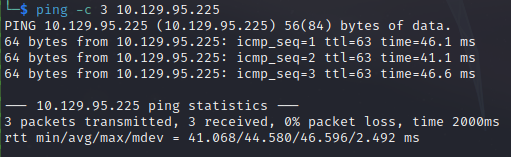

# Blunder 
Name: Blunder
Date:  
Difficulty:  Easy
Description:  
Better Description:  [Ippsec Video](https://www.youtube.com/watch?v=G5iw8c2vXuk&t=2270s)
Goals:  OSCP Prep - Python scripting on the fly
Learnt: 

Pre video hand holdy extraviganza I reconned the box with similar recon I would normally do as the masscan came back with just one port.

## Recon

The time to live(ttl) indicates its OS. It is a decrementation from each hop back to original ping sender. Linux is < 64, Windows is < 128.

Nuclei find CVE-2020-9490:
[nvd](https://nvd.nist.gov/vuln/detail/CVE-2020-9490)
*"Apache HTTP Server versions 2.4.20 to 2.4.43. A specially crafted value for the 'Cache-Digest' header in a HTTP/2 request would result in a crash when the server actually tries to HTTP/2 PUSH a resource afterwards. Configuring the HTTP/2 feature via "H2Push off" will mitigate this vulnerability for unpatched servers."*

nikto finds `/admin/config.php` 

Google dork the [CMS](https://github.com/Bludit)

Although there is already a script at this point for the bruteforcing the goal of this walkthrough is to improve my python scripting - which for me seems like a step that I have to improve at my overall hacking perspective of interacting with application less indirect manner, refactoring the bruteforcer from the Black Hat Python book for my AllTheHackingScripts repo to make it more universal. 

## Exploit

## Foothold

## PrivEsc

      
