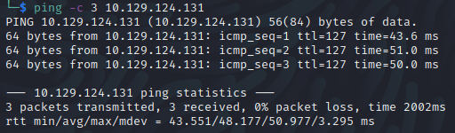
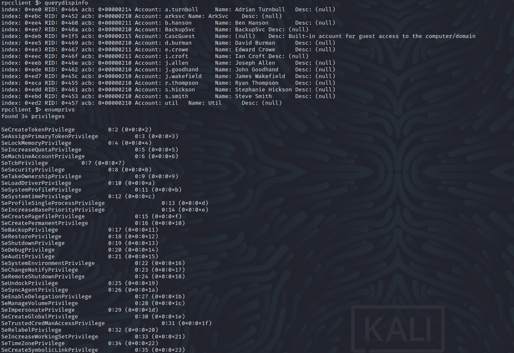

Name: Cascade
Date:  
Difficulty:  
Description:  
Better Description:  
Goals:  
Learnt:

## Recon

The time to live(ttl) indicates its OS. It is a decrementation from each hop back to original ping sender. Linux is < 64, Windows is < 128.

It is nice when `enum4linux` returns a full spread of information check [[enum4linuxOutput]]

Can't create user, enumerate net shares, get srvinfo, lsaenumsids - but we have them from the enum4linux output.
	
## Exploit

## Foothold

## PrivEsc

      
