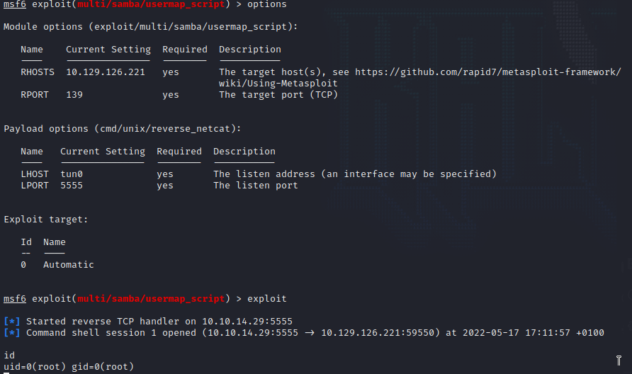

Name: Lame 
Date: 17/05/2022
Difficulty: Easy 
Description:  
Better Description: Research the versions the box.
Goals: TJNull's OSCP like boxes
Learnt: Check all the versions!

## Recon
The time to live(ttl) indicates its OS. It is a decrementation from each hop back to original ping sender. Linux is < 64, Windows is < 128.
```bash
ping -c 3 10.129.103.233 
PING 10.129.103.233 (10.129.103.233) 56(84) bytes of data.
64 bytes from 10.129.103.233: icmp_seq=1 ttl=63 time=38.0 ms
64 bytes from 10.129.103.233: icmp_seq=2 ttl=63 time=47.0 ms
64 bytes from 10.129.103.233: icmp_seq=3 ttl=63 time=86.1 ms

--- 10.129.103.233 ping statistics ---
3 packets transmitted, 3 received, 0% packet loss, time 2002ms
rtt min/avg/max/mdev = 37.997/57.041/86.101/20.876 ms
nmap -sC -sV -p- 10.129.103.233 --min-rate 5000 
Starting Nmap 7.92 ( https://nmap.org ) at 2022-05-16 11:12 BST
Nmap scan report for 10.129.103.233
Host is up (0.53s latency).
Not shown: 65530 filtered tcp ports (no-response)
PORT     STATE SERVICE     VERSION
21/tcp   open  ftp         vsftpd 2.3.4
|_ftp-anon: Anonymous FTP login allowed (FTP code 230)
| ftp-syst: 
|   STAT: 
| FTP server status:
|      Connected to 10.10.14.29
|      Logged in as ftp
|      TYPE: ASCII
|      No session bandwidth limit
|      Session timeout in seconds is 300
|      Control connection is plain text
|      Data connections will be plain text
|      vsFTPd 2.3.4 - secure, fast, stable
|_End of status
22/tcp   open  ssh         OpenSSH 4.7p1 Debian 8ubuntu1 (protocol 2.0)
| ssh-hostkey: 
|   1024 60:0f:cf:e1:c0:5f:6a:74:d6:90:24:fa:c4:d5:6c:cd (DSA)
|_  2048 56:56:24:0f:21:1d:de:a7:2b:ae:61:b1:24:3d:e8:f3 (RSA)
139/tcp  open  netbios-ssn Samba smbd 3.X - 4.X (workgroup: WORKGROUP)
445/tcp  open  netbios-ssn Samba smbd 3.0.20-Debian (workgroup: WORKGROUP)
3632/tcp open  distccd     distccd v1 ((GNU) 4.2.4 (Ubuntu 4.2.4-1ubuntu4))
Service Info: OSs: Unix, Linux; CPE: cpe:/o:linux:linux_kernel

Host script results:
| smb-security-mode: 
|   account_used: guest
|   authentication_level: user
|   challenge_response: supported
|_  message_signing: disabled (dangerous, but default)
|_smb2-time: Protocol negotiation failed (SMB2)
| smb-os-discovery: 
|   OS: Unix (Samba 3.0.20-Debian)
|   Computer name: lame
|   NetBIOS computer name: 
|   Domain name: hackthebox.gr
|   FQDN: lame.hackthebox.gr
|_  System time: 2022-05-16T06:13:50-04:00
|_clock-skew: mean: 2h00m26s, deviation: 2h49m44s, median: 24s

Service detection performed. Please report any incorrect results at https://nmap.org/submit/ .
Nmap done: 1 IP address (1 host up) scanned in 82.46 seconds

nmap -sU -p- 10.129.103.233 --min-rate 5000    
Starting Nmap 7.92 ( https://nmap.org ) at 2022-05-16 11:41 BST
Nmap scan report for 10.129.103.233
Host is up (0.092s latency).
Not shown: 65531 open|filtered udp ports (no-response)
PORT     STATE  SERVICE
22/udp   closed ssh
139/udp  closed netbios-ssn
445/udp  closed microsoft-ds
3632/udp closed distcc

Nmap done: 1 IP address (1 host up) scanned in 53.88 seconds

```


## SMB Enumeration 
See [[Lame-smb-enumeration]] for full output. Given read and write access without credentials we can upload a shell to the server via the /tmp share 

## Foothold 
I put a reverse tcp msfvenom shell on there for later just in case.  You can't execute file over smbclient but a backdoor is a backdoor and backup.

```bash
smbclient //$IP//tmp -c 'put shell.elf'
```

## Metasploit with

Research distcc [found](http://edublog.bitcrack.net/2016/10/pwning-metasploitable-2-exploiting_12.html); TL;DR version is that there is metasploit exploit.
It is showcased on metasploitable-2. But it is ruse. Dorked the Samaba version for [another metasploit exploit](https://www.exploit-db.com/exploits/16320)


