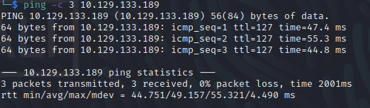
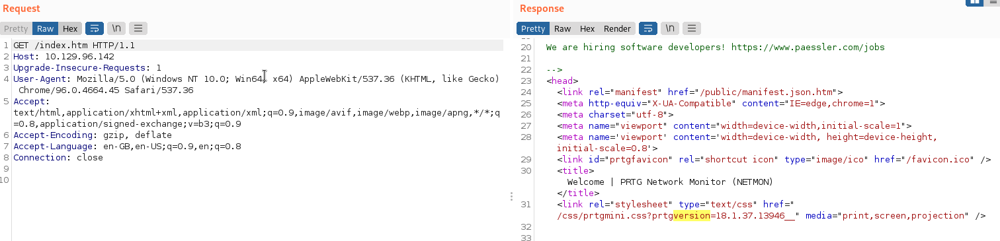
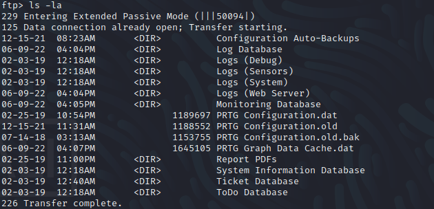
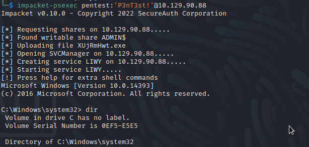

Name: Netmon
Date: 09/06/2022  
Difficulty: Easy
Description: 
Better Description: FTP till the plaintext password is disclosed
Goals: OSCP prep - no metasploit.
Learnt: impacket is awesome, exploit scripts come in various qualities sometimes the bash script is actually the best.

## Recon

Quick user.txt with anonymous ftp login.
  

PRGT kindly discloses version on the root of the http.
  
	
The default user and password do not work and all exploits require authenication.
PRTG Stores its data at C:\ProgramData\Pae

`grep -r -n prtgadmin` later... 

Unfortunately the password won't work but as it is puzzle it is just the variation on the suffixed date.  
Just increment by one.

## Exploit and Root...

Just searchsploit prtg, the TL;DR of the exploit is we need cookies from successful authenication.

Never forget psexec.

 

root.txt is on Adminstrator's desktop.
      
