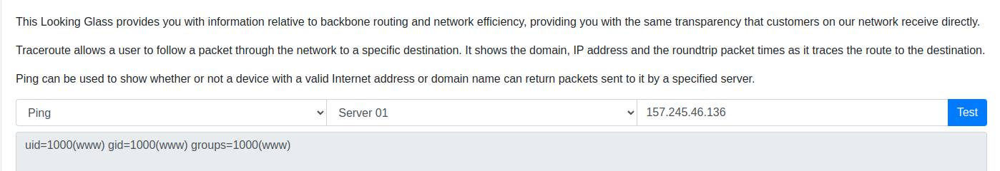

## Looking Glass

Nikto report os XSLT vulnerabilities
[payloads](https://github.com/swisskyrepo/PayloadsAllTheThings/tree/master/XSLT%20Injection)

I made my own page with this: [curesec](https://curesec.com/blog/article/blog/MoinMoin-198-XSS-175.html).
It is actually a command injection

## Sanitize 
 
Possible hint is the SQLI in th corner

`admin' or 1=1 -- -`

## Baby Auth

Make an account because you can -> change your PHPSESSION cookie to a base64 encoded {"username": "admin"}

 
## Baby Nginxatsu

XSRF

## baby BoneChewerCon

This one requires two things. Enter in anytime and read the debugger output.

## Full Stack Conf

