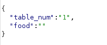
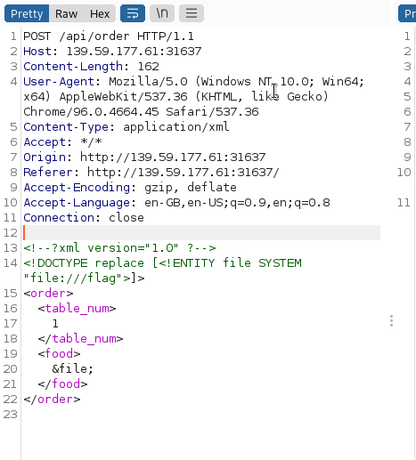
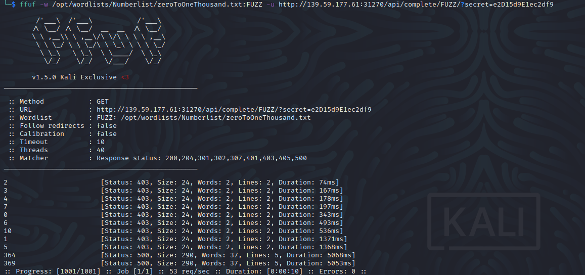
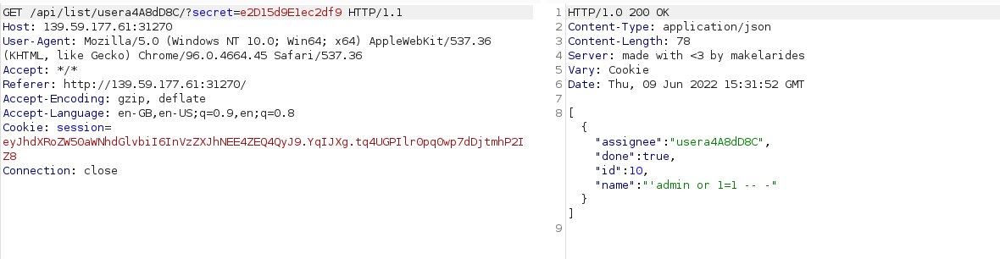
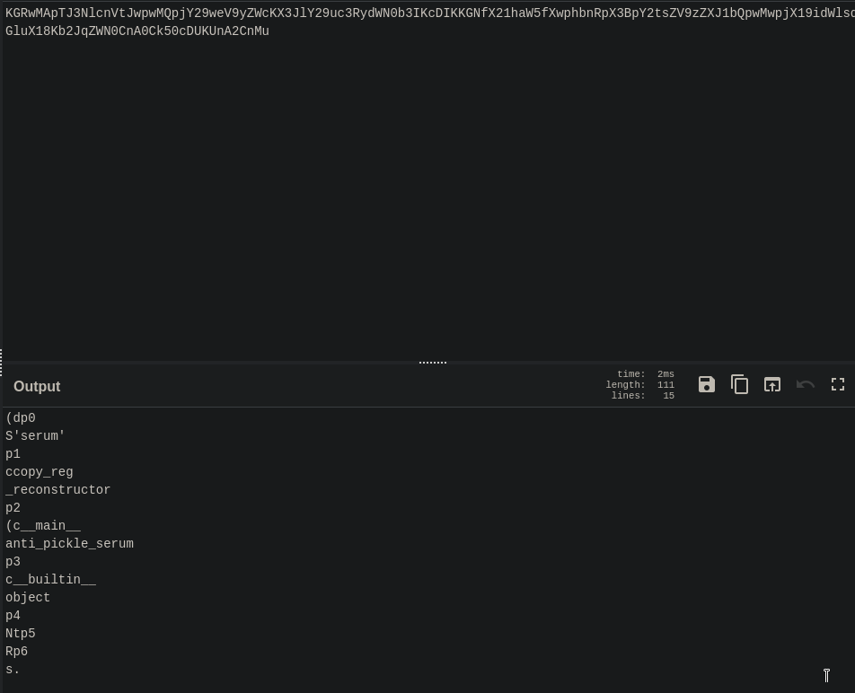
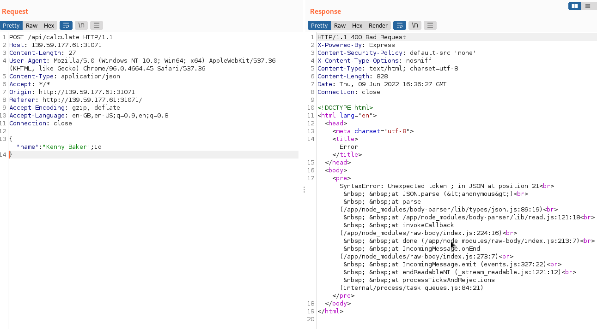

WTF is XXE, writing xml injections

## Looking Glass

Nikto report os XSLT vulnerabilities
[payloads](https://github.com/swisskyrepo/PayloadsAllTheThings/tree/master/XSLT%20Injection)

I made my own page with this: [curesec](https://curesec.com/blog/article/blog/MoinMoin-198-XSS-175.html).
It is actually a command injection


## Sanitize 
 
Possible hint is the SQLI in th corner


`admin' or 1=1 -- -`

## Baby Auth

Make an account because you can -> change your PHPSESSION cookie to a base64 encoded {"username": "admin"}

 
## Baby Nginxatsu

https://medium.com/adrixus/beginners-guide-to-nginx-configuration-files-527fcd6d5efd

The /storage directory holds a backup of a sqlite database
```bash
wget http://<ip:port>/storage/v1_db_backup_1604123342.tar.gz
tar -xf v1_db_backup_1604123342.tar.gz # not actual qzip compressed!
sqlite3 database.sqlite
select * from users; 
```

## baby WAFfles order

I mucked around with this one but I have done enough api or xml injections. I peaked at a video that suggest it so went to [payloadAllTheThings](https://github.com/swisskyrepo/PayloadsAllTheThings) to try that.
I then remembered that there is a json request:


PATT states: *Basic entity test, when the XML parser parses the external entities the result should contain "John" in firstName and "Doe" in lastName. Entities are defined inside the DOCTYPE element....example...It might help to set the Content-Type: application/xml in the request when sending XML payload to the server.*

Tried some payloads, changed Header options, but to no avail. Then went back research actually what xml was and watched a bit of the video. 
I almost got it but added a space between `!` and `--`



## baby todo or not todo

Another API one...

```html
<input id='data-secret' type='hidden' value='e2D15d9E1ec2df9'> 
```
Tried fuzzing for a idor




I missed the /api/list; which if substitute the user for all like in the source code you can list everything.


## baby BoneChewerCon

This one requires two things. Enter in anytime and read the debugger output.

## Full Stack Conf


## baby website rick

Cookie called plan\_b.



If you change the `serum` to `anti_pickle_serum`

Python has serialization in the form of [pickle.. pickle..](https://www.i2tutorials.com/python-serialization-deserialization/) so I checked that out.
I just went straight to the [writeup](https://braincoke.fr/write-up/hack-the-box/baby-website-rick/) and [another writeup](https://ir0nstone.gitbook.io/hackthebox/challenges/web/baby-website-rick)as I have not seen this before. 
Very cool and well explained writeup. I really really want to be able to write exploit code like this. 

Did not have high hopes for blazing through the final challenge.

## baby breaking grad

I realised that the json of either individual was important as I poked around. Instead of a writeup forums suggested bash inject.
Guessing that was just adding a `;id` to the insider json I got:



Firstly this is node js error so a nodejs function might be useful; thanks Cyclopath.
I attempted a payload from a nodejs research.


Then reread the forums and reaslised again I was out of my depth.
What I learnt collective from all the writeup is they all downloaded and hosted the code locally.
Seems like I missed the hint to do so as Haddix Bug Bounty talk on application analysis is to do so, now that I remember.
I watched this [video](https://www.youtube.com/watch?v=kTsg8iQzX4M) and [writeup](https://hilb3r7.github.io/walkthroughs/babybreakinggrad.html) and went away resolute in the need to learn some actual js.

TL;DR - In the source code the forumla parametre is evaluated in an insecure way such the payload:
```
(function (y){return ''[y?y:'length'][y]})('constructor')('throw new TypeError(process.mainModule.require(\"child_process\").execSync(\"[INSERT COOMAND HERE*\").toString())')()
```
...Can be passed in the json to then add additional output to the error handling which get rce. Javascript.

Note the flag may return faulty: change the `#&39;` to a `'` 


