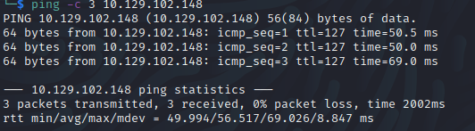

Name: Active
Date:  
Difficulty:  Easy
Goals:  OSCP Prep
Learnt:

## Recon

The time to live(ttl) indicates its OS. It is a decrementation from each hop back to original ping sender. Linux is < 64, Windows is < 128.



```powershell
# SVC_TGS password  
"edBSHOwhZLTjt/QS9FeIcJ83mjWA98gw9guKOhJOdcqh+ZGMeXOsQbCpZ3xUjTLfCuNH8pG5aSVYdYw/NglVmQ"
```

https://www.trustedsec.com/blog/weaponizing-group-policy-objects-access/

## Exploit

## Foothold

## PrivEsc


      
