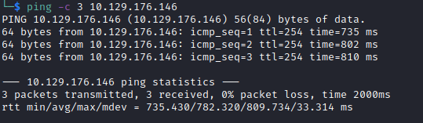

# Attended Helped-Through

Name: Attended
Date:  
Difficulty:  Insane
Goals:  
- Understand what it takes to be this good
- Analyse xct workflow
- Buffer overflow revision, but also gleen some tips
- Try smallest amount of recon possible and not any of my automated data collection for massive data crunking at some point.
- Perform "racing mind practice" -  a term that I likened to practicing play music at speed - it is fluid continous attempt to remain at at most peak for endurance  - 
- Finish in hour and a half. - SPOIL it did not happen I know it could have if naabu had worked, I was not correctly second guessing XCT on the smtp-user-enum "solution", also got impatient on the email call back from the attended.htb - then I reset the box incase I spammed the swaks too much
Learnt:
- Better smtp TTPs!
- When I put capability pieces together I can actually achieve stuff!
Beyond Root:
- Patch the machine to prevent a buffer overflow

## Recon

The time to live(ttl) indicates its OS. It is a decrementation from each hop back to original ping sender. Linux is < 64, Windows is < 128. The ttl is  < 255 meaning this a freeBSD box.



```bash
echo "10.129.176.146 attended.htb" | sudo tee -a /etc/hosts
```

We can enumerate 
```bash
MAIL FROM:<>
# Manual user enumeration with RCPT as the email server will indicate if the user exists
# Test if we can send mail
RCPT TO:<root@attended.htb>
DATA
Subject: Provide a subject line with a new line space 

Message goes here
# end with "." on a line by itself
.
```

Emailing the hard way.


```bash
sudo naabu -host 10.129.176.146 -p 0-65535 -i tun0 -nmap-cli 'nmap -sV -sC -e tun0'
```

- Tools dont work use wireshark to visualize traffic. 

smpt-user-enum cannot enumerate the users as the

Vim motions
`244 j` and change `$username` with `<$username\@attended.htb>` or you could just write the user list correctly with cli, without have to ruin the source code.. or so I thought
```bash
cat users.txt | awk '{print $1"@attended.htb"}' > betterusers.txt
```


Just missing a few things


You can supply the domain name with -D flag and the address from flag with -f so actually the tool is not broken at all my solution is better:
```bash
cat users.txt | awk '{print "<"$1"@attended.htb>"}' > betterusers.txt
# we do not need domain flag as it willl append to our custom users issue
smtp-user-enum -M RCPT -U betterusers.txt -f "<user@attended.htb>" -t 10.129.176.146
```


Target IP:
Attack IP:
guly  - is a username from a banner for some reason I thought this is somekind of service weird...it is not.
attended.htb - actual one of the box creators is the [Networked](https://app.hackthebox.com/machines/203) creator, which also had a guly

What is stated is that as the workflow leap for walkthrough video constraits for good content etc, is that we only have two ports open. So as ssh is not vulnerable and it is a CTF it is about how the enumerated users on the box interact and enumerating that. There is also nothing open on udp ports either.

Listener for emails and use SWAKS
```bash
# XCT has some kind of custom arch setup so uses sh and sudo for whatever reason
# sudo sh -c 'rlwrap nc -lvnp 25'
rlwrap nc -lvnp 25
# use swaks to automate the email sending
swaks --from 'root@attended.htb' --to 'guly@attended.htb' --header "Subject: Hello there" --body 'XCT and I are coming for your emails hide user and root' --server attended.htb
```
Swaks - Swiss Army Knife SMTP, the all-purpose SMTP transaction tester

I  did not get a response back 


## Exploit

## Foothold

## PrivEsc

## Beyond Root

      
