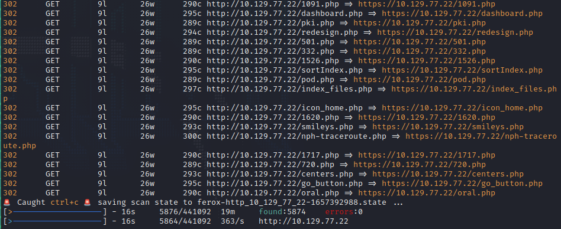
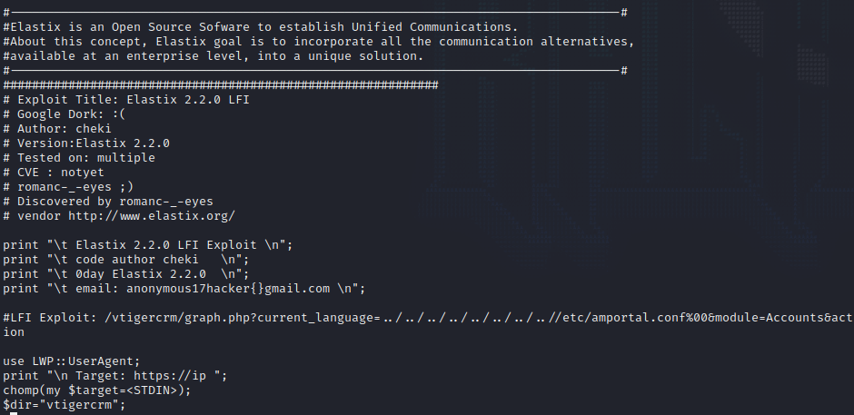
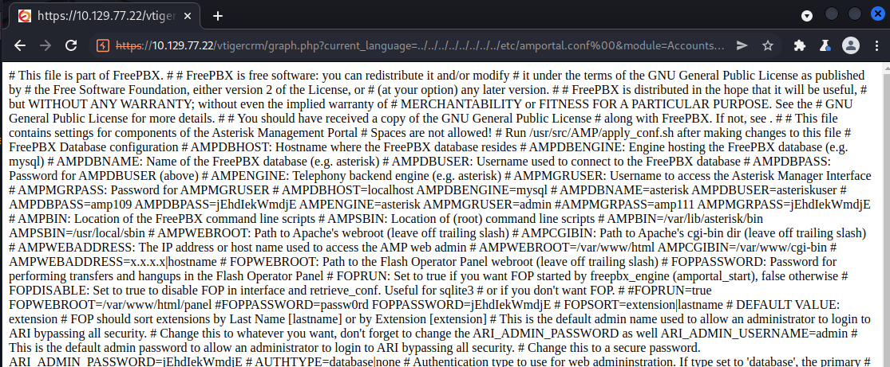
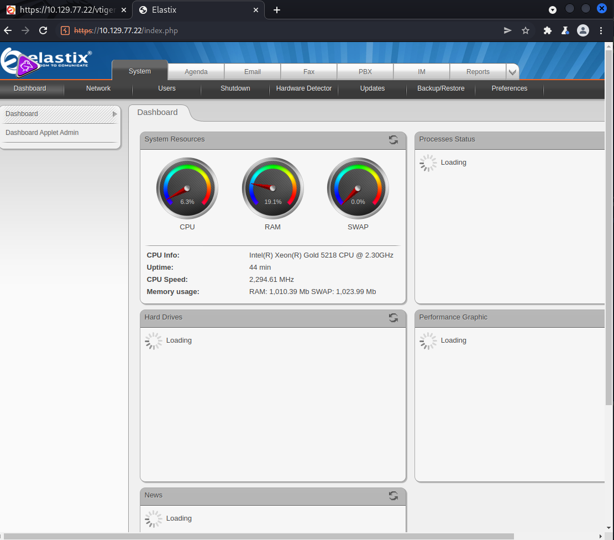
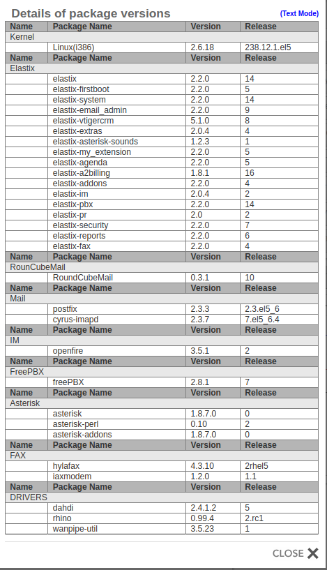
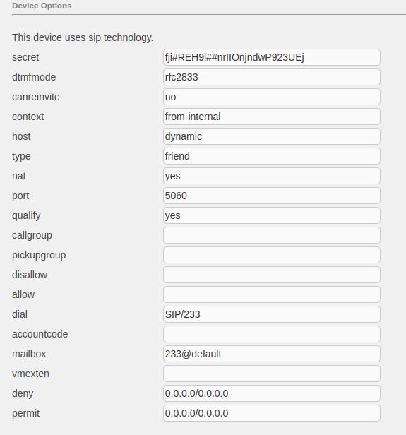
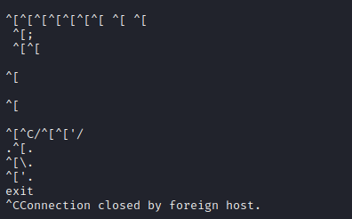

# Beep 
Name: Beep
Date:  
Difficulty:  Easy
Description:  
Better Description:  
Goals:  OSCP Prep
Learnt:

## Recon
The time to live(ttl) indicates its OS. It is a decrementation from each hop back to original ping sender. Linux is < 64, Windows is < 128.
```bash
ping -c 3 10.129.1.226
PING 10.129.1.226 (10.129.1.226) 56(84) bytes of data.
64 bytes from 10.129.1.226: icmp_seq=1 ttl=63 time=38.8 ms
64 bytes from 10.129.1.226: icmp_seq=2 ttl=63 time=35.6 ms
64 bytes from 10.129.1.226: icmp_seq=3 ttl=63 time=42.6 ms

--- 10.129.1.226 ping statistics ---
3 packets transmitted, 3 received, 0% packet loss, time 2002ms
rtt min/avg/max/mdev = 35.626/39.005/42.630/2.864 ms
```

Anti directory busting: 


Searchpsploiting for elastix:


## Exploit



For human eyes:
`admin: jEhdIekWmdjE` are valid credentials.
```
# AMPDBUSER: Username used to connect to the FreePBX database 
# AMPDBPASS: Password for AMPDBUSER (above) 
# AMPENGINE: Telephony backend engine (e.g. asterisk) 
# AMPMGRUSER: Username to access the Asterisk Manager Interface 
# AMPMGRPASS: Password for AMPMGRUSER 
# AMPDBHOST=localhost AMPDBENGINE=mysql 
# AMPDBNAME=asterisk AMPDBUSER=asteriskuser 
# AMPDBPASS=amp109 AMPDBPASS=jEhdIekWmdjE AMPENGINE=asterisk AMPMGRUSER=admin #AMPMGRPASS=amp111 AMPMGRPASS=jEhdIekWmdjE
...
#FOPPASSWORD=passw0rd FOPPASSWORD=jEhdIekWmdjE
...
ARI_ADMIN_USERNAME=admin 
# This is the default admin password to allow an administrator to login to ARI bypassing all security. 
# Change this to a secure password. ARI_ADMIN_PASSWORD=jEhdIekWmdjE
```

Login to the elastix dashboard


Click around...


More clicking around, user name in address book that maybe useful.
![[fanis.png]]

Secret?


At this point, I went back to my nmap scans and tried to verify extract states of what was running on each port as nmap return alot of `?` unsure except for the http.

CHECK SMTP with credentials




## Foothold

## PrivEsc