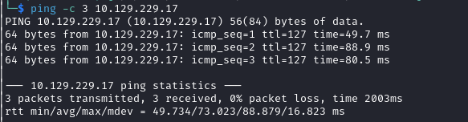

# Blackfield Helped-Through

Name: Blackfield
Date:  
Difficulty:  Hard
Goals:  
- Four hours then Helped-Through, but it will probably be a Helped-Through
- General review of my AD methodology 
- Learn from Snowscan 
Learnt:
Beyond Root:
- Active-Directory-Recon improvements

- [[Blackfield-Notes.md]]
- [[Blackfield-CMD-by-CMDs.md]]

[BLACKFIELD Walkthrough with Snowscan](https://www.youtube.com/watch?v=dh8Ny6Dl4zs)

## Recon

The time to live(ttl) indicates its OS. It is a decrementation from each hop back to original ping sender. Linux is < 64, Windows is < 128.

	
## Exploit

## Foothold

## Privilege Escalation

## Post-Root-Reflection  

## Beyond Root

