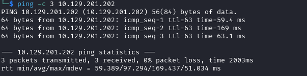

# Anomalies : BoardLight Writeup

Name: BoardLight
Date:  
Difficulty:  
Goals:  
Learnt:
Beyond Root:

Remember to complain about various issues.. 29/5 prior.
## Recon

The time to live(ttl) indicates its OS. It is a decrementation from each hop back to original ping sender. Linux is < 64, Windows is < 128.

	
## Exploit

## Foothold

## Privilege Escalation

## Post Root Reflection

## Beyond Root

rescan udp
