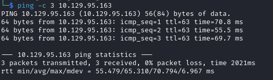

# Book Helped-Thorough

Name: Book
Date:  
Difficulty:  Medium
Goals: 
- Failed to do the `logrotate` section of the Linux Privilege Escalation so has to look up the solution and this was the box that had the same solution
Learnt:
Beyond Root:
- Implement `logrotate` for a home version of Linux and improving my logging setup

- [[Book-Notes.md]]
- [[Book-CMD-by-CMDs.md]]

This helped-through was made by reading [ivanitlearning](https://ivanitlearning.wordpress.com/2021/04/17/hackthebox-book/) and following along.
## Recon

The time to live(ttl) indicates its OS. It is a decrementation from each hop back to original ping sender. Linux is < 64, Windows is < 128.

	
## Exploit

## Foothold

## Privilege Escalation

## Post-Root-Reflection  

## Beyond Root

