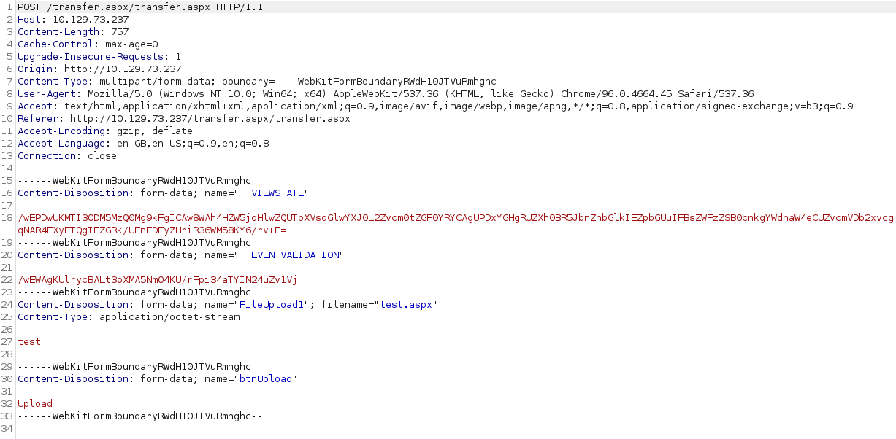
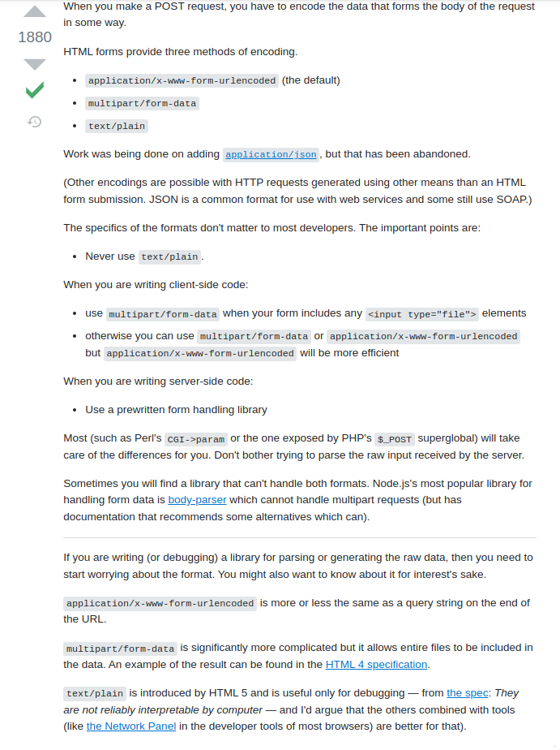

# Bounty

Name: Bounty
Date:  
Difficulty:  Easy
Goals:  
- OSCP Prep 
- Try Sherlock.ps1 
Learnt:
Beyond Root:

I thought I had finished this machine, apparently not. I got RCE and file upload used the correct type. It is simply that I ran out of time one day and forgot to note that I had not finished it or it did not work and it was broken for me at some point in the last six months. I was look for a [areyoua1or0](https://www.youtube.com/@areyou1or0) to follow along and get some more neuro-diversity to immulate in my own thinking and Bounty was one I watched thinking I had finished it. So I know that Sherlock.ps1 will find the exploit - but I do not know which one as with watching it on a break trying to get food particial worked out. I have never used that script or see other use it. [areyoua1or0](https://www.youtube.com/@areyou1or0) is awesome. She works at Offensive Security at time of writing in machine building/QA, multilingual with great English, currently doing Exploit Dev cert from OS and has some serious skills. Her videos are shorter, but to me that indicates she knows her stuff. The less time it takes someone to explain something the more understanding is being brought in teaching to have simplified to what is important. Also she is a woman and not a white guy so that is gold for pure difference of perspective in my opinion and I think she deserves more Subs. I will do a follow along with her in coming weeks to breakdown her thought process. 

## Recon

The time to live(ttl) indicates its OS. It is a decrementation from each hop back to original ping sender. Linux is < 64, Windows is < 128.

The `nmap/Extensive.*` scans declare IIS to be version 7.5 so probably it is a Windows Server 2008/R2.

[Microsoft IIS](https://en.wikipedia.org/wiki/Internet_Information_Services) is tech behind the webserver on port 80.
There is a upload page at transfer.aspx

And its source code:

And testing file uploading:

Researching the request and response properties:

[form.html](https://www.w3.org/TR/html401/interact/forms.html#h-17.13.4) suggests that this should used for submitting forms that contains files, non-ASCII data and binary data - meaning content checking of the file given the scope of checks would. The picture of Merlin I suppose is a clue that the file upload type that will be successful is `.png`.

 

The [article](https://blog.sucuri.net/2015/04/website-firewall-critical-microsoft-iis-vulnerability-ms15-034.html)

## Exploit

Retood my understanding of where my understanding was, I did not really have much `aspx` or IIS experience and file upload had primarily occured in CTFs on Linux's host. There are lots of `asp(x)` webshell that I could have uploaded if I was familiar to the use powershell or and LOLBAS to upload a reverse shell. [tennc](https://github.com/tennc/webshell), which is archive of webshells but is so the entire [nishang](https://github.com/tennc/webshell/blob/master/aspx/nishang/Antak-WebShell/antak.aspx), beware it is public repository where I advise that you `curl -Lo` raw version manually or get official repositories that are embedded **and if you can't read anything do not download it.** 

## ... Triumphant Return!

See [[Bounty-Old-Attempt]]