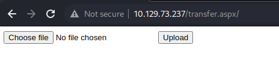
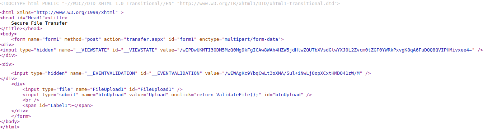
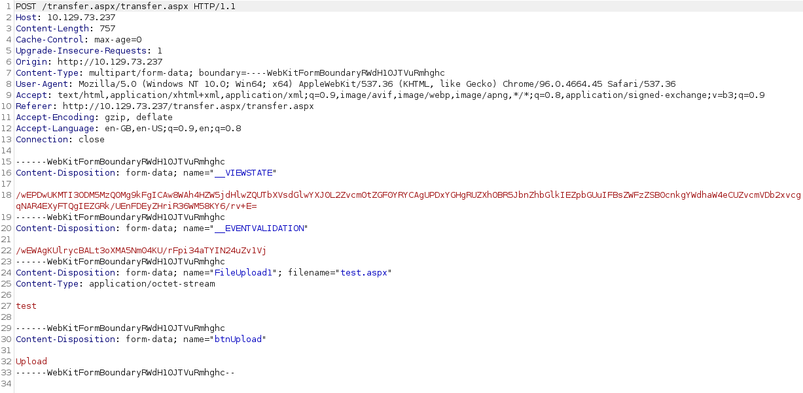
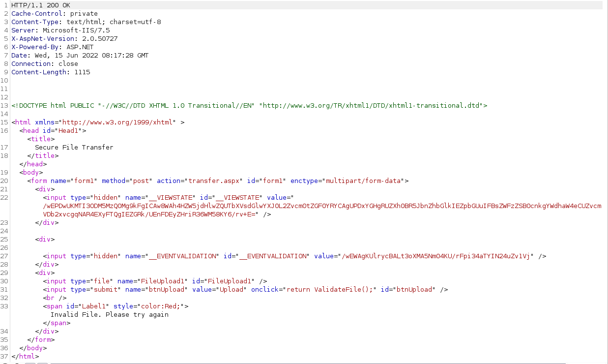
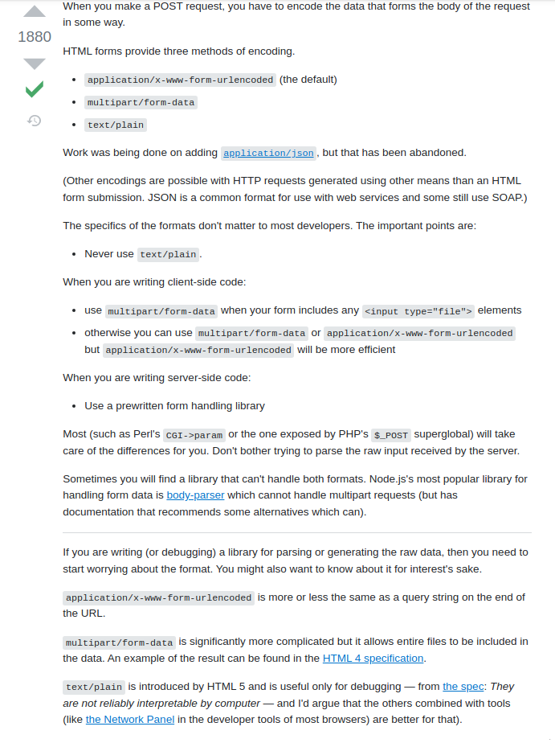
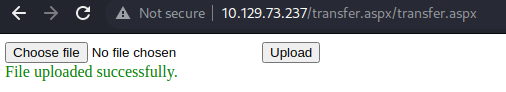
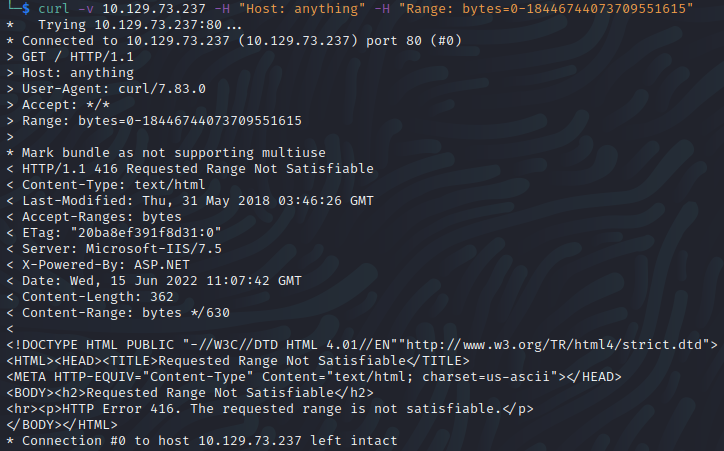

# Bounty

Name: Bounty
Date:  
Difficulty:  
Description:  
Better Description:  
Goals:  
Learnt:

## Recon
The time to live(ttl) indicates its OS. It is a decrementation from each hop back to original ping sender. Linux is < 64, Windows is < 128.

The `nmap/Extensive.*` scans declare IIS to be version 7.5 so probably it is a Windows Server 2008/R2.

[Microsoft IIS](https://en.wikipedia.org/wiki/Internet_Information_Services) is tech behind the webserver on port 80.
There is a upload page at transfer.aspx

And its source code:

And testing file uploading:

Researching the request and response properties:

[form.html](https://www.w3.org/TR/html401/interact/forms.html#h-17.13.4) suggests that this should used for submitting forms that contains files, non-ASCII data and binary data - meaning content checking of the file given the scope of checks would. The picture of Merlin I suppose is a clue that the file upload type that will be successful is `.png`.

 

The [article](https://blog.sucuri.net/2015/04/website-firewall-critical-microsoft-iis-vulnerability-ms15-034.html)

## Exploit

## Foothold

## PrivEsc

