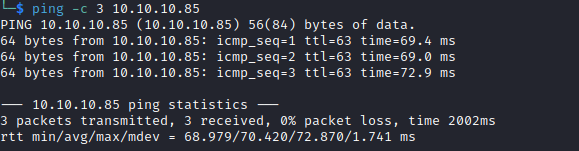

# Celestial Writeup

Name: Celestial
Date:  
Difficulty:  
Goals:  
Learnt:
Beyond Root:

- [[Celestial-Notes.md]]
- [[Celestial-CMD-by-CMDs.md]]

I watch the Ippsec video over my lunch break and it being on my list of Helped-Throughs I though I would just try it out. I know it involves Node deserialization and a cronjob that upset Ippsec. 

## Recon

The time to live(ttl) indicates its OS. It is a decrementation from each hop back to original ping sender. Linux is < 64, Windows is < 128.

	
## Exploit

## Foothold

## PrivEsc

## Beyond Root

