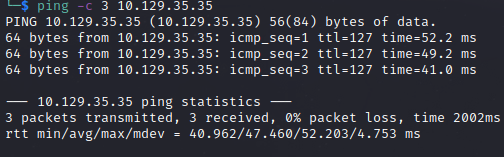

# Conceal HelpThrough

Name: Conceal
Date:  1/11/2022
Difficulty: Hard 
Goals: OSCP Prep
Learnt:
- snmp-check output is bonkers
- 5353 (multicat dns)
- 5355 (LLMNR) - responder catch hashes from this 
- ike-scan -m  for better output
- Ipsec
- Setting up VPN servers
- nmap does not SYN through a VPN
- Strongswan is very picky

Having a bad hardware day... Therefore to keep the proverbial paddling  of a good life going ever on, Ippsec video on standby to learn why this box is so hard to enumerate and how I can encorporate more diligence when facing challenges that do not want to be found.

## Recon

The time to live(ttl) indicates its OS. It is a decrementation from each hop back to original ping sender. Linux is < 64, Windows is < 128.


[isakmp](https://en.wikipedia.org/wiki/Internet_Security_Association_and_Key_Management_Protocol)

I did an Ikescan to find this, awhile ago knowing the box is hard. Just here to learn and textual fill in the gaps,:

```
CONCEAL : 9C8B1A372B1878851BE2C097031B6E43
iso.3.6.1.2.1.1.4.0 = STRING: "IKE VPN password PSK - 9C8B1A372B1878851BE2C097031B6E43"
```

On hearing the introduction I have never step up a vpn from nothing. So I will also do that. 


`Dudecake1!`

```bash
snmp-check -l 
```

At this point I fired up researching Ipsec protocol, because I think I have not covered it much to little in my notes. The VPN protocol - it authenicates and encrypts packets to provide secure communication between two computer. I will release my articles on making my own tomorrow evening along with the Ipsec related information. [Strongswan](https://en.wikipedia.org/wiki/StrongSwan) is apparently really complex and frail as of 4 years ago, will look into a better version. I looked into OpenVPN, but I would need to transfer config.

We need to install strongswan, because we want to create a transport vpn because a tunnel mode would encrypt traffic were cant exchange or debug at the other end. Trouble IPsec with [https://docs.netgate.com/pfsense/en/latest/troubleshooting/ipsec.html]. With some reading I decided to move on from this box until I need to make a VPN with Strongswan. I learnt about Ipsec, but Strongswan has evolved since, but
Ipsec manual and Ipsec.secrets, the Strongswan documentation is rough.

```bash
sudo apt install strongswan

# Ipsec.secrets
sudo vim /etc/ipsec.secrets
$ip %any : PSK "$Key" 

echo "
conn Conceal
        type=transport
        keyexchange=ikev1
        left=$IP
        leftprotoport=tcp
        right=$Coneals_IP
        rightprotoport=tcp
        authby=psk
        esp=3des-sha1
        ike=3des-sha1-modp1024
        ikelifetime=8h
        auto=start
" | sudo tee -a /etc/ipsec.conf

```


At this point I thought I might as well pause the video and try hacking in from here for 30 minutes.

FTP anonymous login with permissions to upload, but I cant print the directory or its contents. 


Tried the webserver to see if it is link somehow. 

No rcpclient, smb - retried uploading:


Tried others and with aspx and failed

## Exploit

## Foothold

## PrivEsc

      
