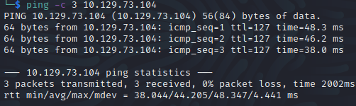
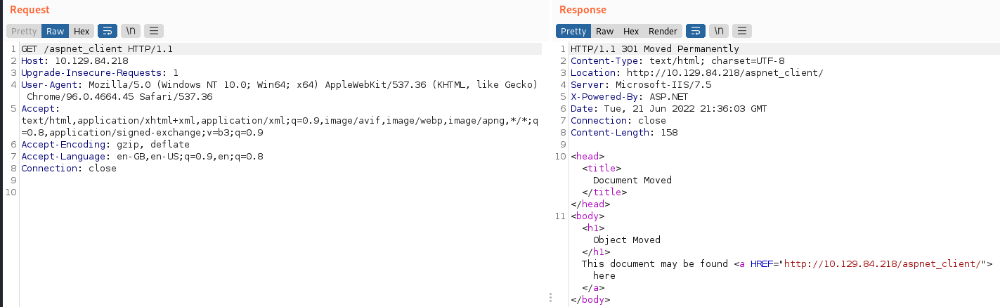

# Devel Helped-through

Name: Devel
Date:  30/10/2022
Difficulty:  Easy  - Its helpthrough because I do not know how to compile C#
Goals:  OSCP Prep
Learnt:
- Windows File system
- I need to learn to compile exploits on VS
- Reminder that `search suggest` in metasploit on the one use for exam 
- VS Code != VS 
- Dot NetNightmare for legacy code and hacking..
- [abatchy17 is a legend](https://github.com/abatchy17/WindowsExploits)
- precompile exploits require keyboard access or remote desktop thank you [0xdf](https://0xdf.gitlab.io/2019/03/05/htb-devel.html)
- Old windows kernel exploits sometimes its best to use metasploit

## Disclaimer I did not finish this box - never compiled anything in VScode (it actually Microsoft Visual Studios) no VS code AAAAAAAAARGH! - requirement to do without metasploit -

 Why is the only acronym that search enigines and everything Americans say and use not matter when is Visual Studio Code  and Microsoft Visual Studios? !@!#$!$%@#$B%^B#@ AAAAAAAAAAAAAAAAARGH!!!****

## Recon

The time to live(ttl) indicates its OS. It is a decrementation from each hop back to original ping sender. Linux is < 64, Windows is < 128.

	
Anonymous FTP, which we can upload to and a directory structure called `aspnet_client`

The [[feroxbuster/feroxbuster-common]] reveals `aspnet_client` 

## Exploit
Upload either [Tunnc Cmd.aspx](https://github.com/tennc/webshell/blob/master/fuzzdb-webshell/asp/cmd.aspx) or [PayloadAllTheThings](https://github.com/swisskyrepo/PayloadsAllTheThings/blob/ba2c02cc3ef3f63df6351aa55509bdac137fb3b8/Upload%20Insecure%20Files/Extension%20ASP/shell.aspx) to FTP and go to the root web page and `/<shellname>.aspx`. The first can run other programs
We are the `iis apppool\web` user

Potentially...

 Privilege | Impact | Tool | Execution path | Remarks 
 --- | --- | --- | --- | --- 
`SeImpersonate`|  ***Admin*** | 3rd party tool | Tools from the *Potato family* (potato.exe, RottenPotato, RottenPotatoNG, Juicy Potato, SweetPotato, RemotePotato0), RogueWinRM, PrintSpoofer, etc. | Similarly to `SeAssignPrimaryToken`, allows by design to create a process under the security context of another user (using a handle to a token of said user). |

It is also Windows 7...

## Foothold

FTP over some tools

Upgrade to powershell and get a reverse shell.

## PrivEsc
   

Tried alot and alot failed. I went away to learn to compile exploits on vscode. I feel very limited. 

This machine went well but my time constraints and management of which now means I that   must, solve this to move forward. Ippsec uses metesploit for this video, [0xdf](https://0xdf.gitlab.io/2019/03/05/htb-devel.html) solves all my problems as I have never used watson, I found wesng output excessive and I need to learn to compile in VS dev. Then have to download 31 GBs of stuff.. so

Why is the only acronym that search enigines and everything Americans say and use not matter when is Visual Studio Code  and Microsoft Visual Studios? !@!#$!$%@#$B%^B#@ AAAAAAAAAAAAAAAAARGH!!!

Check the .NET version.
`reg query "HKEY_LOCAL_MACHINE\SOFTWARE\Microsoft\NET Framework Setup\NDP"`

Just because of how head-to-keyboard smashingly frustrating that is, future me - never forget:
https://github.com/rasta-mouse/Watson
https://github.com/abatchy17/WindowsExploits

After another 23 minutes of long day dealing with now legacy .NET cannot be targeted, be default for whatever reason. So this is going to be a on going article addition to my Archive trying to make that work. 

TIL compiled binaries require keyboard access

I had the reverse of of 0xdf, where he got the shell, because my life is an endless string of "why what the.. ok.. right..well...\*sigh\*" it seems sometimes. I can actually code in C I just never seem to have time, but not that well. Compiling is mostly painful.

Liver shot with dlls...

