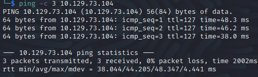
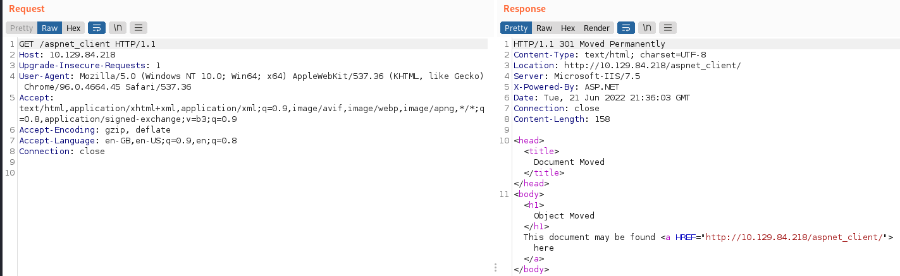

Name: Devel
Date:  
Difficulty:  Easy  
Goals:  OSCP 
Learnt:

## Recon

The time to live(ttl) indicates its OS. It is a decrementation from each hop back to original ping sender. Linux is < 64, Windows is < 128.

	
Anonymous FTP, which we can upload to and a directory structure called `aspnet_client`

The [[feroxbuster/feroxbuster-common]] reveals `aspnet_client` 

## Exploit
Upload either [Tunnc Cmd.aspx](https://github.com/tennc/webshell/blob/master/fuzzdb-webshell/asp/cmd.aspx) or [PayloadAllTheThings](https://github.com/swisskyrepo/PayloadsAllTheThings/blob/ba2c02cc3ef3f63df6351aa55509bdac137fb3b8/Upload%20Insecure%20Files/Extension%20ASP/shell.aspx) to FTP and go to the root web page and `/<shellname>.aspx`. The first can run other programs
We are the`iis apppool\web` user

Potentially...

 Privilege | Impact | Tool | Execution path | Remarks 
 --- | --- | --- | --- | --- 
`SeImpersonate`|  ***Admin*** | 3rd party tool | Tools from the *Potato family* (potato.exe, RottenPotato, RottenPotatoNG, Juicy Potato, SweetPotato, RemotePotato0), RogueWinRM, PrintSpoofer, etc. | Similarly to `SeAssignPrimaryToken`, allows by design to create a process under the security context of another user (using a handle to a token of said user). |

It is also Windows 7...

## Foothold

FTP over some tools

Upgrade to powershell and get a reverse shell

## PrivEsc
   

Tried alot and alot failed. I went away to learn to compile exploits on vscode. I feel very limited.