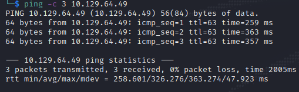

Name: Faculty
Date:  
Difficulty:  
Description:  
Better Description:  
Goals:  
Learnt:

## Recon

The time to live(ttl) indicates its OS. It is a decrementation from each hop back to original ping sender. Linux is < 64, Windows is < 128.

PHPSESSID

https://mailchi.mp/faculty/good-work
https://us2.campaign-archive.com/home/?u=b46cc084c8bdde1ea04555baa&id=1af03beada

## Exploit

## Foothold

## PrivEsc

      
