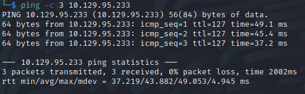

Name: Grandpa
Date:  
Difficulty:  Easy
Goals:  
Learnt:

## Recon

[[CVE-2000-0114-http___10.129.95.233__vti_inf.html]] is 0 in severity, but 
[[CVE-2017-7269-http___10.129.95.233]] is critical RCE 9.5! for a buffer overflow, which there is a metasploit exploit for [https://www.exploit-db.com/exploits/41992](https://www.exploit-db.com/exploits/41992). There is also an 
[Explaination](https://www.exploit-db.com/exploits/8704) for a Remote Authenication Bypass allowing unrestricted listing downloading and uploading of files into password protected WebDAV folder. The 8806.pl did seem to work and neither did adding `%c0%af` into `curl`'s against `/images/` and  `/_Private/`. 

## Exploit

## Foothold

## PrivEsc

      
