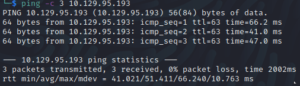

Name: Hawk
Date:  
Difficulty:  Medium
Goals:  
Learnt:

## Recon



FTP - has .drupal.txt.enc


Removed `\n` newlines from the decoded-drupalDOTtxt.txt - Check 7900 Drupal7


robot.txt - includes, misc, modules, profiles - see screenshots and robots.txt in this directory.


Checked themes/chocolate, profile/admin to test what the site was using for 


Potentially find access to update the site maliciously 


What an exploit name!

So metasploit is possible and [python2 exploit](https://github.com/sl4cky/CVE-2018-7600/blob/master/Drupalgeddon2.py), for OSCP compliance and readying!
Both require authentication, so cracking the drupal.txt.enc properly seems the intended path.

Nikto finds a web.config with some rules page name requests and page handling, aswell a rule for pages to then display if parameterised


Fuzz the ?q=FUZZ, but corss check with robots.txt, see curled version.


Manual toying with the exploits
```php
user/register?element_parents=account/mail/%23value&ajax_form=1&_wrapper_format=drupal_ajax

Data%3dform_id%3duser_register_form%26_drupal_ajax%3d1%26mail[%23post_render][]%3dexec%26mail[%23type]%3dmarkup%26mail[%23markup]%3d<%3fphp+eval('cat+/etc/passwd')php>
// The above failed
```


[[cache-poisoning-fuzz-http___10.129.95.193__9cd019c40b46d1dcffde94fa825ce5a2=1]]


## Exploit


## Foothold

## PrivEsc

      
