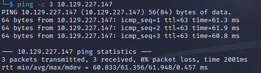

# Jarvis Writeup
Name: Jarvis
Date:  
Difficulty:  Medium
Goals:  
- OSCP Prep
- Brutal 12 hour *examINATION* of ability
Learnt:

For a brutal self assessment after clearing my head I am returning to this box to simulate exam conditions for personally self assessment. Day One of Four, idea being the recon is mostly done, thus shave off 1-2 hours off that 14 hours. 2 - 2.5 hours per box.

## Recon

The time to live(ttl) indicates its OS. It is a decrementation from each hop back to original ping sender. Linux is < 64, Windows is < 128.

Recursive recon and vhost enumeration 

## Exploit

[[phpmyadmin-setup-http___10.129.227.147_phpmyadmin_setup_index.php]] 

[[CVE-2019-12616-http___10.129.227.147_phpmyadmin_]]
A vulnerability was found that allows an attacker to trigger a CSRF attack against a phpMyAdmin user. The attacker can trick the user, for instance through a broken  tag pointing at the victim's phpMyAdmin database, and the attacker can potentially deliver a payload (such as a specific INSERT or DELETE statement) through the victim.

[CVE-2018-12613](https://nvd.nist.gov/vuln/detail/CVE-2018-12613)
Potential with credentials: [# phpMyAdmin 4.8.1 - Remote Code Execution (RCE)](https://www.exploit-db.com/exploits/50457)

https://medium.com/@happyholic1203/phpmyadmin-4-8-0-4-8-1-remote-code-execution-257bcc146f8e

## Foothold

## PrivEsc

      
