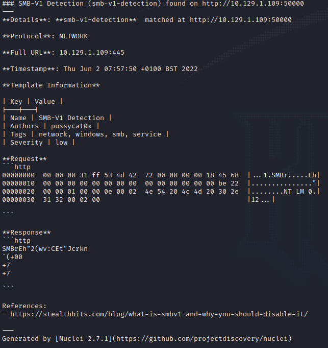
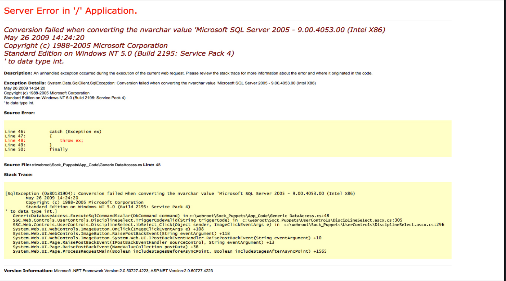
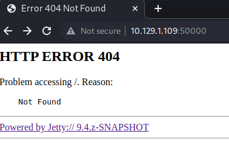

# Jeeves
Name: Jeeves
Date:  
Difficulty:  Medium
Description:  
Better Description:  
Goals:  OSCP Prep
Learnt:

## Recon
The time to live(ttl) indicates its OS. It is a decrementation from each hop back to original ping sender. Linux is < 64, Windows is < 128.

nuclei found smb version is enabled!

Tried SQLis on the root askJeeves:
`'admin OR 1=1 -- -`

Even if this is not a path top foothold or exfiltration then it is a disclosure of Winodws NT 5.0(Build 2195: Service Pack 4), Intel x86 chipset. You also did not need to try SQLi as it is a generic error page.

On port 50000 the Jetty is missing

## Exploit

## Foothold

## PrivEsc

      
