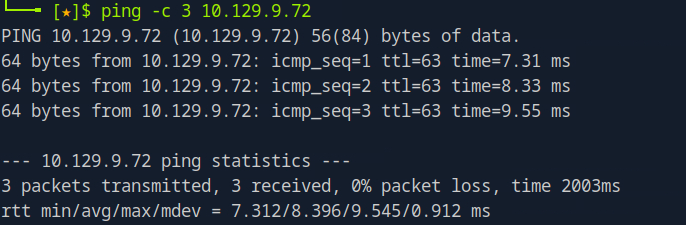

# Keeper Writeup

Name: Keeper
Date:  
Difficulty: Easy 
Goals:  
Learnt:
Beyond Root:

- [[Keeper-Notes.md]]
- [[Keeper-CMD-by-CMDs.md]]
## Recon

The time to live(ttl) indicates its OS. It is a decrementation from each hop back to original ping sender. Linux is < 64, Windows is < 128.

The above page points and is identical to the keeper.htb

## Exploit

## Foothold

## Privilege Escalation

## Post-Root-Reflection  

## Beyond Root

