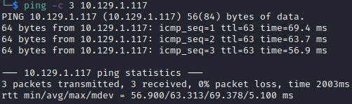

# Kotarak Writeup

Name: Kotarak
Date:  2/2/2023
Difficulty:  Hard
Goals:  
- OSCP Prep
- Female Neurodiversity for the assimilation
Learnt:
Beyond Root:
- Linux Malware in C and detections for Rootkits and Malware

## Recon

The time to live(ttl) indicates its OS. It is a decrementation from each hop back to original ping sender. Linux is < 64, Windows is < 128.

- Webserver default Admin Login panels?
	- Default passwords?

- Strange/Custom ports?
	- What do common extractions with CLI tools suggest about this ports use? -  `curl`, `telnet`, `nc`

Parameter equals:

- What data returns from the parameter
	- LFI? Can you read disk/memory?
	- RFI? Can you get remote resources?
	- SSRF? Can you request known resources - ports, files, webpages?
	- XSS? Can you execute javascript scripting?
	- SSTI? Can you exploit the template engines access to system?
	- (no)SQLI? Can you create error code enough to PoC interaction with database?  
	- CMDi? Can you execute with `& CMD` - windows  or `; CMD` - linux?
	- IDOR? Can you deserialize or decoded data; or modify data to change your object context?  

## Exploit

## Foothold

## PrivEsc

## Beyond Root

      
