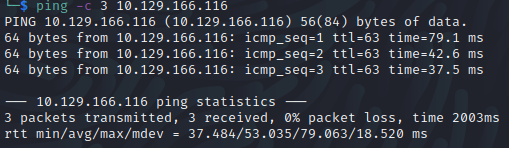

Name: LaCasaDePapel
Date:  
Difficulty:  
Description:  
Better Description:  
Goals:  
Learnt:

## Recon

[rapid7](https://www.rapid7.com/db/modules/exploit/unix/ftp/vsftpd_234_backdoor/)

## Exploit

Due to my goals I will not use the metasploit version of this exploit, instead the public exploit avaliable on [exploitdb](https://www.exploit-db.com/exploits/49757)
This does not work as the deoding of the telnetlib.interact does not decode. Then tried [ahervias](https://github.com/ahervias77/vsftpd-2.3.4-exploit/blob/master/vsftpd_234_exploit.py)
	

## Foothold

## PrivEsc

      
