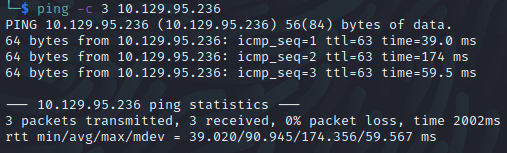

Name: Lightweight
Date: 16/06/2022
Difficulty: Medium 
Description:  
Better Description:  
Goals: OSCP prep; LDAP knowledge
Learnt: My nmap script should be used more

## Recon

The time to live(ttl) indicates its OS. It is a decrementation from each hop back to original ping sender. Linux is < 64, Windows is < 128.

Found futher confirmation as to the OS with `nmap --script discovery`

Seeing as the webserver seems a bit of dud; went to [Curtis' awesome cheatsheets](https://github.com/curtishoughton/Penetration-Testing-Cheat-Sheet/blob/master/Enumeration/LDAP/LDAP.md)
Used the nmap script and just see nmap/ldap-serch for users, domain, and hashes enumerated from the script. Woo. While I crack the hashes in the background I walked the website and found that you can just with IP as uid login, but seeing as I have the hashes, might as well... seeing as it is not a 15 minute rule here is the actually way I will assume that this is not an intended path.

SSH-ed on to the box there was a anti-bruteforcing protection on the box so could see what it is hosting 

## Exploit

## Foothold

## PrivEsc

      
