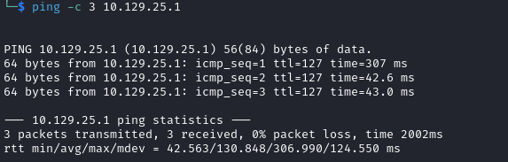

# Anomalies : Mailing Writeup

Name: Mailing
Date:  
Difficulty:  
Goals:  
Learnt:
Beyond Root:
- Email Server and Clients
- Email Server Hardening
- PwnBox light-Ricing

This will be *great*, I have never done phishing and only the lightest Email related Recon for password and I do not like emails as part of life. I have also not setup Exchange Servers in Azure or SMTP servers and client for myself, so even though this is an easy box this more smear of Writeup documenting my metaphorical crawling out of volcanic pool billions of years behind everyone else. 
## Recon

The time to live(ttl) indicates its OS. It is a decrementation from each hop back to original ping sender. Linux is < 64, Windows is < 128.



```
sudo apt install thunderbird
```

```
thunderbird &
```


RTFM **"Make sure to mark all boxes on the bottom of the form"**

Add an account:
- Email address
- Username
- Password
- Account name
- Incoming email server
- Account type
- Outgoing (SMTP) email server
	- Tick:
		- Outgoing server requires authentication
		- Use the same username and password for sending email
		- Require SSL for incoming email

Move to Parrot pwn box


Potentially the only time I have actually followed the assumed instructions and it not work in a CTF. A new confusing kind of humiliation.


Made both ingress and egress SMTP server configurations in Thunderbird Identical 933, SSL/TLS

https://www.hmailserver.com/forum/viewtopic.php?t=24327


https://smtpsmuggling.com/

*"SMTP smuggling is a novel vulnerability that allows e-mail spoofing by exploiting interpretation differences of the SMTP protocol in vulnerable server constellations. More specifically, different understandings of so called "end-of-data" sequences between outbound (sending) and inbound (receiving) SMTP servers may allow an attacker to smuggle - hence SMTP smuggling - spoofed e-mails (see Figure 1). Threat actors can abuse this to send malicious e-mails from arbitrary e-mail addresses, allowing targeted phishing attacks."*

[37C3 - SMTP Smuggling – Spoofing E-Mails Worldwide](https://www.youtube.com/watch?v=V8KPV96g1To)

This would be a very cool exploit, it is similar to HTTP Request Smuggling in that we can multiple requests in one HTTP Request that we then trick the or set of servers to parse a second malicious request bypassing access controls in some way. We have Maya as a user to target.

https://github.com/The-Login/SMTP-Smuggling-Tools
```bash
python3 -m venv .venv
source .venv/bin/activate 
pip install -r requirements.txt
```


Time before and after are strange - answer:


[Wikipedia - Opportunistic TLS STARTLS](https://en.wikipedia.org/wiki/Opportunistic_TLS): *"Opportunistic TLS (Transport Layer Security) refers to extensions in plain text communication protocols, which offer a way to upgrade a plain text connection to an encrypted (TLS or SSL) connection instead of using a separate port for encrypted communication. Several protocols use a command named "STARTTLS" for this purpose. It is a form of opportunistic encryption and is primarily intended as a countermeasure to passive monitoring."*

While I mulling over things and brute forcing SMB I made a nice bash script to print all the British Dates
```
for j in $(seq 1 12); do for i in $(seq 1 31); do echo "$i/$j/2020"; done; done | grep -v '31/9/\|31/4\|31/11\|30/2/\|31/2'
```


With both configuration headaches and physical headache from the newest round of COVID again


STARTLS, The pixel blur is amazing I really hope my screenshots from the past were never like this. Tried with the specified email address. Then switched back to Parrot, because of the time required to get Responder online on windows would push time


Password mailing - probably not valid. Read READ READ


https://www.digitalocean.com/community/questions/how-to-solve-thunderbird-failed-to-find-the-settings-problem
```

openssl s_client -connect mailing.htb:993

```


```
[Errno 2] No such file or directory
```


## Exploit

## Foothold

## Privilege Escalation

## Post Root Reflection

I could not even configure Thunderbird to even start asking how to use the SMTP access.
- Should I even do HTB seasons?


## Beyond Root


- Pwnbox -> betterPwnBox
	- to Fix
