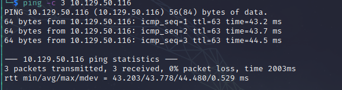

# Nineveh Writeup
Name: Nineveh
Date:  
Difficulty:  
Goals:  
Learnt:

## Recon

The time to live(ttl) indicates its OS. It is a decrementation from each hop back to original ping sender. Linux is < 64, Windows is < 128.

7.0.18-0ubuntu0.16.04.1  
OpenSSL 1.0.2g 1 Mar 2016
PCRE Library Version 8.38 2015-11-23
  
www-data user and group
/etc/php/7.0/apache2

SSL /TLS everything points towards a certificate attack. Man in the middling myself to exfiltrate data somehow.

Login page is NOT fixed! - Hydra reports all passwords work, usernames admin and amrois

admin
amrois

https://nineveh.htb/db/

admin:admin - does not work

Also error with ssl cert...

RCE requires [creds](https://www.exploit-db.com/exploits/24044)

[Multiple](https://www.exploit-db.com/exploits/39714)

## Exploit

## Foothold

## PrivEsc

      
